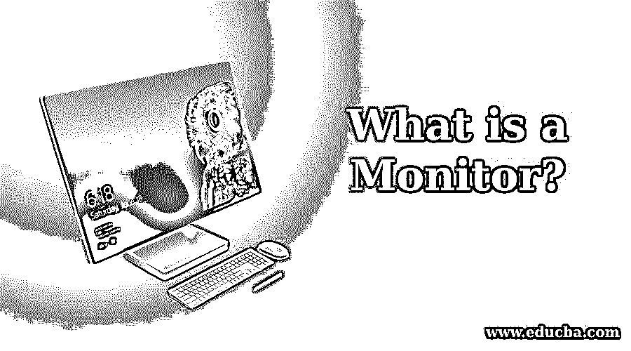

# 什么是显示器？

> 原文：<https://www.educba.com/what-is-a-monitor/>

## 监视器简介

监视器是一种电子输出系统，被称为视频显示(VDT)或视频显示(VDU)单元。相关计算机通过视频卡创建的信息显示由照片、文本、视频和图形呈现。虽然它几乎像一个屏幕，但它的分辨率比屏幕高得多。作为施乐 Alto 计算机系统的一部分，第一台电子显示器于 1973 年 3 月 1 日问世。老式显示器是通过使用阴极射线管(CRT)荧光屏设计的，这使得它们又重又宽，从而节省了桌面空间。今天，平板技术，通常是 led 背光，制造所有的显示器。与旧的 CRT 显示器相比，新屏幕占用的桌面空间更小。Hanns-G、宏碁、戴尔、Sceptre、三星、LG 电子、惠普和 AOC 是最常见的电脑显示器品牌。你可以直接或者通过亚马逊、新蛋等零售商从这些厂商那里购买显示器。通常，DVI、HDMI 或 VGA 端口连接显示器。另外还包括 USB、DisplayPort 和 Thunderbolt。在投资购买新显示器与电脑配合使用之前，请确定这两个设备接受相同的连接类型。
例如，如果您的电脑只能接受 VGA 连接，请不要购买带有 HDMI 端口的显示器。许多视频卡和显示器都有几个端口，但仍然需要检查与不同类型设备的兼容性。

### 显示器问题疑难解答

显示器的输出通常由各种变量计算得出，而不仅仅是一个属性，如显示器的总尺寸。这些包括纵横比(水平长度对垂直长度)、功耗、刷新率、对比度(亮色对暗色的浓度)、反应时间(从有效到无效再到另一个有效像素需要多少时间)、显示器尺寸等。很多东西可以自己修，但是为了安全起见最好不要打开包装。如果使用此处列出的建议无法解决问题，请将显示器交给专业人员。

<small>网页开发、编程语言、软件测试&其他</small>

**1。屏幕闪烁:**屏幕扫描可以通过改变显示器的刷新率来克服，Windows 控制面板可以实现。

**2。颜色问题:**如果您的旧 CRT 显示器难以显示颜色，或者当您的屏幕边缘有一系列颜色时，您可以禁用它，以消除它产生的磁性差异。如果需要帮助，请参阅计算机显示器如何消磁。

**3。无图像:**你有一台屏幕上什么都不显示的电脑吗？请阅读我们的电脑显示器测试指南，了解包括测试显示器连接是否松动、确保亮度描述正确等措施。

**4。设置:**显示器通常可通过即插即用立即使用。如果计算机上的视频没有像您认为的那样显示，请考虑升级您的视频卡系统。如果需要帮助，请参阅如何升级 Windows 驱动程序

### 监视器的类型

有各种类型的监视器，例如:

#### 1.平板显示器

它们重量轻，占用空间少。与 CRT 显示器相比，它们耗电更少。这种装置更有效，因为它们无害。这种显示器比阴极射线管要贵。PDA、笔记本电脑和手机都使用平板显示器。这种显示器有各种尺寸，如 15 英寸、17 英寸、18 英寸和 19 英寸等。该节目使用平板显示器的两块玻璃板进行渲染。在那些盘子里有一种物质可以通过几种方式被触发。

#### 2.触摸屏显示器

这些设备也被认为是输入系统。它不使用鼠标或键盘，而是帮助用户使用手指或图案与计算机交流。当用户触摸屏幕时，事件发生并将其传输到处理控制器。像这样的屏幕包含图像或文字来帮助用户与设备交流。它通过点击屏幕上的菜单或图标接收用户的输入。触摸屏显示器有各种风格；下面给出了三种具体类型。

#### 3.led 监视器

这是一个发光二极管显示器的平板显示器。重量低，深度简短。它使用 LED 面板作为光源。如今，笔记本电脑屏幕、移动电话、电视、电脑显示器和平板电脑等大大小小的设备都使用 LED 显示屏。他们确实使用许多其他电子设备。

#### 4.有机发光二极管监视器

这是一个有效的，更轻，更薄，更好的刷新功能和对比度比液晶显示器与现代，单位停车显示技术。它由各种薄膜的两个导体之间的位置组成。不需要背光，因为这些显示器是发射型的。它还提供了更高的图像质量，主要用于最高质量的平板电脑和智能手机。

### 推荐文章

这是一个什么是显示器的指南？.在这里，我们将详细讨论 Monitor 及其不同类型的介绍，以及 Monitor 问题的故障排除。您也可以浏览我们推荐的其他文章，了解更多信息——

1.  [理解 Scala 的概念](https://www.educba.com/what-is-scala/)
2.  [科特林 vs 斯卡拉](https://www.educba.com/kotlin-vs-scala/)
3.  [Scala 版本介绍](https://www.educba.com/scala-versions/)
4.  [Scala 数据类型概述](https://www.educba.com/scala-data-types/)

