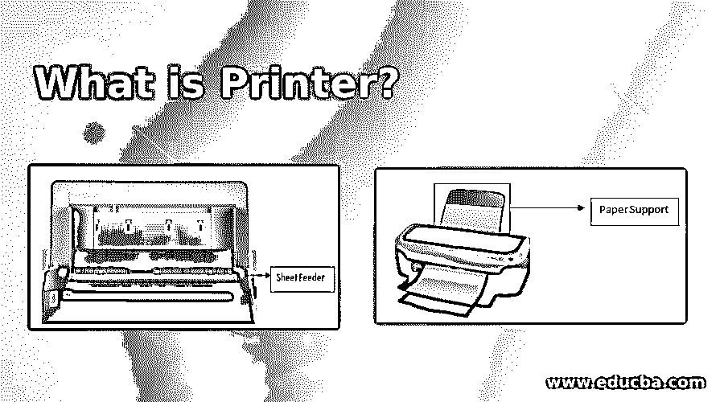
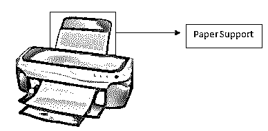
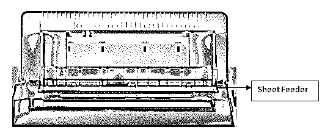
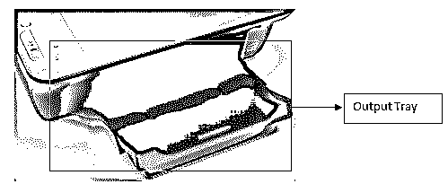

# 什么是打印机？

> 原文：<https://www.educba.com/what-is-printer/>

## 打印机的定义

打印机可以被定义为专门用于将计算机系统上看到的内容复制到物理材料(通常是某种纸张)上的许多外围设备之一。有许多类型的打印机可用，包括传统的墨粉打印机、热敏打印机、击打式打印机、菊花轮式打印机、点阵打印机、激光打印机、喷墨打印机、3D 打印机等。打印机的类型也可以根据其连接规定进行分类，例如有线打印机和无线打印机，它们可以通过蓝牙、VLAN、wifi 等无线网络进行连接。

### 打印机的各种部件

为了成功执行打印过程，典型的打印机应具备所有基本部件，它们是:

<small>网页开发、编程语言、软件测试&其他</small>

*   纸张支架
*   输纸装置
*   打印机盖
*   输出托盘
*   输出托盘扩展
*   连接器
*   边缘导轨
*   控制按钮
*   墨盒盖
*   打印头

#### 1.纸张支架

任何用于将计算机中的内容打印到纸张上的打印机都应该有纸张支持。打印机中的该支撑部件可用于在打印过程开始时布置可用于送入打印机的纸张。它还被视为保持纸张整洁有序的规定，以便每次发送一张纸，供打印机不间断地打印，并获得正确无误的结果。

#### 2.送纸器

送纸器是纸张支架下方的部件，它是打印过程中的下一个部件。它通常用于容纳空白纸张，然后在打印过程开始时将空白纸张送入打印机。它似乎是两个擀面杖，让纸张在它们之间，以确保纸张是直的，没有皱纹，打印没有任何错误。下面是一种常见的送纸器设计，可以在简单的有线打印机中观察到。

#### 3.打印机盖

打印机盖只不过是打印机的外壳，用作打印机机械部件上的盖子。这可以防止设备附着在外部灰尘上，也不会让用户不小心弄乱打印机的机械设置。它可以在任何需要的时候被访问和打开，例如当设备需要维修或者当墨盒需要更换的时候。在大多数情况下，品牌利用这一部分作为机会来增强设备的外观，以吸引客户购买设备。

#### 4.输出托盘

输出托盘用于在打印过程完成后接收纸张。它还有助于按要求的顺序接收结果。打印机的这一部分被视为另一个重要部分，因为与没有输出托盘的打印过程相比，它使整个打印过程更加方便。

#### 

#### 5.输出托盘扩展

输出托盘扩展，顾名思义，是输出托盘的扩展，并不是在所有打印机设备中都可以看到。这是一个可选部分，因为当纸张比正常尺寸大时，它可以很好地工作。这通常可以在输出托盘上方找到，因为它是输出托盘的附加组件。

#### 6.连接器

连接器是所有部件中最重要的，因为它是唯一让电源进入的媒介，也是唯一将计算机的打印命令发送到打印机的媒介。同样，连接性取决于打印机设备的类型。打印机可以是有线的或无线的，这简单地意味着打印机连接可以分别通过有线供应或没有有线连接来启用。打印机的无线连接自带无线连接类型，如蓝牙、VLAN、wifi 等。

#### 7.边缘导轨

印刷装置中的边缘引导件通常放置在纸张支撑托盘上，这也是该装置的重要部分。它有助于将所有纸张保持在原位，并且在打印机运行时不会移动它们。用户可以将它前后移动到某一尺寸，以保持导轨与用于打印过程的纸张尺寸一致。

#### 8.控制按钮

控制按钮是放置在打印设备上的按钮，可以自行控制设备。打印机上常见的几个按钮是用于给打印机加电的电源关闭/打开按钮、用于加载或弹出或重置当前用于打印的纸张的加载或弹出纸张按钮，以及用于访问放置在打印机设备内的墨盒的墨水按钮。

#### 9.墨盒盖

墨盒盖放置在墨盒插槽的上方，以便将墨盒保持在适当的位置，并便于通过打印机设备发送打印命令。无论何时将墨盒安装到打印机中或从打印机中取出墨盒，都可以打开和关闭该窗口。

#### 10.打印头

打印头是打印机的另一个最重要的部分，它的工作是将墨盒中的墨水输送到纸张表面。当打印机从计算机设备接收到命令时，打印机将内容打印在纸上，而打印头用于拾取墨水并将其放置在纸上。

### 打印机的使用

打印机设备的使用取决于打印机的类型和使用打印机的目的，例如:

*   **个人用途:**打印家庭用图像和个人文件。
*   **一般用途:**打印一般用途的文件。
*   **业务用途:**打印业务相关文档需要高端打印机。
*   **营销用途:**印刷营销标志&条幅，使用允许各种材料的打印机。

### 结论

打印机设备用于在物理材料上创建各种形式的硬拷贝，这已经成为家庭和企业的最终需求。它使个人不用在纸上重新创建计算机中的数据，相反，计算机可以将数据直接发送到打印机打印副本。

### 推荐文章

这是一本什么是打印机的指南？.在这里，我们将详细讨论打印机及其不同部件的介绍和使用方法。您也可以浏览我们推荐的其他文章，了解更多信息——

1.  [理解 Scala 的概念](https://www.educba.com/what-is-scala/)
2.  [科特林 vs Scala |十大对比](https://www.educba.com/kotlin-vs-scala/)
3.  [Scala 版本介绍](https://www.educba.com/scala-versions/)
4.  [Scala 数据类型概述](https://www.educba.com/scala-data-types/)

