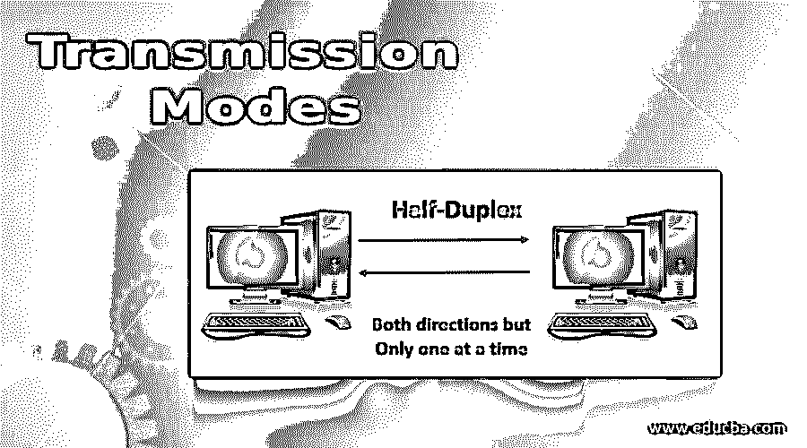
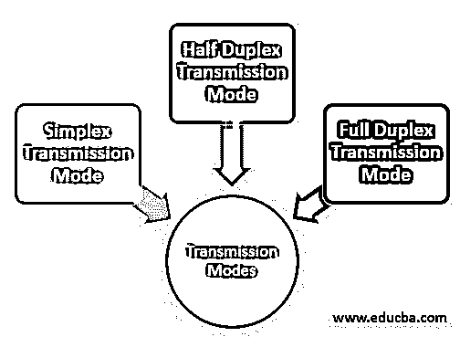
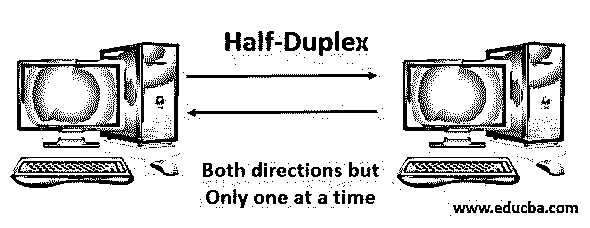
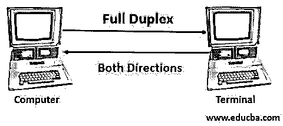

# 传输模式

> 原文：<https://www.educba.com/transmission-modes/>

## 传输模式介绍

传输模式或通信模式是指使用通信信道在两个设备之间传输数据，该通信信道包括光纤、铜线、无线信道和各种存储介质。传输的数据是以电磁波的形式存在的。数据传输有多种方式，其中传递的信息是使用数字调制的脉冲序列。20 世纪 40 年代，数据传输模式首先在调制解调器中引入计算机网络系统，然后在局域网、广域网、中继器和其他网络系统中引入。

### 传输模式的类型

术语“传输模式”是指两个通信设备通过交互信道传递信息，该信道告知设备之间的信息流方向。在计算机网络系统中，我们主要看到三种不同的类型。首先是单工，然后是半双工，接下来是全双工。

<small>网页开发、编程语言、软件测试&其他</small>

它们描述如下:

#### 1.单工传输模式

*   在计算网络中，当信息从发送者到接收者是单方向流动或单向流动时，称为单工传输模式。
*   在这种传输模式下，通信只在一个方向上进行，电路的连接方式是只发送或只接收。
*   没有其他机制将数据传输到发送方，这种传输模式通常包括专用电路，用于安全和火灾报警。

##### 例子

*   计算机和键盘之间的通信是单工传输的一个基本例子，其中键盘是输入，计算机是输出。
*   扬声器系统也是单工传输的一个例子，其中麦克风作为输入，扬声器作为输出。

##### 优势

*   主要优点是当在两个设备之间进行传输时，可以充分利用通信信道的容量。
*   在单工传输模式下，无线电台可以利用通信信道的全部带宽，这样所有数据可以一次性传输，不会有任何数据丢失。

##### 不足之处

*   由于设备之间的通信是单向的，因此两个设备之间没有相互通信。
*   单工传输模式主要用于不需要快速回复的商业领域，因为通信主要执行双向数据交换。

#### 2.半双工传输模式

*   在计算机网络中，从发送者到接收者有双向信息流，但每次只有一个信息流时，称为半双工传输模式。
*   在这种传输模式下，通信是双向的，连接的设备可以发送或接收数据，但不能同时发送或接收。
*   通信方向可以反过来，因为无线电台可以接收和发送数据，发送的每个字符都立即显示在屏幕上。

##### 例子

*   许多计算机调制解调器、打印机、缓冲区轮询都属于半双工传输模式。
*   对讲机是半双工传输的完美例子。对讲机的工作功能是当一个人从一端讲话时，另一个人从另一端监听。休息一会儿后，另一个人说话，另一端的第一个人听着。同时讲话是不可能的，因为这将造成声音失真，并且接收者和发送者都不能理解信息。

##### 优势

*   半双工传输主要用于涉及电线和电路的低速传输。
*   在半双工传输的帮助下，以更简单的方式执行错误检测。如果在数据传输过程中的任何阶段出现任何错误，接收方将只向发送方提供重新传输数据的请求，发送方将据此进行确认。
*   由于双向通信是通过这种传输模式进行的，因此在传输过程中，通信信道的整个带宽都被利用，而且每次只能在一个方向上使用。

##### 不足之处

*   在这种模式下，当一种模式正在发送数据时，对方必须等待响应，这会导致在正确的时间发送和接收数据的延迟。

#### 3.全双工传输模式

**

** 

*   在计算网络中，从发送方到接收方同时存在双向信息流或双向信息流称为全双工传输模式。
*   在这种传输模式下，通信在通信链路上双向进行，需要两条线路，并且两个设备共享信道容量。
*   双向通信连接设备，同时接收和发送，并且通信链路包含单独的发送和接收路径。

##### 例子

*   这种传播方式最常见的例子是电话。当两个人使用电话线通过电话说话或交流时，两个人都有同时说话和听的能力。

##### 优势

*   全双工传输模式是最快的传输模式，因为传输是双向同时进行的。
*   无线电台包含两个独立的信道，一个信道用于在一个方向发送数据，另一个信道用于在相反方向的另一端的接收器。

##### 不足之处

*   如果在通信设备之间没有适当的链路或者没有任何专用路径，则通信信道的信道容量被细分成多个部分，并且不能保持信道带宽的适当利用。

### 推荐文章

这是一份传输模式指南。在这里，我们还讨论了传输模式的介绍和类型以及优缺点。您也可以看看以下文章，了解更多信息–

1.  [切换模式](https://www.educba.com/switching-modes/)
2.  [FTP 命令](https://www.educba.com/ftp-commands/)
3.  [星形总线拓扑](https://www.educba.com/star-bus-topology/)
4.  [数据链路层](https://www.educba.com/data-link-layer/)

