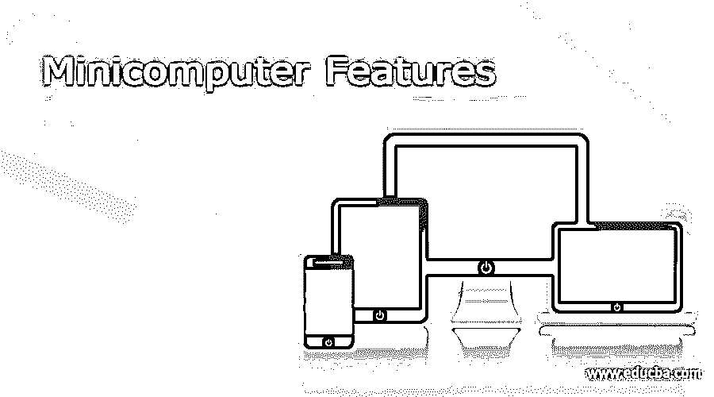

# 小型计算机特征

> 原文：<https://www.educba.com/minicomputer-features/>

## 小型机特性介绍

小型机是一种具有许多与大型计算机相同的特性和功能，但体积更小的计算机。顾名思义，它也被称为迷你。就计算系统而言，它介于大型机和微型计算机之间，因为它比大型机小，但比微型计算机大。小型机比大型机或超级计算机更小、更便宜、功能更弱，但比个人计算机更昂贵、功能更强。20 世纪 60 年代中期，小型机问世，在此期间，晶体管和核心内存技术仅用于构建小型计算机，IBM 公司是第一家制造这种计算机的公司。平板电脑、台式小型机、手机、笔记本电脑、高端 MP3 播放器等等都是小型机的例子。

### 小型计算机的特点

以下是小型机的特点

<small>网页开发、编程语言、软件测试&其他</small>

它在大型计算机中的尺寸相对较小——小型计算机是小型过程控制计算机发展的结果。小型计算机，如较大的 EDP 计算机系统，具有中央处理器(CPU)、存储器和面向科学的指令集，并根据存储的程序概念运行。

它比超级计算机或大型计算机便宜——小型机以其较低的成本、应用程序和交付时附带的软件包类型而著称。随着小型计算机使用的增加和存储器成本的降低，许多具有超过 32，768 字存储器的小型计算机系统已经出现。

它没有大型机或超级计算机强大，但它比微型计算机强大得多——微型计算机比个人计算机、微型计算机和工作站更强大，尽管比大型机或超级计算机小，但它缺乏大型机或超级计算机的处理能力。

支持多处理和多任务处理——小型机可能有一个或多个处理器，支持多任务处理和多处理，以便同时执行几项任务，并且通常能够承受繁重的工作负载。

小企业和个人可能从中受益——市场上由小型计算机系统提供服务的一些应用很可能被微型计算机所吸收，但在大多数情况下，微型计算机正在全新的领域中找到应用。传统的小型机系统在规模上有了显著的增长，它将成为较小的商业数据处理应用中更重要的竞争对手。

### 小型计算机的用途

小型机的主要用途。它们主要用于三个目的。

#### 1.控制流程

小型计算机主要被企业用来管理生产过程。数据采集和反馈是过程控制的两个主要功能。例如，小型计算机在工厂里被用来调节生产过程。如果方法的某个部分出现问题，它会识别出来并做出必要的更改。

#### 2.沟通

小型计算机是人类操作员和更强大的处理器之间的纽带。在小型计算机的支持下，用户可以进行诸如错误检查之类的操作，然后利用系统进行修改。

以下是其他一些应用——

*   它们也用于科学计算。
*   用于处理公司交易。
*   这个程序用来处理数据库。
*   用于工程计算
*   用于文件处理

#### 3.数据管理

我们用于数据管理的小型计算机可以执行任何与数据相关的操作，如获取、恢复或生成数据。

### 小型计算机的应用

以下是小型机应用的一些例子:

*   这是一个在商业会计领域使用的术语。
*   它被用作主机的子机；例如，它被用于公司的下属部门，因为它比大型计算机便宜。
*   可以将一组小型机组装成一个内部网络。
*   流通、编目、系列控制、管理、采购、通信、数据检索等等都是用它来完成的。

### 结论

小型计算机，也称为 Minis，是一种小型计算单元。它成立于 60 年代中期。它具有许多与大型计算机相同的特性和功能，但体积更小。小型计算机比大型计算机或超级计算机更小、更便宜、功能更弱，但比个人计算机、微型计算机和工作站功能更强。

### 推荐文章

这是小型机功能指南。在这里，我们也讨论了小型机的介绍和特点，以及它的用途和应用。您也可以看看以下文章，了解更多信息–

1.  [微处理器 vs 微控制器](https://www.educba.com/microprocessor-vs-microcontroller/)
2.  [计算机工程 vs 计算机科学](https://www.educba.com/computer-engineering-vs-computer-science/)
3.  [计算机的部件](https://www.educba.com/components-of-computers/)
4.  [计算机输入设备](https://www.educba.com/computer-input-devices/)

