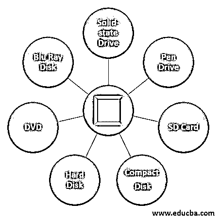

# 辅助存贮器

> 原文：<https://www.educba.com/secondary-memory/>

## 二级存储器简介

你知道处理器的内存既昂贵又有限，也称为主内存。更快的主存储器也是易失的。如果我们需要永久存储大量数据或程序，我们需要更低的成本和永久存储器。二级记忆叫做这个。我们在这里讨论的是用于存储大量数据、音频、视频和多媒体文件的辅助存储设备。辅助存储器也适用于设备可以在其上存储数据和程序的各种存储介质。指定的或可移动的辅助存储媒体。固定存储媒体是连接到电脑的类似硬盘的内部存储媒体。可从计算机中取出的便携式存储介质称为可移动存储介质。

### 顶级辅助内存设备

让我们看看二级记忆。

<small>网页开发、编程语言、软件测试&其他</small>

#### 1.固态驱动器

此外，SSD 是用于存储和访问数据的非易失性存储介质。与硬盘相比，它提供了许多优于 SSD 的优势，例如更快的访问时间、更低的功耗、无噪声操作等等。随着 SSD 成本的下降，它已经成为笔记本电脑和台式机上标准硬盘的绝佳替代品。也适合存储空间不大的平板和笔记本。

#### 2.笔式驱动器

第二便携式存储系统是笔驱动。USB 闪存驱动器、拇指驱动器或跳线驱动器也是已知的。它通过 USB 端口连接到计算机。它通常用于在计算机之间存储和传输信息。例如，可以使用计算机编写报告，然后复制或传输到笔驱动器。稍后，要访问或编辑您的论文，您可以将笔驱动器连接到一个设备。在 pen drive 中，您还可以存储重要的文档和图像、音乐和视频，并将其保存在安全的地方。笔驱动器没有移动部件；它包括一个内置的电路存储芯片来存储数据。芯片装在铝或塑料外壳内。笔驱动器的存储容量通常为 2g 到 128 GB。它也是一个播放设备和插头，因为没有进一步的驱动器，硬件或软件需要使用。

#### 3.sd 卡

安全数字卡代表 SD 卡。它通常用于智能手机和数码相机等移动设备。你可以把它从你的系统中移除，你可以看到存储在读卡器计算机上的东西。SD 卡包含几个存储数据的存储芯片。没有活动部件。SD 卡并不完全相同，因此它们在速度、大小和容量上可能互不相同。普通 SD 卡、微型 SD 卡和迷你 SD 卡是 SD 卡的一些例子。

#### 4.光盘

光盘是围绕一个介质磁盘便携式二级存储设备。它由塑料聚碳酸酯组成。1982 年，飞利浦和索尼共同开发了 CD 的概念。第一张 CD 是 1982 年 8 月 17 日在德国飞利浦车间制作的。它最初用于存储和播放录音，后来用于存储文档、视频、音频文件和其他数据，如 CD 上的软件。

#### 5.硬盘

它是一种用于数据存储的硬磁盘。它永久存储数据，位于驱动器内部。硬盘也称为硬盘驱动器。它是永久存储数据的硬磁盘，因为它是非易失性存储单元。硬盘位于电脑主板上的驱动装置中，由一个或多个密封包装的磁盘组成。当磁头在旋转时经过盘时，数据被写在盘上。

#### 6.数字影碟

飞利浦、松下和东芝在 1995 年共同开发了他们的 DVD。对于数字各种光盘或数字视频光盘，DVD 是简称。它是一种用于存储光学数据的光学介质形式。虽然它和 CD 一样大，但它的存储容量却比 CD 大得多。它还通常用于存储和显示电影，以及分发软件程序，因为它们太大而不适合放在 CD 上。

#### 7.蓝光光盘

蓝光光盘是一种高清晰度、多媒体文件的光存储介质。与 DVD /CD 相比，BD 使用的激光波长更短。这允许写臂更紧密地集中在磁盘上，从而封装更多的数据。最多可存储 128 GB 的 BD。

### 推荐文章

这是二级记忆指南。在这里，我们讨论二级存储器及其不同设备的介绍，如固态硬盘、笔驱动器、SD 卡等。详细地说。您也可以浏览我们推荐的其他文章，了解更多信息——

1.  [理解 Scala 的概念](https://www.educba.com/what-is-scala/)
2.  [科特林 vs Scala |十大对比](https://www.educba.com/kotlin-vs-scala/)
3.  [Scala 版本介绍](https://www.educba.com/scala-versions/)
4.  [Scala 数据类型概述](https://www.educba.com/scala-data-types/)

