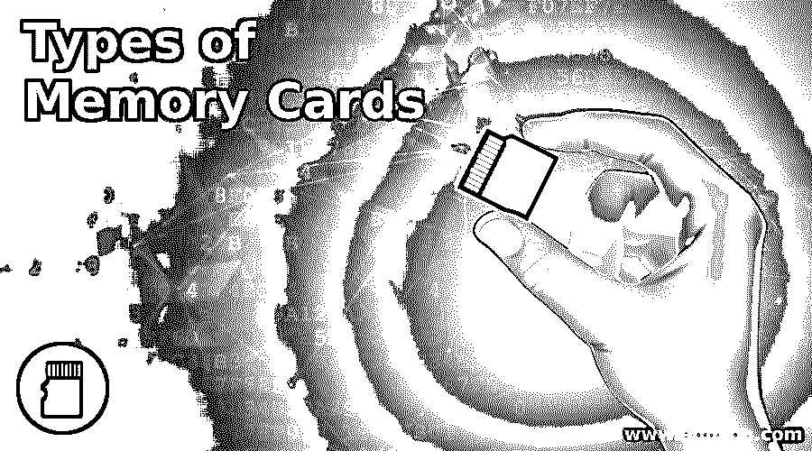

# 存储卡的类型

> 原文：<https://www.educba.com/types-of-memory-cards/>

## 存储卡介绍

存储卡用于在诸如手机、数码相机以及其他手持设备的电子设备中存储数据。这是一种非易失性闪存，这意味着即使您从设备中取出卡，它也不会丢失数据。此外，存储卡可以重复使用，重新格式化和数据可以从卡上删除。用户应该根据自己的容量、价格和兼容性来选择存储卡。这取决于设备是否支持特定类型或特定大小的存储卡。有不同类型的存储卡。现在，一天卡已经变得更小，但容量更大。最常见的存储卡类型是微型和普通版本的安全数字存储卡和紧凑型闪存存储卡。

### 各种类型的存储卡

下面给出了各种类型:

<small>网页开发、编程语言、软件测试&其他</small>

#### 1.紧凑型闪存卡

紧凑型闪光灯也被称为 CF 卡，是摄影师使用的。CF 卡比 SD 卡大很多，用的也少。它们提供更大的存储空间以及更高的运行速度。

有两种不同容量的 CompactFlash 卡:

*   **I 型卡:** 42.8mm x 36.4mm x 3.3 mm 厚。
*   **ⅱ型卡:** 42.8mm x 36.4mm x 5.5 mm 厚。

#### 2.安全数字卡

安全数字是 SD 卡的基本格式。SD 卡的尺寸为 32 mm x 24 mm，厚 2.1 mm。这些 SD 卡的大小限制为 4GB。这些卡的速度比其他 SD 卡要慢。

#### 3.安全数字高容量

安全数字高容量卡(SDHC)旨在存储高清照片和视频。此卡的大小和形状与标准 SD 卡相同，任何支持 4GB 内存的 SD 卡都是 SDHC 卡。SDHC 卡的存储容量高达 64 GB。

下面给出了最低速度的 SDHC 卡的等级列表。

*   2 级 SDHC 卡支持最低 2 MB/s 的速度
*   4 级 SDHC 卡支持最低 4 MB/s 的速度
*   6 级 SDHC 卡支持最低 6 MB/s 的速度
*   8 类 SDHC 卡支持最低 8 MB/s 的速度
*   10 级 SDHC 卡支持最低 10 MB/s 的速度

#### 4.安全数字扩展容量

安全数字扩展容量(SDXC)卡是 SDHC 卡的更高版本。这些卡的存储容量为 64 GB，最大可达 2 TB。1 类 SDXC 卡支持最低 10 MB/s 的速度，而 3 类 SDHC 卡支持最低 30 MB/s 的速度

#### 5.微型安全数字高容量

Micro Secure Digital High Capacity(Micro sdhc)卡可存储高达 32 GB 的数据。像 SDXC 一样，它每秒可以传输 10 兆字节。
Micro Secure Extended Capacity(micros dxc)卡与 SDXC 相同，支持超过 32 GB 和高达 2 TB 的存储。
它传输数据的速度比 MicroSD 和 MicroSDHC 更快。

#### 6.极限数字图像卡

Extreme Digital Picture Card 也称为 xD-Picture Card 是一种用于数码相机的可移动闪存。它是由富士胶片和奥林巴斯公司开发的。其尺寸为 20 毫米 x 25 毫米，厚度为 1.7 毫米。

#### 7.索尼记忆棒

索尼记忆棒小巧轻便，用于数码相机、录音机等各种设备。通过适配器，它可以与兼容 Memory Stick PRO 的所有设备一起使用。Memory Stick Micro (M2)的尺寸为 15 毫米 x 12.5 毫米 x 1.2 毫米，而 Memory Stick PRO 的尺寸为 50 毫米 x 21.5 毫米 x 2.8 毫米。它用于高像素数码相机和数码摄像机。Memory Stick PRO DUO 的尺寸为 31mm x 20mm x 1.6mm。Memory Stick PRO DUO 提供 Memory Stick PRO 媒体的高级功能。

### 结论

在本文中，我们看到了各种类型的存储卡及其功能。您可以根据自己的需求以及存储容量、传输速度、卡的大小和兼容性来选择任何一种卡。

### 推荐文章

这是存储卡类型的指南。这里我们分别讨论存储卡的类型和 7 种类型。您也可以看看以下文章，了解更多信息–

1.  [C 中的内存分配](https://www.educba.com/memory-allocation-in-c/)
2.  [什么是堆内存？](https://www.educba.com/what-is-heap-memory/)
3.  [什么是 Memcached？](https://www.educba.com/what-is-memcached/)
4.  [Java 中的内存类型](https://www.educba.com/types-of-memory-in-java/)

