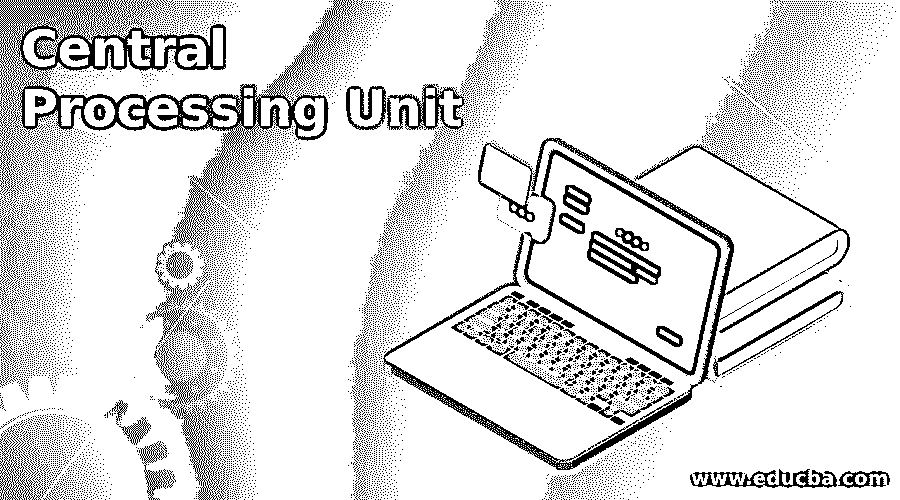

# 中央处理机

> 原文：<https://www.educba.com/central-processing-unit/>

## 中央处理器简介

众所周知，中央处理器(CPU)是计算机的大脑，它按照编写的逻辑顺序一条接一条地执行程序代码。它运行系统软件(操作系统)和应用软件。它接受来自用户和其他活动程序的输入，处理数据，将中间结果存储在内存中，并将最终输出显示在计算机屏幕上或存储在外部存储器中。CPU 是一个电子电路，它按照程序流程执行逻辑、基本运算、输入/输出和控制功能。CPU 也称为处理器，主要指除主存储器和 I/O 单元之外的处理和控制单元。

### 中央处理器的历史

下面给出的是中央处理器的历史:

<small>网页开发、编程语言、软件测试&其他</small>

#### 1.定制设计 CPU

在 20 世纪 40 年代的最初几天，计算机被连线来执行各种任务，并且没有软件代码。CPU 是定制设计的，并作为独特计算机的一部分使用。这些计算机被称为固定程序计算机或存储程序计算机。真空管和继电器用于这些房间大小的水冷计算机。

#### 2.晶体管中央处理器

在 20 世纪 50 年代和 60 年代，不可靠的重型真空管和继电器被小型晶体管所取代。更复杂的 CPU 和其他关键部件一起被安装在印刷电路板上。IBM system 360 是 IBM 在 1964 年推出的第一台大型计算机。IBM 使用微编程概念使计算机兼容，IBMS 360 架构非常受欢迎，并统治大型机市场多年。

基于晶体管的 CPU 具有更高的性能水平、更高的可靠性、更低的功耗和 10 Mhz 的时钟频率。集成电路 CPU 为 SIMD 矢量处理器等新型处理器铺平了道路，并促进了克雷和富士通超级计算机时代的到来。

#### 3.小规模集成

多个互连的晶体管被容纳在一个叫做芯片的紧凑的半导体空间中。最初，非专用数字电路出现在这些芯片中，这种集成电路被称为小规模集成器件(SSI)。SSI 集成电路最初用于阿波罗计算机，后来用于 IBM S/370，PDP- 10。它可能需要数百个芯片来构建一个 CPU，但它节省了大量的电力和空间。

#### 4.大规模集成

金属氧化物半导体场效应晶体管(MOSFET)促进了大规模集成电路的发展。极低的功耗、高可扩展性、容纳更高密度晶体管的能力是 LSI 电路的独特之处。PDP-11 计算机是第一个 LSI 实现。

#### 5.微处理器

在微处理器中，所有的 CPU 部件都容纳在一个小的集成电路上，由于这种设计，这些 CPU 的时钟频率高达几 GHz。MOS 集成电路技术引发了 20 世纪 70 年代微处理器的发明。1971 年的英特尔 4004 和 1974 年的英特尔 8080 主导了所有其他 CPU 的实现。它的指令集能够向后兼容大型机中的早期硬件和软件版本。微处理器成了 CPU 的同义词。

### 中央处理器的组件

下面给出了中央处理器中的三个主要基本组件:

*   算术逻辑单元
*   控制部件
*   登记

几乎没有附加组件，如地址生成单元、存储器管理单元、高速缓存。

#### 1.算术逻辑单元

ALU 负责算术和逻辑运算。

这些操作的输入如下:

*   **数据(操作数):**由寄存器提供，该寄存器存储先前操作的结果或来自外部存储器的新鲜数据或内部管理的常数值
*   **代码(操作):**由控制单元作为指令进给。

在操作结束时，结果被存储在内部寄存器中，用于下一次操作，或者如果步骤完成，则通过控制单元存储在外部存储器中，并且相应地更新状态寄存器。执行这些操作的速度称为时钟速率，CPU 根据时钟速率进行分类。

#### 2.控制部件

组件如下:

*   控制 CPU 的操作。
*   在正确的时间向 ALU、内存和 I/O 设备发出信号，向 CPU 中的所有单元发出指令。
*   将数据从外部存储器移动到 ALU。
*   将处理的输出存储在外部存储器中。

#### 3.登记

寄存器为保存 a .中间结果，by ALU 处理前的传输数据，c .移动到外部存储器前的输出数据，d .指令，e .存储器地址提供存储空间。有些寄存器供内部使用，不能从外部访问，有些可供用户访问。

下面给出了几个寄存器:

*   指令寄存器从程序计数器中取出指令供处理器执行。
*   存储器缓冲寄存器。
*   存储器数据寄存器。
*   存储器地址寄存器。

#### 4.地址生成单元

这个单元计算需要从中提取数据的内存地址。该单元与其他单元并行运行，节省了执行时间并提高了性能。

#### 5.存储器管理单元

这个单元处理逻辑地址到物理地址的转换，管理内存分页和虚拟内存。

#### 6.隐藏物

频繁访问的数据存储在靠近处理器的高速缓存中，作为 CPU 的一部分，以避免不必要的 I/O 操作并减少处理时间。

### 中央处理器的工作

任何 CPU，无论其大小、形式和复杂性如何，都执行包含一组逻辑顺序指令的程序。CPU 处理第一条指令，并在程序计数器中寻找下一条指令。如果下一条指令是跳转语句，则控制需要转移到的相应指令地址存储在程序计数器中，程序跳转到该位置，并从该位置继续执行。在一些有多个处理器的计算机中，允许多条指令同时并行执行。

执行过程中的各种步骤对于大多数计算机来说是常见的，它们是获取、解码和执行。

#### 1.取得

这个步骤从存储程序的内存中获取指令。指令的地址存储在程序计数器中，一旦地址被处理，它就被索引到逻辑序列中的下一条指令。由于内存较慢，提取指令可能需要一些时间，这可以通过将指令存储在缓存中来解决。

#### 2.译

指令被解码，要执行的操作的类型和要执行的操作的操作数被挑选出来。

#### 3.执行

使用操作码和操作数执行执行步骤，结果存储在寄存器中。

### 中央处理器的优势

下面是提到的优点:

*   CPU 是计算机的心脏和大脑，是计算机的基本单元。
*   它体积小，非常适合主板上的插槽。它为手机、平板电脑、嵌入式电脑等小型计算机的设计提供了便利。
*   在一台计算机中安装多个处理器可以增强算术和逻辑运算的能力。
*   它处理数学和商业数据的速度更快。

### 结论

计算机的尺寸不断缩小，它们出现在手表、玩具、机器和地球上的一切东西中。这是通过 CPU 设计和功能的匹配即兴发挥而成为可能的。CPU 是计算机的重要组成部分。

### 推荐文章

这是中央处理器指南。在这里，我们分别讨论了 CPU 的介绍、历史、组件、工作和优点。您也可以看看以下文章，了解更多信息–

1.  [逻辑地址](https://www.educba.com/logical-address/)
2.  什么是注册？
3.  [计算机体系结构的类型](https://www.educba.com/types-of-computer-architecture/)
4.  [计算机硬件的类型](https://www.educba.com/types-of-computer-hardware/)

