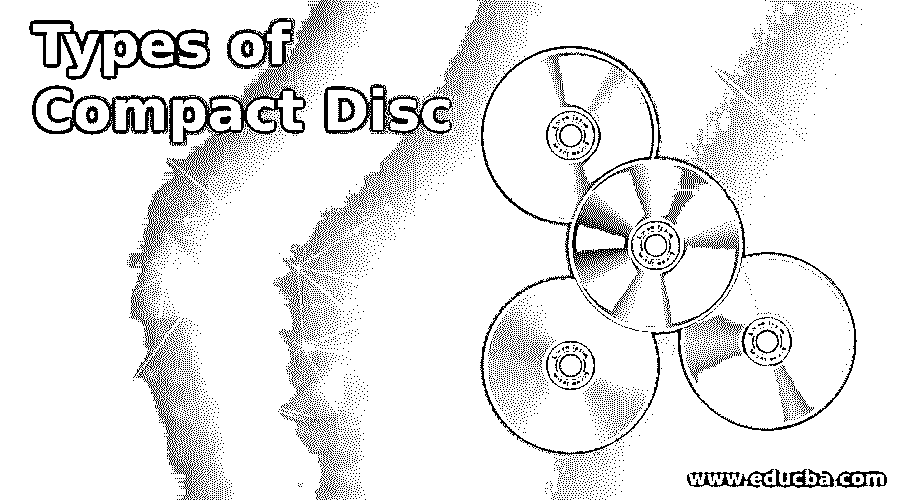

# 光盘的类型

> 原文：<https://www.educba.com/types-of-compact-disc/>

## 光盘介绍

在各种类型的光盘中，光盘(简称 CD)早在 20 世纪 80 年代就已经取代了磁带介质，用于存储音频、视频和计算机数据文件。在 1990- 2010 年期间，许多音频和视频专辑以 CD 格式发行，CD 是软件发行、升级和许可副本的标准媒体。CD 是为用户和所有使用 CD 磁盘驱动器的个人计算机保存重要文件的备份介质。与软驱不同，CD 是一种便宜、便于携带、功能强大的媒体，而且对用户非常友好。这是一个去年留声机的微缩版，信息以坑和脊的形式存储在光盘表面的螺旋轨道上。红色激光识别凹坑并将其转换成数据。在这篇文章中，让我们学习各种类型的光盘。

### 光盘的类型

光盘可以分为以下几类:

<small>网页开发、编程语言、软件测试&其他</small>

*   **操作:**只读、可记录、可重写
*   **最终用途:**视频、音频、照片、图形
*   **内容质量:**超级音频、超级视频、数字多功能光盘(DVD)

#### 1.光盘

ROM 代表只读存储器。存储在这些类型的 CD 中的内容只能被读取，但不能被任何人修改。任何标准的激光唱机都可以播放这张 CD。这种媒体最初主要用于预录音乐市场。随后，计算机软件、许可证、数据和教育内容通过这些类型的 CD 分发。这种介质可以存储 650 MB 的数据。

#### 2.可记录光盘(CD-R)

内容可以通过连接到计算机的 CD 驱动器或外部 CD 驱动器写入该媒体。一张新的 CD 上涂有一层染料，当光线通过时，这种染料会变色。这种染料本质上是感光的。CD 刻录机在写入数据(刻录数据)时，通过特殊的激光照射染料并改变染料的颜色。这些 CD 可以通过任何普通的 CD 播放器读取。在读取时，颜色的变化被感应并读取数据，类似于通过普通 CD 中的坑和脊读取数据。

物理染料层具有保存期限，并且随着时间的推移，其特性可能会恶化，从而导致错误。CD 的寿命取决于 CD 的储存条件和质量。在 CD 的任何给定部分只能录制一次，并且不能重写或更改。信息可以添加到 CD 的未刻录区域。

#### 3.可重写 CD (CD-RW)

这种介质使用金属合金作为 CD-R 中的染料。在 CD 写入期间，金属合金层的属性被激光射线改变。合金性质的任何变化，即可以通过其反射率来跟踪晶体或无定形的，并且在读取时使用这种变化。大多数 CD 读取器可以读取以这种方式刻录的 CD，绕过低强度激光而不改变其特性。这张 CD 中的数据可以擦除，新数据可以存储任意次数。

在重写时，使用激光熔化金属层来初始化金属层，并且数据被新存储。与 CD-R 相比，写入需要更多的时间，并且金属层比染料退化得更快，与 CD-R 相比，这种介质的寿命更短

#### 4.音频 CD

索尼和飞利浦在一份名为红皮书的文件中提出了这种媒体的格式，红皮书是以文件封面的颜色命名的。这种格式被正式称为光盘数字音频(CD-DA)。附加文本信息，如专辑、歌曲和歌手的名称，存储在标准音频 CD 中一个 5KB 大小的指定区域。

这些音频 CD 也具有存储图形信息的能力，但是它需要专用的 CD 和图形播放器来显示图形数据。歌曲的歌词主要以图形格式存储，在歌曲播放时显示。有时，玩家会被电视或电脑显示器所吸引。扩展图形版本在子代码通道中存储额外的文本/视频信息，很少有人接受这种格式。

#### 5.超级音频 CD

1999 年，索尼和飞利浦再次开发了这种格式，它提供了一种更高保真的音频格式。这些只读光盘以高分辨率的质量充斥着音乐爱好者的耳朵。它有混合版本，其中标准音频格式以及超级音频格式都可用。

#### 6.音乐光盘

用于存储音乐演奏数据，并在电子乐器中播放时支持音频合成。

#### 7.视频光盘

视频内容以标准数字格式存储在 CD 上。VCD 标准被称为白皮书标准，由松下、JVC、索尼和飞利浦于 1999 年制定。VCD 具有与 VHS 相似的图像质量，并且在使用时 VCD 的质量不会像 VHS 那样快速下降。这张 CD 可以在电脑、VCD 和一些 DVD 播放机上播放，分辨率为 352 x 240。

#### 8.超级视频光盘

这是一个优于 VCD 2.7 倍分辨率的版本。它在画质和技术特性上介于 VCD 和数字视盘之间。它可以保存很长的视频。

#### 9.照片光盘

由柯达独家设计，通过编码功能存储高质量的扫描照片、幻灯片和图像。任何装有特定软件或照片光盘播放器的电脑都可以播放这些光盘。

#### 10.CD-i

这些交互式光盘存储音频、视频和图像，需要 CD-I 播放器来播放多媒体光盘中的内容。

#### 11.数字影碟

数字视盘的容量是普通 CD 的 6 倍，最多可存储 4.7GB 的内容。DVD 在高质量的电影发行中被广泛使用，它远远优于 VCD 和 VHS。交互式菜单，评论，删除场景是其独特的功能。它能够在其两面(顶部和底部)存储数据。它将数据存储在不止一层上。尺寸和使用的技术与普通 CD 相同，但多面和多层的内部存储功能给 DVD 带来了明显的优势。

### 结论

随着宽带互联网和顶级产品(OTT)产品的出现，音频或电影内容作为下载在互联网上销售。软件和许可证组件也可以通过互联网下载。在过去的十年里，CD 的使用已经减少了，但是 CD 并没有消失，它仍然存在。

### 推荐文章

这是一份光盘类型指南。在这里，我们讨论了光盘的介绍，11 种类型的详细解释。您也可以浏览我们的其他相关文章，了解更多信息——

1.  [计算机内存的类型](https://www.educba.com/types-of-memory-in-computer/)
2.  [计算机语言的种类](https://www.educba.com/types-of-computer-language/)
3.  [计算机蠕虫的种类](https://www.educba.com/types-of-computer-worms/)
4.  [计算机体系结构的类型](https://www.educba.com/types-of-computer-architecture/)

