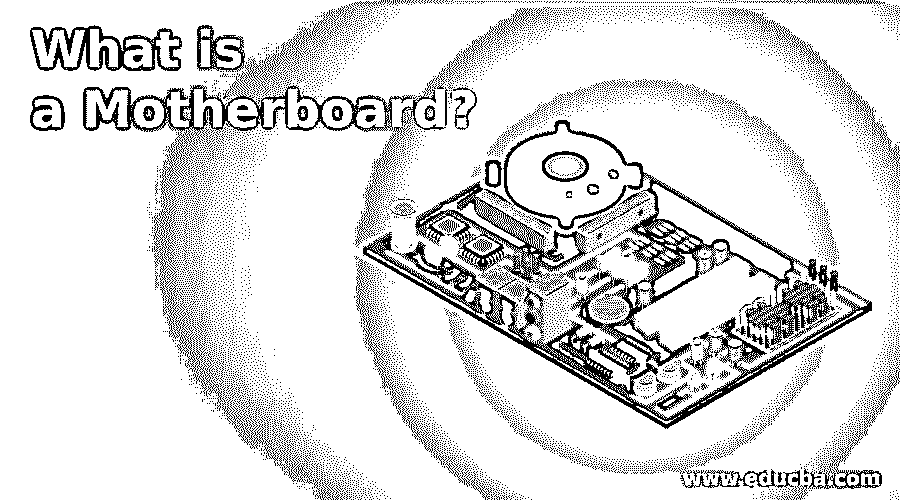
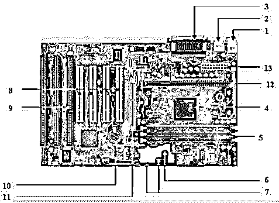

# 什么是主板？

> 原文：<https://www.educba.com/what-is-a-motherboard/>

## 主板介绍

主板被定义为计算机系统的电路板，也称为逻辑板或主板。在计算机系统中，最大的部件是主板，它控制计算机系统的所有部件，并在所有部件之间建立链接。从主板上，不同的组件如 rom、CPU、RAM、PCI 插槽、USB 端口和其他组件被连接。控制器的设备也像 DVD

### 主板的组件

在下面的部分中，主板的一些重要组件定义如下:

<small>网页开发、编程语言、软件测试&其他</small>

#### 1.键盘和鼠标

主要有两种类型的鼠标和键盘连接器。第一个连接器称为 PS/2，第二个连接器称为 USB。

#### **2。通用串行总线**

USB 端口用于连接计算机系统。在计算机系统中，有各种类型的设备与 USB 端口相连，如键盘、鼠标、照相机、扫描仪、打印机和其他设备。USB 端口的主要用途是连接外围设备和计算机主板。连接到计算机系统的外围设备可以在不重启系统的情况下被插入或移除，这是 USB 端口的主要优点。

#### 3.并行端口

过去使用的老式打印机使用并行端口与计算机系统连接。在并行端口中，多根导线用于在单个实例中发送或接收多位数据。另一方面，串行端口一次只使用一根线。在并行端口中，使用 25 针母 DB 型连接器。

#### 4.CPU 芯片

中央处理器是控制计算机系统所有功能的处理器。任务和功能的总体流程由中央处理器控制。对于计算机系统来说，中央处理器被称为计算机系统的大脑。

#### 5.RAM 插槽

RAM 插槽用于连接计算机系统中的 RAM(内存)。在一般的计算机系统中，主要有两个 RAM 插槽，但有时在主板上可以有四个以上的插槽来增加计算机系统的内存。

#### 6.软盘控制器

旧的主板芯片包含一个 34 针类型的带状电缆，用于连接计算机系统和软盘驱动器。在这种带状电缆中，一端直接与计算机系统连接，一端与主板连接。

#### 7.IDE 控制器

集成驱动电子设备也称为 ATA 或并行 ATA。IDE 是为硬盘控制而发布的组件类型。在当今的计算机系统中，IDE 控制器支持的是不支持的。

#### 8.PCI 插槽

PCI 的完整形式是一个外围组件接口。PCI 插槽主要用于插入计算机上的扩展卡。其他 PCI 设备也可以像声卡、网卡、显卡、网卡、调制解调器和其他设备一样连接。在今天的计算机系统中，对 PCI 扩展槽的支持是不存在的。

#### 9.ISA 插槽

工业标准体系结构(ISA)被定义为扩展总线的标准体系结构。用于连接输入设备和调制解调器的 ISA 插槽。

#### 10.CMOS 电池

CMOS 电池用于存储主板上的 BIOS 设置。CMOS 电池也能够存储时间和数据。

#### 11.AGP 锁

AGP(加速图形插槽)是一种计算机插槽，用于将显卡连接到系统。该时隙是高速时隙，因此可以高速进行数据传输。

#### 12.CPU 插槽

CPU 插槽是一种端口，用于将中央处理器连接到计算机系统的主板。

#### 13.电源插槽

电源插槽用于向计算机系统提供电源，使其能够启动并执行其功能。提供给系统的总电源约为 110 交流电。在电源型连接器中，共有 20 个针脚，用于维持计算机系统的电源供应。

### 主板因素

主板的主要外形因素是尺寸和形状。其他因素包括物理布局、安装孔和电路板结构。

在下面的部分中，提到了一些外形规格:

#### 1.ATX

在这种类型中，为鼠标、键盘、输入/输出设备、视频连接器和其他设备定义了标准位置。在 1990 年，ATX 形状因子被开发出来。此外形规格的扩展槽有新的位置，扩展槽有单独的空间，以便可以与主板连接。

#### 2.微型 ATX

微型 ATX 的优势与 ATX 外形相同。主要的区别在于系统设计的改进，因此随着主板尺寸的减小，组件的总成本也随之降低。通过减少主板上的 I/O 插槽数量来减小尺寸。

### 主板的用途

主板是计算机系统中的主要组件，用于连接计算机系统的所有组件，以便它们可以在系统中执行多种任务和功能。主板被认为是系统的中枢，因为所有组件都连接到单个电路板来执行它们的功能。主板是一种昂贵的设备，一旦损坏，用户需要花很多钱为计算机系统购买新的主板。主板是一个中心设备，所有设备都在这里连接，并维持计算机系统中的流量。

### 结论

主板是安装在计算机系统中的一种电路板，计算机系统的所有组件都连接在主板上。主板被认为是计算机系统的支柱。根据预算、需求、要求和速度，主板有不同的形式。主板被认为是一个中枢，所有不同的计算机设备都通过它连接起来。

### 推荐文章

这是一个什么是主板的指南。在这里，我们讨论了主板的介绍，它的组件，因素和用途的解释。您也可以浏览我们的其他相关文章，了解更多信息——

1.  [主板类型](https://www.educba.com/types-of-motherboard/)
2.  [GIS 组件](https://www.educba.com/gis-components/)
3.  [计算机硬件的类型](https://www.educba.com/types-of-computer-hardware/)
4.  [什么是嵌入式系统？](https://www.educba.com/what-is-embedded-systems/)

