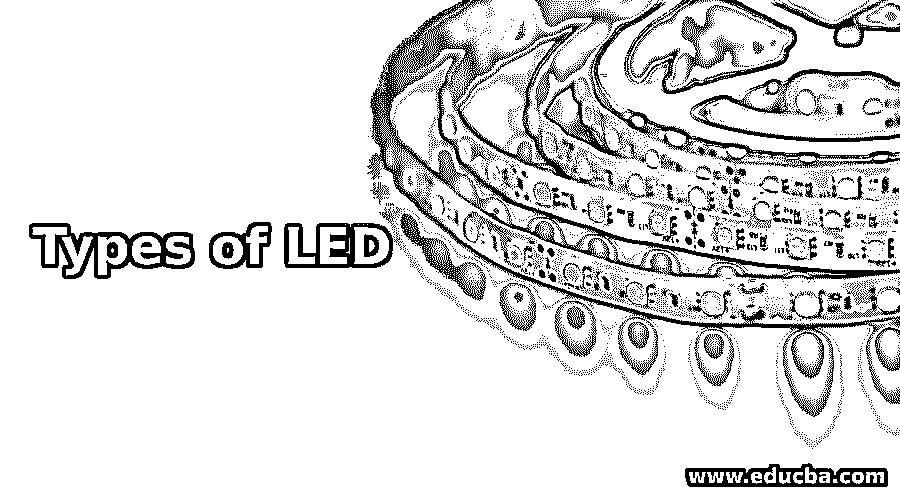

# LED 的类型

> 原文：<https://www.educba.com/types-of-led/>

## LED 类型介绍

以下文章概述了 LED 的类型。在过去，LED 的使用是有限的，并且仅在少数设计中可用。但如今，技术发展到了一个更大的程度，LED 以不同的风格实现，如高尔夫球、灯管、反射器、GLS 和聚光灯。它的功率与白炽灯泡不同，有不同的配件，如卡口和螺丝。

与其他灯泡相比，这个价格是合理的。因此它在电费方面提供了相当大的成本削减。LED 被扩展为发光二极管是由于电致发光效应而发射光能的半导体元件。它由 PN 结组成，以正向偏压发射光。它适用于所有领域，如汽车、路灯、办公室和家庭照明、智能手机和电视。

<small>网页开发、编程语言、软件测试&其他</small>

### 9 种不同类型的 LED 列表

LED 的广泛应用具有体积小、坚固耐用、寿命长、耗电少、可瞬间切换等先进特性。由于这些可靠的特性，LED 在大量人群中获得了更多的关注。学生、工程师和电子爱好者喜欢在他们的项目中使用 LED。

#### 1.变光开关

与其他灯泡类似，LED 配有调光开关。与 LED 灯泡的调光开关相比，普通白炽灯泡的调光开关效果不佳。因此，建议用 LED 灯泡取代标准灯泡，因为它比其他标准灯泡的瓦数更低。

#### 2.彩色 LED

彩色 LED 吸引着每一个人，有三种类型可供选择，如冷白光 LED、暖白光 LED 和日光 LED。大多数家庭使用暖白色的卤素灯泡。日光 LED 中的颜色，其中有明显的白色和淡蓝色，主要用于突出真实的颜色。

#### 3.照明用 LED 灯管

它的实现是为了替代荧光灯管，在少数情况下，它可以是单一悬挂的替代品。其他设计需要新的镇流器和重新布线。它通过沿着灯管长度提供一系列 LED 微型产品来运行，并且可以按照预期的尺寸使用。

#### 4.SMD LED

它被扩展为表面安装器件，在 LED 照明中很受欢迎。安装在灯泡中的 SMD 芯片具有额外的亮度，这在办公室和家庭中是可靠的。

#### 5.COB LED

COB 代表板上芯片，这是另一代 LED，提供比 SMD 更强的光量，并具有可访问的选项，因为用户认为这是一束控制光。它提供了更好的流明功率比，这表明它具有高生产率。

#### 6.石墨烯 LED

热门频道 BBC charged the evolution of light 包含 LED 灯丝形状，内衬石墨烯，并被标记为 2015 年末最可用的一种。它比标准灯泡更便宜，并声称可以减少大约 10%的能源费用。石墨烯的用途是由一位在曼彻斯特大学工作的俄罗斯科学家发明的。这场战斗现在正在进行，并有助于找到耐用材料的创新用途。

#### 7.传统和无机发光二极管

它可以用传统的嵌入二极管的方法获得，并由无机元件制成。最广泛应用的发光二极管由化合物半导体制成，如磷化镓砷、铝镓砷等。LED 灯的颜色取决于所用的材料。

这些发光二极管被拟人化为一个小的发光二极管，这是隐含在指示面板与各种形式的发光二极管及其类型。它甚至可以被归类到无机 LED 中，该无机 LED 具有各种类型的 LED，如可以通过可变电压操作的表面安装 LED、闪光 LED、多色和双色 LED、5mm 单色 LED、字母数字 LED 显示器。这种类型的无机发光二极管被大量使用。

#### 8.最大亮度 led

高强度 LED 和高亮度 LED 属于无机 LED，并开始在照明和装饰应用中实施。这种类型的 LED 现在正成为与无机 LED 相同的指令，并且具有最大光能输出。为了获得最大的光输出，LED 需要可管理的功耗和电流水平。LED 可以安装在散热器上，以消除散发的多余热量。

当谈到效率时，LED 是许多传统照明的重要替代品。自动灯家庭照明现在被广泛使用。与节能灯、紧凑型荧光灯和白炽灯相比，它在环境因素和效率方面有很大优势。HBLEDs 的效率水平最高，并且在多次关闭和打开时具有较长的寿命。但是这种灯泡的寿命是有限的，当它被忽略的时候。

#### 9.有机 LED

有机 LED 采用发光二极管的基本概念。顾名思义，LED 是由有机元件制成的。基本发光二极管使用具有不同掺杂水平的基本无机半导体，并从作为光焦点的专用 PN 结发射光。有机 LED 显示器制造成薄片，并产生漫射光区域。

大多数情况下，它是印刷在玻璃基板上的薄膜材料。由半导体元件制成的电路，用于将电荷传输到嵌入的像素，使 LED 发光。LED 技术随着其效率水平不断提高，在任何领域都没有界限。

### 结论

灯泡的亮度是通过瓦数来评估的，它和白炽灯泡一样好。但是，与普通 LED 相比，LED 具有惊人的功耗系数，可以产生相同数量的光能，这就是为什么 LED 在所有行业都是首选和适用的。如今，各种各样的设计和颜色被引入，使它们在这个竞争激烈的电子世界中得以持续。

### 推荐文章

这是一份 LED 类型指南。这里我们分别讨论 LED 的介绍和 9 种不同类型的列表。您也可以看看以下文章，了解更多信息–

1.  [主板类型](https://www.educba.com/types-of-motherboard/)
2.  [计算机内存的类型](https://www.educba.com/types-of-memory-in-computer/)
3.  [大型计算机的种类](https://www.educba.com/types-of-mainframe-computers/)
4.  [电脑线缆的种类](https://www.educba.com/types-of-computer-cables/)

