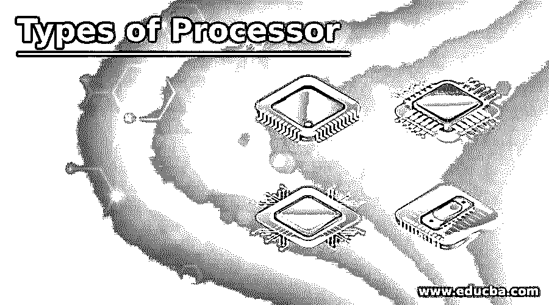

# 处理器的类型

> 原文：<https://www.educba.com/types-of-processor/>

## 处理器简介

以下文章概述了处理器的类型。处理器被定义为对基本指令和输入过程作出反应以操作计算机的逻辑电路或简单芯片。处理器的重要目的是获取、解码、处理、执行和写回作为对芯片指令的反馈。处理器被称为任何集成到笔记本电脑、计算机、智能手机和嵌入式系统中的电子系统的大脑。控制单元和算术逻辑单元是处理器的两个重要组成部分。

逻辑功能可以是加法、乘法、减法和除法，而控制单元根据输入指令管理遵循操作或命令的业务流。该处理器与相邻组件交互，相邻组件可以是它们的输出、输入、存储和记忆组件。

<small>网页开发、编程语言、软件测试&其他</small>

### 不同类型的处理器

不同类型的处理器是微处理器、微控制器、嵌入式处理器、数字信号处理器，并且处理器可以根据设备而变化。CPU 的重要元件被标记为处理器和系统的心脏元件。控制单元激活、获取并执行输入指令。处理器可以嵌入在微处理器中，并由单元 IC 芯片组成。但是有些设备是基于多核处理器的。它包括一个或多个 CPU。它是一个典型的微型元件，引脚嵌入在主板上。也可以通过风扇和散热器连接到主板上，以分散产生的热量。

#### 1.微处理器

系统的基本过程由嵌入在嵌入式系统中的微处理器来表示。市场上有不同企业实现的各种类型的微处理器。微处理器是一个标准处理器，由 ALU、控制单元和一组寄存器组成，称为控制寄存器、状态寄存器和暂存寄存器。

它可以是片上存储器，少数接口可以通过中断线路与外部世界交互，其他接口可以是端口和存储器寄存器，用于与外部世界交互。这些端口通常被称为可编程的，使他们作为输出或输入。这些程序可以根据设备的行为进行输入和修改。

一个或两个微处理器可以合并成一个多处理器。输入输出操作和内存由处理器共享。对于每个处理器来说，存储器寄存器中的访问时间是相似的，并且每个处理器通过总线相关联。工作和访问以及它们的输入和输出功能由处理器相互共享，以执行相同的功能。

#### 2.微控制器

微控制器是标准的，有不同的尺寸和封装。输入读取并对其相应的输出做出反应是基本微控制器的基本功能，因此它被称为通用输入输出处理器(GPIO)。一些微控制器是 Microchip P1C16F877A、Microchip Atmega328、Microchip P1C18F45K22、Microchip P1C16F671 和 Microchip P1C16F1503。

#### 3.嵌入式处理器

嵌入式处理器被构造成控制电气和机械功能。它包括许多模块，如定时器、程序存储器、数据存储器、复位、电源、数据存储器、中断控制器、时钟振荡器系统、接口电路、专用电路和系统应用端口和电路。

#### 4.数字信号处理器

数字信号处理器用于过滤、测量、压缩模拟和数字信号。信号处理意味着对数字信号的处理和分析。该过程可以使用专用集成电路、数字信号处理器、现场可编程门阵列来实现，或者可以是计算机来实现不同的信号。DSP 中的处理器用于条形码扫描仪、示波器、打印机、移动电话。这些处理器用于快速和隐含的实时应用。

### 处理器的组件

*   处理器的基本部分是控制单元、算术逻辑单元、寄存器、浮点、L1 和 L2 高速缓冲存储器。
*   算术逻辑单元由指令中操作数的逻辑和算术函数组成。
*   浮点单元被称为数字协处理器或数学协处理器。与基本微处理器电路的操作相比，它是一个快速处理数字的专门操作者。
*   寄存器用于保存指令和其它数据，以便将操作数送入 ALU，并存储运算结果。L2 和 L1 高速缓冲存储器节省了 CPU 从 RAM 中获取数据的时间。
*   主要功能是获取、解码、写回和执行。fetch 是从内存中获取指令并提供给 RAM 的函数。
*   解码是一个过程，在这个过程中，指令可以被编辑，以便从 CPU 的其他元素中理解需要在由指令解码器完成的操作中保持不变。在执行过程中，CPU 需要触发并执行这些功能。
*   市场上的许多处理器都是多核处理器，由多个 IC 组成，以增强处理器的性能，功耗有限，并提供同步处理来执行并行处理或多个任务。
*   多核心的安装有独立的处理器，因为它们被插入到一个插座中，并提供了一个共同建立的连接，使其速度更快。
*   在某些计算机中，它有两个或更多内核，并且可以增加到十二个内核。如果 CPU 一次只能用一组有限的命令进行处理，则称之为单核处理器。如果 CPU 同时执行两条指令，那么它就被称为双核处理器。
*   如果它遵循四组命令，那么它被称为四核处理器。如果有更多的核心，计算机可以同时服从多个命令。

### 结论–处理器类型

很少有处理器是使用虚拟化处理器内核的多线程处理器。这些处理器也称为 vCPU。它不像物理核心那样功能强大，旨在提高虚拟机的性能。它可以添加不必要的 vCPU 来影响整合率，整合率可以从四到六个内置的一个物理核心构建。

### 推荐文章

这是处理器类型的指南。这里我们讨论处理器的介绍，以及不同的类型和各自的组件。您也可以看看以下文章，了解更多信息–

1.  [嵌入式系统的类型](https://www.educba.com/types-of-embedded-systems/)
2.  [计算机体系结构的类型](https://www.educba.com/types-of-computer-architecture/)
3.  [计算机软件的种类](https://www.educba.com/types-of-computer-software/)
4.  [计算机语言的种类](https://www.educba.com/types-of-computer-language/)

