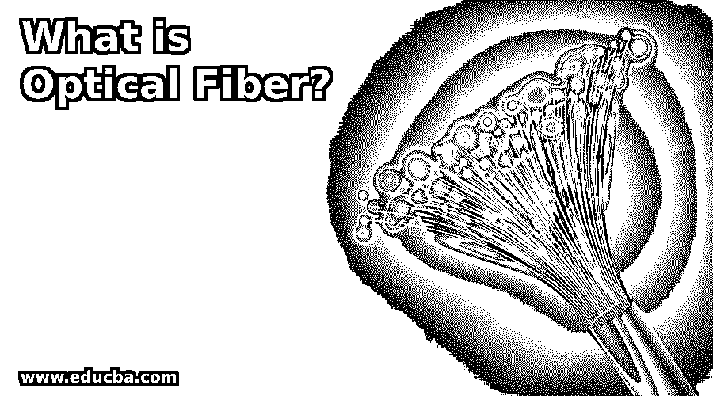

# 什么是光纤？

> 原文：<https://www.educba.com/what-is-optical-fiber/>

## 光纤概论

光纤是一种线，它是透明的纤维，也非常柔韧，由二氧化硅制成，或者可以由仅比人的头发粗的塑料制成。它的主要用途是传输光，也用于建立光纤通信。它能够长距离传输信号，但光纤的成本与其他类型的电缆相比并不昂贵。光纤能够处理所有类型的外部干扰，并且信号质量不会受到损害。

### 不同类型的光纤

下面给出了提到的不同类型:

<small>网页开发、编程语言、软件测试&其他</small>

#### 1.单一模式

在单模光纤中，只有一种模式用于传输光。电缆只能传输一种波长的光。单模的透射波长在 1310 nm- 1550nm 左右。因为仅传输一种模式的光是有限制的，但是与多模光缆相比，单模光缆能够以更少的损耗进行传输。与其他类型的光纤相比，这种模式的带宽要高得多。与多模类型的光缆相比，单模光纤的发展是最新的。

单模光纤中的纤芯尺寸非常小，几乎等于波长尺寸。这种模式下通过的光不属于可见光谱。因为传输方向是直线的，所以信号丢失的机会非常小，并且传输质量非常高。单模光纤在需要长距离发送信号并且传输速度需要很高的地方是最有益的。这种模式唯一的缺点是单模不容易耦合。

#### 2.多模式

在多模光纤中，可以有多种模式用于传输光。在多模模式中，不同模式光可以容易地传输。与单模光纤相比，多模光纤纤芯尺寸更厚。在这种电缆中传输的光的波长大约为 850-1300 纳米。因为在这种类型中，多种模式的光被透射，所以每种光具有不同的反射角，并且基于这种反射角，总反射数发生变化。也可以有一种光模式，其中光一次都没有击中核心。其中使用的主要原理是透射是全内反射，因此可以有一些模式的光具有一些不会引起内反射的反射角，因此它被包层吸收。

并且由于这种损失是在光传输时发生的。由于在电缆中传输的光有多种模式，这些模式具有不同的反射角，并且由于反射次数较多，信号可能仅在电缆内部完全丢失，无法到达目的地。较低波长的光模式以直线传输，因此信号质量不会受到损害。多模光纤可以进一步分为阶跃折射率多模和渐变折射率多模电缆。

#### 3.微结构

微结构光缆是一种新型光缆。微结构类型使用不同的概念将光从一端传输到另一端。在微结构光纤中，由于反射率和全内反射，光被传输。所有这些传输都是在核心部分和包层部分完成的。微结构光缆有多种类型，如光子晶体、菲涅尔光纤、空气包层光纤或双包层光纤。

#### 4.充满

光纤的发展也可以基于工业要求，以便它们可以直接安装在空气室中。这种类型的主要应用是在建筑和复杂。这种类型的光缆甚至防火，使这种电缆受欢迎。

#### 5.单一的

在这种类型的光纤中，只有一根玻璃线。当需要将单模光从一端传输到另一端时，这种类型电缆是最优选的。当需要发送双向通信的多路数据信号时，也可以使用它。

#### 6.双层公寓

在这种类型光纤中，可以有多股玻璃纤维。设备之间可以进行双工模式通信，其中一条线路用于传输，一条线路用于接收。

### 光纤是如何工作的？

在光纤中，光在光纤内反射并从一端传输到另一端时，传输速度非常快。光在其中不断反射。其中有一个核心部分，光的实际传输就发生在这个部分。纤芯是一种类似玻璃的结构，正好位于光缆的中间。a =在芯层外面有另一层类似玻璃的层，称为包层。

包层仅用于维持芯层内部的光信号。它们被捆扎在一起形成光缆。有一个称为护套的外层保护管束。其中数据以光的形式发送，在发送端编码，在接收端解码为可在接收端处理的数据。与另一种电缆相比，它的信号传输速度非常快。

### 结论

光纤是光的传输介质，这是一种非常快速的介质，因此信号可以从发送端传输到接收端。有多种模式的光纤用于传输，选择正确的模式完全取决于用户的要求。

### 推荐文章

这是一本什么是光纤的指南？在这里，我们将介绍 6 种不同类型的光纤以及这种光纤的工作原理。您也可以看看以下文章，了解更多信息–

1.  [网络拓扑](https://www.educba.com/network-topologies/)
2.  [复用技术](https://www.educba.com/multiplexing-techniques/)
3.  [传感器的应用](https://www.educba.com/applications-of-sensors/)
4.  [星形网络拓扑](https://www.educba.com/star-network-topology/)

