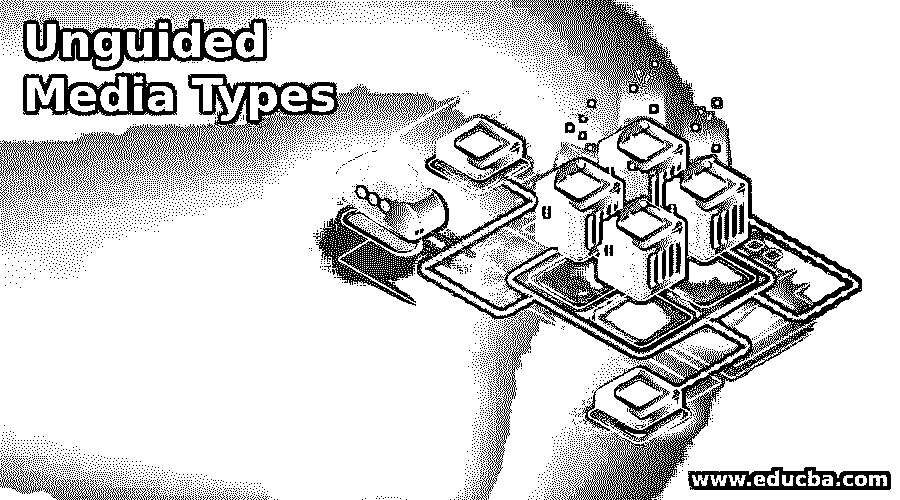

# 无向导媒体类型

> 原文：<https://www.educba.com/unguided-media-types/>

## 非导向媒体类型的定义

非导向介质类型传输用于传输电磁波，而不使用任何物理传输介质。因此它也被称为无线传输。无制导介质类型包括空气作为介质，电磁能量可以容易地在其中流动，而没有任何侵入或阻碍。无线电波是以全向方式在自由空间的所有方向上传输的电磁波，即信号在所有方向上传输，并广泛用于传播主要用于电信的信号。电信领域大量使用非导向媒体类型。

### 无导向介质的类型

*   有两种类型的介质类型用于电磁波的传输和传播，并且由于发射器和接收器保持适当的视线而不受地球曲率的影响。
*   无导向介质首先利用天线来发射和接收电磁波。想到的另一个问题是，当我们有有线或导向媒体时，为什么我们需要非导向媒体？
*   因此，答案在于，不可能通过雕刻和铺路的方式在丘陵地区制造和安装任何光纤、电线和电缆，因此根本不建议用于这种例外情况，而是使用非导向介质类型。
*   非导向介质类型具有从源到目的地的电磁波传播，它可以借助于地面传播，其中传播靠近大气，即在电离层和地球表面之间。
*   电磁波传播的距离取决于传播的功率。
*   另一种通过非制导介质类型传播的方式是通过天空传播，其中电磁波具有较高的频率，相对于图中的视线在大气中向上辐射。
*   很明显，与导向介质不同，非导向介质利用空气作为传输介质，而不是电线或电缆，因此被称为无线传输介质。
*   不使用任何物理介质进行传输。

有以下三种类型的非导向传输介质:

<small>网页开发、编程语言、软件测试&其他</small>

*   微波传送
*   无线电广播
*   红外传输

#### 1.微波传送

*   微波传输包括频率范围大约为(1-300GHz)的电磁波。
*   电磁波相对于视线的传播是单向的，不允许任何侵入。
*   一旦传输介质彼此面对，那么两个端点和视线之间的通信变得流畅以建立任何连接。
*   以上两点被称为源点，从这里产生波，然后天线在被称为接收端的目的端接收最终传输。
*   两类微波传输如下:

地面型微波传输

卫星式微波传输

*   **地面型微波传输:**地面型微波传输两个天线都是固定的，用于发射端和接收端的信号传输，微波的传播主要用于空中通信。
*   **卫星式微波传输:**卫星式微波传输是一种由源发射的电磁波，本质上是电磁的，它具有一些包含发射天线的源，用于放大源波，即信号，并转播到接收天线。GPS(全球定位系统)是卫星式微波传输的最佳应用之一。

#### 2.红外型传输

*   红外型波是最高频率的波，用于从 300GHz 到 400 THz 的范围。
*   红外传输主要用于在规定范围内的源和目的地之间的通信。
*   红外传输是不能轻易用于穿墙的高频率，但是差别仍然存在。
*   在访问电视或任何其他面向波的系统时，没有任何方式或机会出现任何种类的干扰。
*   电视接收到发射的波，然后在使波的行为更像光线的基础上执行动作。
*   随着电磁波的频率变得可见，它的行为越来越像光。
*   我们遇到的最常用的红外传输的例子是利用操作交流，或任何其他电子设备。
*   远程系统利用电磁波，电磁波被提升，然后从无线电波向光移动。
*   红外类型的波被认为是非制导传输介质的一种更安全的形式。
*   红外类型的波是强大的，因为它没有任何机会嗅探或欺骗或说任何不必要的活动和非常少的机会易受攻击。
*   因此，在使用这些红外类型的波进行传输时，不需要为所有上述不希望的活动进行任何许可。

#### 3.无线电广播

*   无线电波是频率很低的电磁波，范围从 3 千赫到 1 千兆赫。
*   一旦无线电波被认为是非常低频的波，那么即使有人在建筑物内，它们也有能力通过接收信号穿透墙壁。
*   无线电波的这一特性使你无法隔离大楼内外的通信。
*   无线电波向天空模式传播，并且是全向的，这意味着源发射器在天空中发射无线电波时，它们从天空反射，接收天线接收信号。
*   存在与本质上是全向的无线电传输相关联的主要问题。如果另一个发射天线正在发送具有相同频率或带宽的信号，则无线电波面临诸如干扰之类的问题。

### 结论

非导向传输介质是一种推荐且最常用的传输介质形式，因为它主要用于需要无线电或任何其他传输形式的场合。此外，与引导式媒体类型不同，非引导式媒体类型是有用且不受欢迎的，因为它易于在远程位置实施而没有太多干扰。

### 推荐文章

这是一个非导向媒体类型的指南。在这里，我们还讨论了非导向介质的定义和不同类型，并给出了详细的解释。您也可以看看以下文章，了解更多信息–

1.  [无向导媒体传输](https://www.educba.com/unguided-media-transmission/)
2.  [引导媒体查询](https://www.educba.com/bootstrap-media-queries/)
3.  [PostgreSQL 中值](https://www.educba.com/postgresql-median/)
4.  什么是社交媒体？

