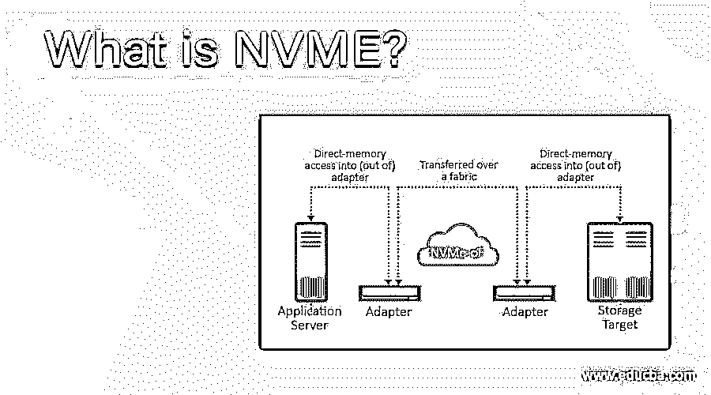

# 什么是 NVME？

> 原文：<https://www.educba.com/what-is-nvme/>

## 什么是 NVME？

NVMe 是专为 NUMA 设计的高性能存储协议，具有难以置信的可扩展性，可将主机链接到内存子系统。它是一种相对现代、实用的协议，旨在通过非易失性存储介质(NAND 和永久存储器)的 PCI 接口直接连接到 CPU。该协议是为 PCIe 高速车道设计的。这种连接 PCIe Gen 3.0 将提供两倍于 SATA 接口的传输速度。

### NVME 在商业中的重要性

业务流程通常对信息如饥似渴。随着数据和规格呈指数级增长，固态硬盘可能会停滞不前。面对 Fast Data 的一些最新问题，即使是连接到传统存储协议的高性能固态硬盘也会遇到性能下降、延迟增加和服务效率低下的问题。NVMe 的具体特性有助于防止从传统数据库纵向扩展实施到不断发展的边缘计算架构的各种瓶颈，并满足现代数据需求。NVMe 是唯一一个适用于高性能和非易失性库存媒体的协议，它将日益具有挑战性的企业、云和高计算强度的边缘数据环境分隔开来。

<small>网页开发、编程语言、软件测试&其他</small>

### 什么是 NVME 驱动器？

非易失性存储器快速(NVMe)是 2013 年的数据接口。非易失性意味着当您的设备重新启动时，存储不会被擦除；因此，快速是指数据通过 PCI Express (PCIe)接口在主板上传输。这使得驱动器可以更直接地连接到主板上，因此数据不需要通过串行高级技术(SATA)控制器来访问。已经问世多年的 NVMe 汽车公司要快得多。在 PCIe 3.0 中，每条通道上每秒 985 兆字节的最大传输速度是可能的，这是当前一代的 PCI Express 标准。4 个 PCIe 通道，这意味着 NVMe 驱动器使用的潜在最高速度为 3.9 GBPS。与此同时，三星 860 Pro 等 SATA 固态硬盘是读写速度达到 560 Mbps 左右的最佳产品之一。

### NVME 性能的优势

NVMe 为基于 SSD 的数据中心提供了两个主要优势。质量是第一位的。由于 NVMe SSD 没有传统协议支持，其提供商将依赖基于内存的存储的全部优势。由于延迟低，闪存可以同时执行多个 I/O 操作。NVMe 的 64，000 个队列和 64，000 个命令允许将 I/o 适当地送入计算机。如果基于 SCSI 的光盘希望一次从数据中选择一个块，这允许 NVMe 驱动器拾取多达 64，000 个块。在 SCSI 每次访问都需要一个周期的同一个 CPU 循环中，NVMe 将访问额外的数据。

### 为什么需要 NVME？

好消息是 NVMe 的规格非常简单。目前，一些数据中心的服务器在其设置中也支持该标准，只要这些服务器具有 PCIe 插槽。由于没有转移到 ROM Bios 或主板设计和其他可引导 Bios 理解 NVMe，用户不需要购买特定版本的服务器。另一方面，选择支持 NVMe 的闪存系统。这些卡目前已经上市。瑞士仓储公司最近对 OCZ 的一张此类卡进行了商品审查。

### NVME 是如何工作的？

NVMe 在主机映射中映射 PCIe 接口的输入、输出和共享内存响应。NVMe 接口支持多核处理器并行 I/O，以支持高性能 CPU 引擎并将其最小化。在 I/O 请求管理系统中，与 SCSI 和 ATA 集合相比，NVMe 具有更简单的控制集合。NVMe 对 SAS 设备的指令需求不到 SCSI 的一半，SATA 驱动器使用 ATA 命令集。在一个消息队列和多达 65，535 个 I/O 队列中，NVMe 支持 64，000 个命令。相比之下，一个 SAS 单元通常支持多达 256 个命令，一个 SATA 驱动器可以容纳多达 32 个命令。但目前，位于 NVMe 的 PCIe 固态硬盘比同等功能的固态硬盘更贵，基于 SAS 和 SATA 的高端商用 NVMe 固态硬盘可能需要比 SAS 或 SAS 固态硬盘更高的功耗。固态硬盘不可用。SCSA 认为，与 NVMe PCIe 固态硬盘相比，更现代的 SAS 固态硬盘有更多好处，例如更好的可扩展性和经过测试的功能。NVMe PCIe 固态硬盘也可以有一个特定应用不需要的输出标准。

### 结论

NVMe 将允许 flash 实现其对结果的贡献。它标准化了 PCIe 总线，并特别针对依赖于内存的存储进行了优化。实现应该相当简单，这些技术现在正由制造商引入。NVMe 可能会对行业产生重大影响，并允许数据中心适应新的需求。

### 推荐文章

这是什么是 NVME 的指南？.在这里，我们将讨论什么是 NVME 驱动器，NVME 如何发挥优势，以及它的重要性。您也可以看看以下文章，了解更多信息–

1.  [什么是存储区域网络？](https://www.educba.com/what-is-storage-area-network/)
2.  [什么是 DSL 调制解调器？](https://www.educba.com/what-is-dsl-modem/)
3.  [什么是流浪？](https://www.educba.com/what-is-vagrant/)
4.  [什么是 Mozilla Firefox？](https://www.educba.com/what-is-mozilla-firefox/)

