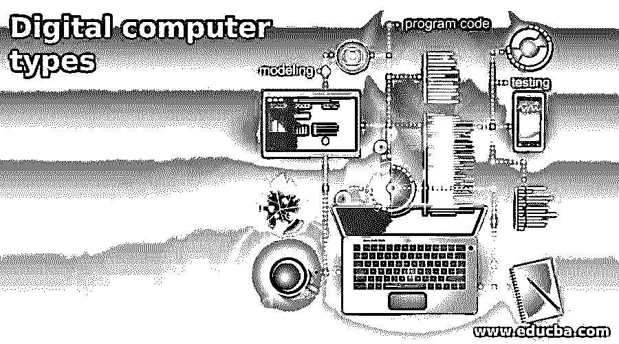

# 数字计算机类型

> 原文：<https://www.educba.com/digital-computer-types/>

## 数字计算机导论

数字计算机只不过是一个执行各种计算任务的数字系统。为了执行任务，数字计算机使用二进制数字系统，该系统有两个数字 1 和 0。一个二进制数字称为一位。它使用电子技术来生成、处理和存储不同类型的数据。根据设备的类型和大小，这些数字计算机被分为 4 种类型，即微型计算机、小型计算机、大型计算机和超级计算机。在这篇文章中，我们将详细讨论数字计算机的类型。

### 数字计算机的类型

下面就提到以下几种类型

<small>网页开发、编程语言、软件测试&其他</small>

#### 1.微型计算机

微型计算机是一种以微处理器为 CPU(中央处理器)的小型、相对便宜的计算机。它由安装在单个印刷电路板(PCB)上的微处理器、存储器和最小输入/输出(I/O)电路组成。一些微型计算机系统包括额外的组件，如定时器、计数器和模数转换器(ADC)。它配备了至少一种类型的数据存储。通常，存储类型是 RAM。有些微型计算机只使用 ram 来完成任务，通常需要辅助存储器。对于输入和输出，它使用键盘、显示器和其他设备。

这些设备可以是集成的或分离的。计算机存储器是 RAM 的形式，并且至少一个其他较不易失性的存储器存储设备在一个单元中与总线系统上的 CPU 结合。它一次只允许一个用户。为了允许多个用户，需要修改软件和硬件。由于微型计算机体积小，重量轻，所以非常轻便，易于操作。由单片硅芯片组成的微型计算机叫做微控制器。这些微控制器用于许多日常家庭用品，如个人电脑、数字手表、微波炉、数字电视机、电视遥控器(Cu)、炊具、高保真设备、CD 播放器、个人电脑、冰箱等。

#### 2.小型计算机

迷你电脑是一种功能与大型电脑相同但体积较小的电脑。迷你电脑比大型电脑小，但比微型电脑大。手机、平板电脑、笔记本电脑、台式迷你电脑、高端 MP3 播放器都是迷你电脑的例子。微型计算机主要被企业用来管理生产过程。与超级计算机和大型计算机相比，Mimi 计算机的成本较低。它比微型计算机强大，但没有超级计算机和大型计算机强大。这台计算机有能力处理一个或多个处理器。它允许多个用户同时使用，并支持多任务和多重处理，以便一次执行多项任务。迷你电脑也被称为迷你。

#### 3.大型计算机

大型计算机是大型组织中用于管理关键操作(如批量数据处理、事务处理和企业资源规划)的计算机。性能相对高于任何其他系统，并且系统中使用了大量的内存和处理器。这些系统主要被大型 IT 公司、沃尔玛、NASA 等使用。它由两个组件 JCL 和 COBOL 组成。JCL 是作业控制语言，一种权威的、有弹性的语言，它有助于操作和定制计算机的远程资源。COBOL 是一种面向商业的通用语言，作为一种高级语言，用于处理商业领域的数据。

该系统具有中央服务器，该中央服务器具有多个操作系统，并且允许以中央方式管理操作。这使得系统高效，具有更高的性能和对单个操作系统更少的工作负荷。大型计算机有处理大量数据的内在能力，也可以支持复杂的应用程序以高计算速度运行。复杂的应用程序可以在大型机上开发和运行。大型计算机使用先进的安全机制来保护大型组织并提供额外的安全性。一次可以在系统中运行多个应用程序，而不会影响系统的性能。

#### 4.超级计算机

超级计算机是与通用计算机相比具有高水平性能的计算机。它的性能不是以 MIPS(每秒百万条指令)来衡量，而是以 FLOPS(每秒浮点运算)的格式来衡量。它在计算机科学领域发挥着重要的作用，用于各种领域，如气候研究、天气预报、分子建模、量子力学、氧气和气体勘探、聚合物、生物大分子和晶体。

超级计算机是为科学家和工程师设计的专用计算机，用于解决复杂的数学和科学计算，需要大量的内存和出色的执行速度。这些是世界上速度最快的计算机，用来解决任何其他计算机都无法解决的问题。超级计算机的成本相当高。它包含一个以上的 CPU 来解释程序指令，并以适当的顺序执行算术和逻辑运算。

### 推荐文章

这是一本数字计算机类型指南。这里我们讨论数字计算机的类型:微型计算机、小型计算机、大型计算机和超级计算机。您也可以看看以下文章，了解更多信息–

1.  [什么是数字取证？](https://www.educba.com/what-is-digital-forensics/)
2.  [什么是数字证书？](https://www.educba.com/what-is-digital-certificate/)
3.  [数字电路](https://www.educba.com/digital-circuit/)
4.  [数字营销实习](https://www.educba.com/digital-marketing-internship/)

