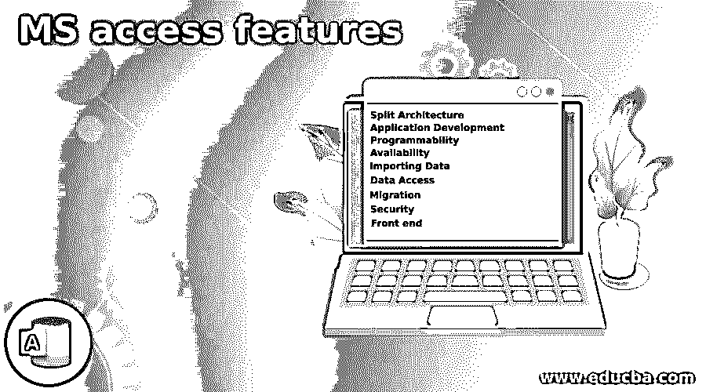

# MS access 功能

> 原文：<https://www.educba.com/ms-access-features/>

## MS Access 功能介绍

微软公司提供的数据库管理系统将微软的关系数据库管理系统与软件工具结合起来，与图形用户界面一起使用，称为 MS Access。数据存储在关系数据库引擎中，可以借助超链接访问该引擎，我们可以将其他来源的数据导入该数据库引擎。开发人员使用 MS Access 创建任何需要备份数据的软件应用程序。Access 支持 VBA，因此我们可以开发带有数据访问对象的应用程序，并且可以在同一个平台上用于数据研究。

### MS Access 的功能

以下是提到的功能:

<small>网页开发、编程语言、软件测试&其他</small>

#### 1.分裂建筑

MS Access 可以分为两部分，前端有数据库查询结果，后端有数据库表和查询。这可以安装在桌面上，并可用于查询数据。当多个用户处理相同的数据时，这有助于在数据库中维护版本并轻松管理。如果需要的话，在前端版本中使用本地表和临时文件来更新数据，从而彻底减少了网络流量。数据库拆分器或链接表管理器可用于在系统中建立拆分架构，从而使更多的人受益。如果数据库很大，可能会出现性能问题。应该注意的是，如果数据大小与我们的系统 RAM 相同，分离架构将会工作。

#### 2.应用开发

MS Access 提供了查询设计器和图形用户界面，帮助用户使用 VB 代码或 SQL 代码开发应用程序，并通过 GUI 显示。外部数据源可以通过 ODBC 连接和链接表的 SQL 查询进行连接。还可以创建报告，其中可以使用任何类型的宏，以便开发人员可以查看报告，并使它们在视觉上吸引查看者。宏还有助于处理设计数据库时出现的错误。

#### 3.可编程序性

数据访问对象和活动数据对象可用于通过 basic C 程序管理数据，以便操作数据库中的数据。虽然复杂的查询无法在短时间内完成，但 Access 提供了数据库中数据的概述，以便可以在 GUI 中设计和使用数据库。SharePoint 可用于与同事共享 web 开发片段，以便添加他们的输入，通过各种图表和图形来增强开发。我们可以使用微软的 VPN 或广域网来加快开发速度。

#### 4.有效性

微软用户可以免费访问，根据他们的查询查看和编辑数据，运行查询，如果需要，还可以删除数据库中的条目。我们不能改变数据库中的设计，但 MS Access 最新版本的免费可用性有助于用户将其安装到他们的系统中，并为任意数量的用户提供 GUI。

#### 5.导入数据

有了微软的众多应用程序，我们可以通过 Access 向微软的任何应用程序导入或导出数据。在 Excel 中处理的数据可以导入到 Access 中，并且可以在 SQL Server 的帮助下进行查询，对此没有限制。可以使用任何微软支持的数据容器，可以通过 SharePoint 或 Outlook 电子邮件系统共享信息。

#### 6.数据存取

顾名思义，我们可以从任何来源访问数据，并将其存储在数据库中。使用查询，我们可以连接来自几个应用程序的数据，并将其用于一个共同的目的。在这里，我们可以根据数据的位置来命名数据，这样开发人员就可以轻松地识别其来源并对其进行管理。

#### 7.移民

我们在 MS Access 中有数据库，如果数据很大，从这些数据库中获取数据并不总是很容易。使用 SQL Server 是必要的，如果不将访问权限迁移到 SQL Server，就无法做到这一点。这可以通过较少的维护和高可伸缩性轻松实现。数据被迁移到 SQL Server，并进一步添加查询以获取有关迁移数据的信息。在某些情况下，Visual Basic 代码会产生问题，因为它在 SQL 中不容易阅读。这里，ASP.NET 代码有助于迁移这些代码，并有助于在系统中建立 web 数据接口。T-SQL 也有助于翻译 VBA 代码。

#### 8.安全性

如果 MS Access 不受任何外来者的保护，那将是一个意外。我们有密码保护，现在这被认为是弱保护，因为任何人都可以绕过它。工作组安全性提供给从事同一项目的一组人。在这里，用户名和密码被提供给个人，而 Access 中的工作将仅被这些组的人共享。另一种安全性是使用只有安全组提供者知道的密钥进行数据库加密。我们还可以锁定数据库，这样人们就不能轻易更改数据，除非获得访问权限。

#### 9.前端

Access 可以作为许多应用程序的前端，如 Excel、SQL Server、Visual Basic、Visual Studio 等。这有助于用户与后端服务进行交互，并通过访问提供输出。此外，Access 有助于与大多数 Microsoft 应用程序(如 Outlook、Word、PowerPoint 等)集成。有了交互式界面和视觉上吸引人的显示，客户很乐意在 Access 中工作。随着大量应用程序的使用，我们可以存储任何扩展名的 Access 文件，这有助于我们在任何应用程序中打开这些文件。

Windows 用户不能否认他们在许多方面受益于 MS Access。软件与许多其他应用程序的交互有助于用户将注意力集中在 MS Access 的前端，在那里他们可以与客户分享见解并展示他们的结果。

### 推荐文章

这是 MS access 功能的指南。在这里，我们将讨论 MS access 的功能，以及软件与许多其他应用程序的交互作用，以帮助用户。您也可以看看以下文章，了解更多信息–

1.  [微软 Word 快捷键](https://www.educba.com/microsoft-word-shortcut-keys/)
2.  [微软项目服务器](https://www.educba.com/microsoft-project-server/)
3.  [微软项目管理](https://www.educba.com/microsoft-project-management/)
4.  [微软项目云](https://www.educba.com/microsoft-project-cloud/)

