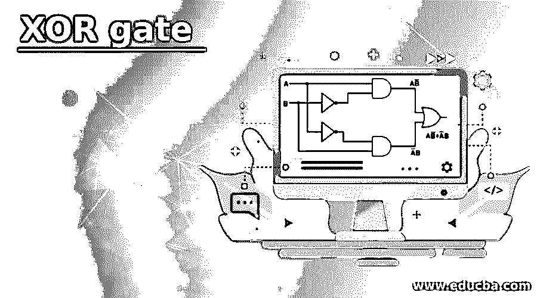
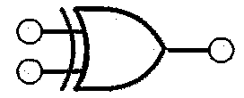
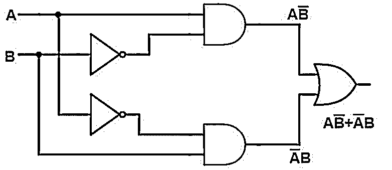
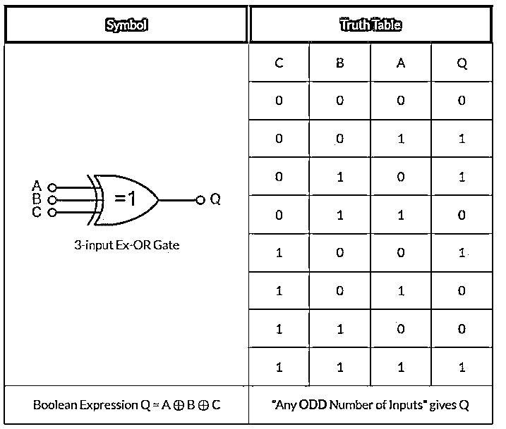
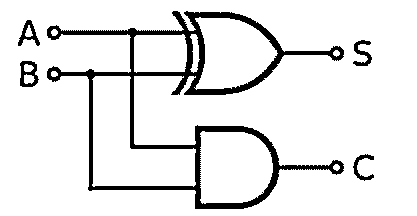

# 异或门

> 原文：<https://www.educba.com/xor-gate/>

## 异或门简介

XOR 门被定义为一种逻辑门，也有其他名称，如 e XOR 或 EOR。当真输入数为奇数时，它给出真输出，当真输入数不是奇数时，它给出假值。它主要用于表示不等式函数，即如果输入不相同，则输出为真；否则为假。对于 Xor 门，没有像 AND 或 OR 门 have 那样的直接布尔表达式。

### 异或门是如何工作的？

逐位方法用于计算任意两个输入值的二进制表示。在二进制表示中，对于每一位，执行 EXOR 运算以得到结果。在 EXOR 运算中，当一位为真，另一位为假时，输出总是为真，如果两个输入位都为真或都为假，输出总是为假，在这种情况下，输出总是为 0。当一个输入值或两个输入值都是 NoData 时，输出也是 NoData。

<small>网页开发、编程语言、软件测试&其他</small>

在异或门运算中，执行异或运算。当异或门有 2 个以上的输入时，电路行为直接取决于它的执行。它的主要条件是奇数个高输入，因此结果总是高且等于 1。

在下图中，描述了 XOR 门的符号表示。该符号以 IEEE 格式定义，是 XOR 门的标准符号。

**举例:**

输入 1 = 5，其二进制表示为 00000101

输入 2 = 3，其二进制表示为 00000011

按位异或

Output = 6，其二进制表示为 00000110

下图描述了异或门的电路图。在该图中，我们有两个输入 A 和 b。该电路包含两个非门、两个与门和一个或门。从电路接收的输出与异或门相同。

### 异或门的真值表

在下图中，附上了两个输入异或门的真值表。

上表的布尔表达式是 Q = A ⊕ B

在上表中，我们有两个输入门，分别命名为门 A 和门 B，由此，我们有上表中提到的四种情况:

*   **情况 1:** 当两个输入都为低电平时，表示 0。根据它，当两个输入相同时，输出总是变为低(0)。所以当 A 和 B 为 0 时，那么输出 Q 也将为 0。
*   **情况二:**当一个输入为高，一个输入为低时，异或门的输出始终为高。在这种情况下，我们有 B =0 和 A = 1，所以输出 Q =1。
*   **情况三:**当一个输入为高，一个输入为低时，来自的输出始终为高。在这种情况下，我们有 B =1 和 A = 0，所以输出 Q =1。
*   **情况 4:** 当两个输入都为低电平时，表示 0。根据它，当两个输入相同时，输出总是变为低(0)。所以当 A 和 B 为 1 时，那么输出 Q 也将为 0。

在下图中，附上了三输入异或门的真值表。

上表的布尔表达式是 Q = A ⊕ B ⊕ C

在上表中，每当我们将高位的奇数作为输入时，输出总是 1。而每当我们有偶数个高输入位(1)时，输出总是设为 0。在情况 1、4、6 和 7 中，当输入等于 1 是偶数时，接收的输出总是 0。并且在情况 2、3、5、8 中，当等于 1 的输入位是奇数时，从异或门接收的输出总是。

### 异或门的用途

不同的用途如下所述:

#### 1.用于加法

它可以用于其他目的。使用异或门可以很容易地设计一位加法器。单比特加法器将两个比特相加，并将产生单比特结果。

s 为输出，C 为进位。

**例如:**

如果我们有两位，1 和 1，我们做二进制加法，结果将是 10，在十进制中，我们得到结果 2。半加法器的主要焦点是从异或门获得输出，进位位从与门获得。这些单比特加法器可以组合形成一个 n 比特加法器，并可以进一步用于长二进制数。

#### 2.伪随机数生成

它可以以这样的方式排列，使得它们形成线性反馈型移位寄存器。线性移位寄存器也称为伪随机数发生器。

#### 3.序列检测和相关

当两个输入均为高电平或低电平时，它具有产生低电平输出(0)的功能。当我们有一个很长的数据序列，并且我们需要搜索任何特定的位序列时，它可以用于查找数据位序列。准确度也可以通过计算目标序列中的 0 计数来确定。它被用于相关，因为它们被附加在解码器中以从中提取奇偶性。

### 结论

它是一种数字电路，用于电路中的位运算。当在异或门中等于 1 的输入位的数目是奇数时，输出总是 1，而当该数目是偶数时，输出总是 0。XOR 门用于产生伪随机数，用于设计单比特加法器等等。

### 推荐文章

这是一个异或门的指南。这里我们讨论引言；异或门是如何工作的？真值表和用途。您也可以看看以下文章，了解更多信息–

1.  [数字电路](https://www.educba.com/digital-circuit/)
2.  [什么是 Raid 5？](https://www.educba.com/what-is-raid-5/)
3.  [c#中的运算符优先级](https://www.educba.com/operator-precedence-in-c-sharp/)
4.  [Listbox in C#](https://www.educba.com/listbox-in-c-sharp/)

