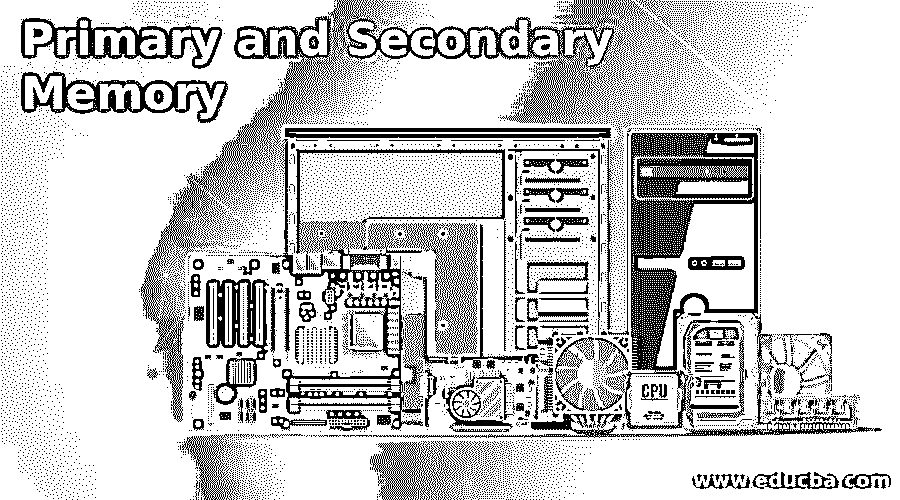

# 主存储器和辅助存储器

> 原文：<https://www.educba.com/primary-and-secondary-memory/>

## 主存储器和辅助存储器介绍

主存储器和辅助存储器是计算机存储器的种类。主存储器也称为计算机的主存储器，实际数据存储在其中，而辅助存储器是辅助存储器，数据可以长期存储在其中，也可以永久存储。那么，什么是记忆呢？它类似于人脑用来存储数据，存储处理数据所需的其他指令。这种计算机内存实际上被分成称为细胞的小部分。每个单元都有一个唯一的地址，从 0 到内存大小-1。

一些类型的计算机内存被设计成快速的，这意味着 CPU 可以快速访问存储的数据。有些设计成本较低，有助于经济地存储大量数据。有些被设计成即使在断电的情况下也能帮助长期存储数据，这就是所谓的非易失性。有些是易失性的，这意味着速度更快，但它们也可能在断电时丢失数据。

<small>网页开发、编程语言、软件测试&其他</small>

### 计算机内存的类型

下面给出了计算机内存的类型:

*   主存储器
*   辅助存贮器

#### 1.主存储器

这种存储器可以保存计算机当前正在工作的数据和指令，因为它的容量有限，并且在断电时会丢失数据。它是由没有寄存器快的半导体器件组成的。

它又分为两类，即 RAM 和 ROM。

**a. RAM:**

*   也称为随机存取存储器，是计算机的主存储器。它是读写存储器。
*   当存在电力短缺问题时，存储在这种类型的存储器中的数据和指令会丢失；因此，它也被称为高速缓冲存储器或临时存储器。
*   最重要的是，RAM 内存非常快且易失，比辅助内存相对昂贵。这是因为 RAM 访问数据的速度很快，当不需要数据时，它会被移动到辅助内存，释放 RAM 空间，并填充新数据以供进一步使用。

下面还列出了几种 RAM，DRAM 和 SRAM。

*   **DRAM:** 代表动态随机存取存储器，是最常用的 RAM 类型之一。新电脑使用更快的双数据速率(DDR)，包括几个版本，DDR2，DDR3 和 DDR4，效率和性能更好。但是，没有两个版本的混合是不兼容的。
*   SRAM 代表静态随机存取存储器，它比 DRAM 快，但是体积更大，价格更贵。它通常以兆字节为单位。一般来说，SRAM 在高端服务器系统中用作数据缓存或 RAM。

**b. ROM:**

*   也称为只读存储器，是一种永久性存储器。
*   当电源关闭时，内容不会丢失。
*   ROM 是一种非易失性存储器，类似于长期使用的辅助存储器。
*   ROM 包含有基本指令集的引导代码。
*   ROM 存储在简单的电子设备中，当设备打开时运行。

下面列出了几种类型的 ROM，PROM，EPROM 和 EEPROM。

*   **Prom:** 它代表可编程只读存储器，与实际的 ROM 不同，因为 ROM 是在制造过程中进行编程的，PROM 是在空状态下制造的，然后使用 PROM 刻录机或编程器进行编程。
*   EPROM: 代表可擦除可编程只读存储器。数据不能擦除，但可以重新编程。擦除它会将 EPROM 从计算机系统中移除，并在重新刻录之前将其暴露在紫外线下。
*   EEPROM: 代表电可擦除可编程只读存储器。EPROM 和 EEPROM 之间的区别是单个字母 E，即 EEPROM 可以被安装它的计算机系统擦除和写入。然而，EEPROM 严格来说不是只读的。写入过程很慢，因此只能偶尔更新程序代码，如 BIOS 代码。

**主存储器的特征:**

*   它是易失性存储器。
*   它比二级存储器快。
*   没有主存储器，计算机系统就不能工作。
*   停电时，用户可能会丢失数据。
*   它是计算机的工作存储器。
*   这些是由半导体存储器组成的。

#### 2.辅助存贮器

这种类型的存储器称为外部存储器或非易失性存储器。它用于永久存储数据或指令，速度比主存储器慢。CPU 不会直接访问内存；相反，它们是通过输入输出例程来访问的。

以下是辅助存储器的类型

**海量存储设备:**

它提供了廉价的存储空间，可用于小型和大型计算机。

有两种类型的磁盘，软盘和硬盘。

*   **光学设备:**它是一种借助激光读写数据的设备。它可以存储高达 185TB 的数据。
*   **USB 驱动器:**最流行的二级存储设备类型之一。这些驱动器是可移动的，体积太小，可重写。
*   **磁带:**用于存储大容量数据，通常用于备份。

**二级记忆的特征:**

*   它是非易失性存储器。
*   它比主存储器慢。
*   它也被称为备份内存。
*   它有助于将数据存储在计算机系统中，这些数据被永久存储，即使停电也不会被删除。
*   计算机系统可以在没有辅助存储器的情况下运行。
*   这些是光和磁存储器。

### 结论——主要和次要记忆

到此，我们将结束我们的主题“初级和次级记忆”。我们已经了解了主存储器和次存储器的含义，以及所有可用的存储器类型。我们还看到了每个主存储器和辅助存储器的特征。例如，主存储器很贵，在计算机系统中很少使用，而辅助存储器相对便宜。

### 推荐文章

这是一个初级和次级记忆的指南。这里我们分别讨论计算机内存的介绍和类型。您也可以看看以下文章，了解更多信息–

1.  [计算机内存的类型](https://www.educba.com/types-of-memory-in-computer/)
2.  [高速缓冲存储器](https://www.educba.com/cache-memory/)
3.  [寄存器内存](https://www.educba.com/register-memory/)
4.  [缓存类型](https://www.educba.com/cache-memory-types/)

