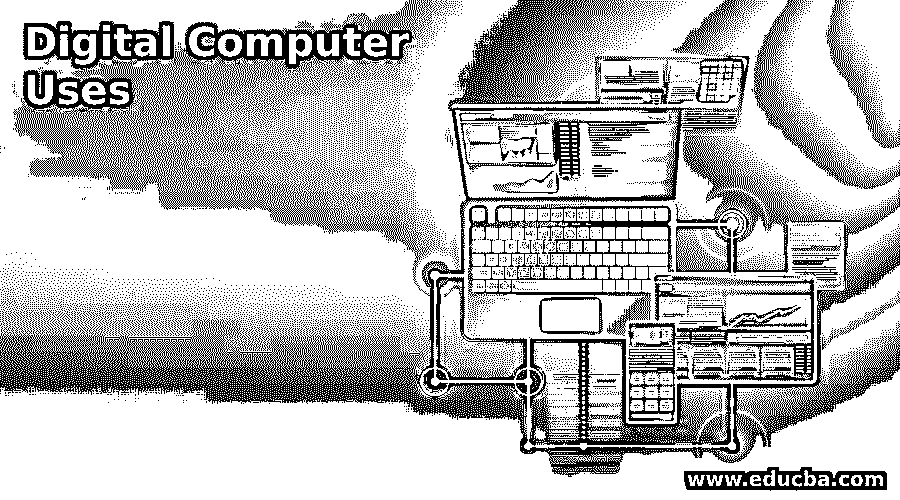

# 数字计算机的使用

> 原文：<https://www.educba.com/digital-computer-uses/>

## 数字计算机导论

数字计算机是一个系统，它可以提供一些输入，进一步使用一些处理操作，并以某种可显示的格式给出所需的输出。数字计算机的运算速度很快，几秒钟就能完成，这有助于节省大量时间。此外，这些数字计算机仅理解作为二进制 0 和 1 处理的一部分的输入和操作的处理信息。它通过简化整个任务来简化人和计算机之间的交流。

### 各种数字计算机使用示例

如上所述，数字计算机是一种系统或机器，在各个领域都有广泛的用途，无论是科学、研究、技术还是其他领域；从最初的几天到现在，它已经像任何东西一样进化了很多。无论是个人电脑、智能手机还是平板电脑，几乎每个领域都有这样或那样的东西，以使系统在任何最糟糕的情况下都保持强健和高度可用。

<small>网页开发、编程语言、软件测试&其他</small>

#### 1.数字计算机在科学研究领域的应用和发展

*   当涉及到科学计算和操作时，数字计算机有能力处理任何可能性。
*   它的计算处理能力相当快，可以在几秒钟内完成。因此，它减少了时间消耗，通过使用数字计算机简化整个过程，使研究和科学齐头并进。
*   从需求收集、数据存储、分析和计算，任何事情都可以用数字计算机来完成。
*   所有的科学图表和算法，以其明确的计算能力和显示，都可以使用任何数字计算机来形成，使整个过程相当容易和简化。
*   个人电脑、笔记本电脑和台式机可以满足科学研究的需要。

#### 2.数字计算机在工业和技术应用中的使用

*   软件业甚至其他行业大量使用数字计算机，这有助于弥合不懂技术和懂技术的爱好者之间的差距。
*   当涉及到设计与任何程序相关的任何模式或架构时，数字计算机提供了许多工具和选项来探索和利用它作为项目实现的一部分。
*   当谈到软件行业时，他们虔诚地采用数字计算机，并将其纳入任何基本任务的考虑范围。
*   整个软件和硬件工业，在某种程度上，都依赖于数字计算机，它以任何形式提供工作兼容性，无论是初始产品还是最终产品。
*   一台完整的数字计算机是由硬件组件组成的，这些硬件组件使得技术应用程序能够在系统上运行，然后所有的计算活动都在它上面执行。
*   即使是规划，直到架构设计，也需要硬件和软件的组合来实现任何要执行的活动的预期结果。

#### 3.数字计算机在控制系统中的应用

*   随着数字计算机的结合和混合，控制系统在计算能力方面有了很大的发展。
*   一台数字计算机能完成许多操作，并能在这些操作的帮助下编制软件；控制系统可以按照其最大的要求和特点来制造。
*   控制系统的设计将再次包括由数字计算机以某种方式支持的工具。
*   这使得整个控制系统在计算和操作方面更加有效和稳健。
*   所有与家庭自动化、家庭设计和绘图相关的最新基础设施都是使用前面提到的软件和工具构建的，这也构成了数字计算机的一部分。
*   一个例子包括整个智能家居概念，涉及自动开关、自动汽车驾驶、机器人等等，所有这些都涉及控制系统的使用。
*   与模拟系统相比，数字计算机只能支持任何控制系统来驱动其整个计划，直到成功完成整个要求或项目，使其完全健壮和通用。

#### 4.数字计算机及其在嵌入式系统和 IOT 中的应用

*   IOT(物联网)与嵌入式系统的融合是最新的趋势，当满足特定的计算需求时，它们都可以创造奇迹。
*   数字计算机不仅彻底改变了当前计算时代的历史，而且彻底改变了从模拟到数字计算的整个时代。
*   包括所有这些主题的处理包括四个主要步骤:输入读数，将数据保存到存储器中，然后进一步处理数据，并使数字计算机辅助它。
*   包括像数字洗衣机、科学计算器、数字时钟等例子。

#### 5.数字计算机及其在金融领域的应用

*   金钱在生活的每个领域都起着举足轻重的作用，因此数字计算机已经在金融技术领域和领域中扎根。
*   早期的转让和与金钱相关的交易仅用于包括实体存在，而数字化并不在其中。
*   后来，当数字计算机出现时，整个金融技术在系统和网络上浮动和工作，这在某种程度上依赖于数字计算机。
*   金融领域中的数字计算机的例子包括使交易过程数字化的 ATM 机。它接受一组特定的输入，然后用其中的算法或操作处理这些输入，从而提供所需的输出。

### 结论

数字计算机确实已经掌握并使人类生活的所有领域都依赖于它。我们周围的一切和每一个组件都在某种程度上依赖于数字化和计算，这就是数字计算机的力量。因此，数字计算机已经进化，并使它的存在永无止境，直到周围的一切都灭绝。

### 推荐文章

这是一本数字计算机使用指南。这里我们分别用例子讨论入门和各种数字计算机的使用。您也可以看看以下文章，了解更多信息–

1.  [电脑线缆的种类](https://www.educba.com/types-of-computer-cables/)
2.  [计算机输出设备](https://www.educba.com/computers-output-devices/)
3.  [计算机的部件](https://www.educba.com/components-of-computers/)
4.  [计算机软件的种类](https://www.educba.com/types-of-computer-software/)

