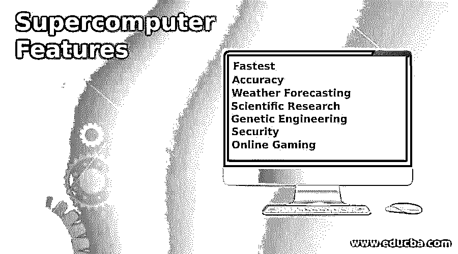

# 超级计算机功能

> 原文：<https://www.educba.com/supercomputer-features/>

## 超级计算机功能介绍

下面的文章提供了超级计算机特性的概要。高性能计算机被称为超级计算机，其能力计算更受青睐，意味着大型复杂的问题可以在几分钟内解决。1964 年推出的第一台超级计算机在一分钟内用单个处理器计算了 300 万次，这表明了超级计算机的能力现在可以由智能手机完成，但超级计算机的能力已经增加到每秒 200 万亿次计算，由 36000 个处理器完成。世界上几乎所有领域都使用超级计算机，例如研究、天气预报、编码或解密密钥以及进行核试验。

### 各种超级计算机功能

下面给出了超级计算机的各种功能:

<small>网页开发、编程语言、软件测试&其他</small>

#### 1.最快的

超级计算机是世界上最快的计算机，可以在几分之一秒内完成任何类型的计算，无论是复杂的空间计算问题还是运行数千次迭代来解密安全密钥。然而，占用的空间也很大，并且它们需要长达 300 米的若干有线连接。此外，这台大型计算机的存储容量也很大，因此它可以从 CPU 中检索任意数量的数据。这就是超级计算机被用于任何研究领域的原因，因为它具有输入或输出能力来处理用户所需的数据。

#### 2.准确(性)

随着大量数据的处理和最快的处理速度，计算机在任何阶段都有可能提供错误的输出。超级计算机被证明在所有的计算中都是精确的，并且提供非常精确的结果。随着模拟完成得更快、更准确，研究人员正在获得超级计算机的优势，即它可以轻松解决问题。不同的迭代被赋予超级计算机，它在一秒钟内解决。这些迭代也可以由超级计算机生成。超级计算机可以精确地解决任何类型的数字或逻辑问题。

#### 3.天气预报

这是超级计算机非常有用和智能的另一个领域。他们可以很容易地预测天气变化，因此如果发生任何地震或山体滑坡，都可以通过超级计算机知道。这使得它能够在短时间内直接帮助正常人的生活。当给出位置和时间时，超级计算机可以预测大气的状况，这项研究是在数字模型上进行的。气象卫星和地面气象站由超级计算机控制，帮助记录每小时的天气观测。超级计算机及其存储器存储所有的天气数据，这有助于预测未来的数据。

#### 4.科学研究

超级计算机被用来解决大型科学研究问题。复杂的问题可以很容易地用超级计算机解决，这使得科学家们能够准确地找到解决方案。此外，空间组织正在使用超级计算机来研究各种形式的行星结构，并验证行星中各种粒子的存在。此外，分子和物质的各种性质可以迭代和研究，以创造新元素。这有助于研究宇宙的结构和宇宙中不同生物的存在。

此外，超级计算机有助于化石研究，因此可以了解各种动物的历史。了解亚原子粒子的结构有助于了解宇宙的起源和它进入日常进化循环的性质。它有助于考古学了解世界古代历史中各种元素的存在，并帮助我们了解人类的进化。

#### 5.遗传工程

基因的修饰和操作对于基因工程师了解基因的结构是很重要的，这样就可以在系统本身中进行各种改变，以了解它们如何通过不同的组合进行修饰。这有助于基因工程师开发新的生物体或相同生物体的改良版本。他们正在使用机器人进行基因突变，超级计算机控制这些机器人。这个自动化的基因工程机器人使基因工程师的工作变得容易，因此可以在短时间内找到几个组合。例如，它被用于研究新冠肺炎病毒的变异，以便用于开发同样的疫苗。

#### 6.安全性

无论是在国家层面还是个人层面，安全都是一个问题。到处都有摄像头，这样任何时候都是安全的。这些摄像机应该一直运行，并且必须由一个中央服务器控制，该服务器运行时没有任何停机时间。这里可以使用超级计算机来控制日常运行的安全系统的所有工作。关于国家安全，超级计算机被用于核武器和任何其他武器的设计，以便为国家设计和制造更好的武器。武器用密码保护，如果需要，这些密码可以在超级计算机的帮助下解码。

#### 7.网络游戏

这是使用超级计算机的另一个方面。与过去相比，超级计算机很便宜，所以游戏玩家用这种计算机来玩游戏。这有助于来自世界各地的游戏玩家在同一个平台上同时玩游戏。将会有数百万的团队成员来玩同一个游戏。国际象棋是超级计算机制定不同游戏计划并帮助玩家获胜的另一个领域。

诸如核试验、物理模拟、发明超级计算机的军事行动、全球变暖挑战、医疗领域和航空航天领域的各种生活水平都是由超级计算机进行的研究。超级计算机的能力无法用简单的语言来衡量或识别，但如果我们开始学习如何在短时间内解决所有复杂的问题，就可以理解。

### 结论

使用一个以上的 CPU 和一个巨大的布线系统需要超级计算机大空间。此外，由于系统相互连接会产生热量，因此超级计算机必须放在有空调的房间里。它不能在任何时候停机，因此由有经验的专业人员维护超级计算机是对超级计算机的要求。

### 推荐文章

这是超级计算机功能指南。为了更好地理解，我们在这里讨论介绍和各种超级计算机的功能。您也可以看看以下文章，了解更多信息–

1.  [小型机特性](https://www.educba.com/minicomputer-features/)
2.  [大型计算机的种类](https://www.educba.com/types-of-mainframe-computers/)
3.  [计算机语言的种类](https://www.educba.com/types-of-computer-language/)
4.  [计算机软件的种类](https://www.educba.com/types-of-computer-software/)

