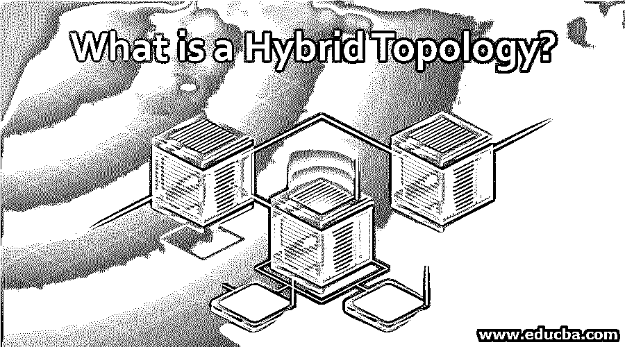

# 什么是混合拓扑？

> 原文：<https://www.educba.com/what-is-a-hybrid-topology/>

## 混合拓扑简介

混合拓扑是两种或多种不同网络拓扑原理的组合。它混合了树形拓扑、总线拓扑、环形拓扑和网状拓扑。混合拓扑的选择和使用取决于其要求和部署，如服务器数量、位置和所需网络的性能。

### 混合拓扑的类型

存在不同种类的混合拓扑，其根据需求将多个基本拓扑互连以形成新的拓扑。它们是星形有线环形网络拓扑、星形有线总线拓扑和分层网络拓扑。与其他基本网络拓扑类似，混合拓扑的机制取决于其 IP 地址。但是在逻辑拓扑的功能上有微小的不同。混合网络有其独特的配置类型。混合拓扑结合了逻辑拓扑和物理拓扑。

<small>网页开发、编程语言、软件测试&其他</small>

#### 1.星形布局

一组星形拓扑与作为相邻拓扑的环形拓扑相关联。通过有线连接将每个星形拓扑连接到环形拓扑。来自某一星形拓扑的数据到达原始环形拓扑中的连接节点。数据流是单向或双向的方法。数据的双向流动确保了原始环形拓扑中的一个节点的攻击或故障不会导致原始环形拓扑中的整个数据流的关闭。

#### 2.总线拓扑

基于星形的总线拓扑通过中央总线网络的互连来实现。在有线连接中将每个星型拓扑链接到总线拓扑。最初的总线拓扑结构提供了一个主干结构，将独立的星型拓扑结构相互连接起来。主干结构是有线连接的形式。

#### 3.分层网络拓扑

分层网络拓扑以分层树的形式排列在不同的级别。它也被称为网络树拓扑。通过有线连接将最低级别如二级连接到最高级别如一级。最大和顶层被称为根或父节点。下一阶段是第一级，包括返回第三级子节点的子节点。因此，除了顶级节点之外，所需级别中的所有节点都给出了最大父节点。最低级别的节点是外围节点，它们不充当其他节点的父节点。这样的节点被称为叶节点。包括最大级别的每个级别包括多个节点。

### 为什么我们要使用混合拓扑？

由于有效的成本，存在使用混合拓扑的各种应用。混合拓扑机制比其他基本机制更有效，并且可以部署在多种环境中。因此网络的适应性和灵活性为用户提供了创建、运行和管理组织的机会。混合拓扑的一些主要应用是金融和银行业、自动化行业、跨国公司、研究机构和许多教育机构。任意两种拓扑(例如部分星形、扩展星形、点对点网络和全网状拓扑)的组合被完成以开发新的混合拓扑。

混合拓扑的应用和例子非常广泛。这是人们选择部署在家里或办公室，它被宣布为一个聪明的选择，因为它有一个超级功率设置和灵活的选择。它为小规模工业甚至其下属单位提供了一个契约。所以它是一个很好的选择，在办公室或家庭有多层建筑和部门。实施混合拓扑有很多好处。因此，根据要求，它被放置以给出其最大效率。但是，基本拓扑的组合会创建一个复杂的网络，影响您的预算。

### 优点和缺点

以下是混合拓扑的优点和缺点:

1.  混合拓扑是各种网络的连接，这些网络采用多种技术将点与链接到服务器的其他设备(如个人计算机和其他硬件组件)相关联。它们还利用了一些优势，如信号强度、吞吐量和数据通信，并且还包括高端设备。
2.  故障检修管理由混合网络提供，混合网络易于诊断集中点或集线器，集中点或集线器依赖于与网络规模相比相对较小的规模。集中点是攻击的来源，它与网络的其余部分分开，并且当网络的其余部分按其通常的功能运行时，它是恒定的。这里，系统的终端用户没有意识到所发生的问题，这对于游戏公司和与数百万用户在线运行和操作的大型企业来说是一个显著的优势。
3.  混合网络以模块化的方式简单增长，支持新硬件组件的线性集成，如额外的集中点。它使网络设计人员能够通过连接到系统的新集线器来更新网络功率和存储能力。混合网络通过一根电缆互连，这使得集成方法非常简单，只需部署一部有线电话。
4.  混合网络的维护和购买成本很高。这是因为集线器必须在同一时间处理特定类型的网络，并保持正常工作，即使该特定功能已从整个系统中删除。它需要相当高水平的智能处理，而这是花费巨资无法实现的。
5.  布线的复杂性是由于在连接点很小的地方有许多备用环和冗余电线。但是应该定期维护以达到可靠的标准。因为电缆连接中的任何干扰都会导致整个网络的崩溃。必须安装额外的冷却系统，因为它涉及许多复杂的电线和网络，以形成可靠的输出。
6.  混合计算的优点是可靠、可扩展和灵活，并因其有效的容错性能而被广泛应用。

### 推荐文章

这是混合拓扑的指南。在这里，我们讨论为什么我们使用混合拓扑和它的不同类型以及优点和缺点。您也可以浏览我们推荐的文章，了解更多信息——

1.  [了解网络拓扑的概念](https://www.educba.com/what-is-network-topology/)
2.  我们为什么要使用逻辑拓扑？
3.  [什么是网状拓扑？|优点&缺点](https://www.educba.com/what-is-mesh-topology/)
4.  [令牌环拓扑介绍](https://www.educba.com/token-ring-topology/)

