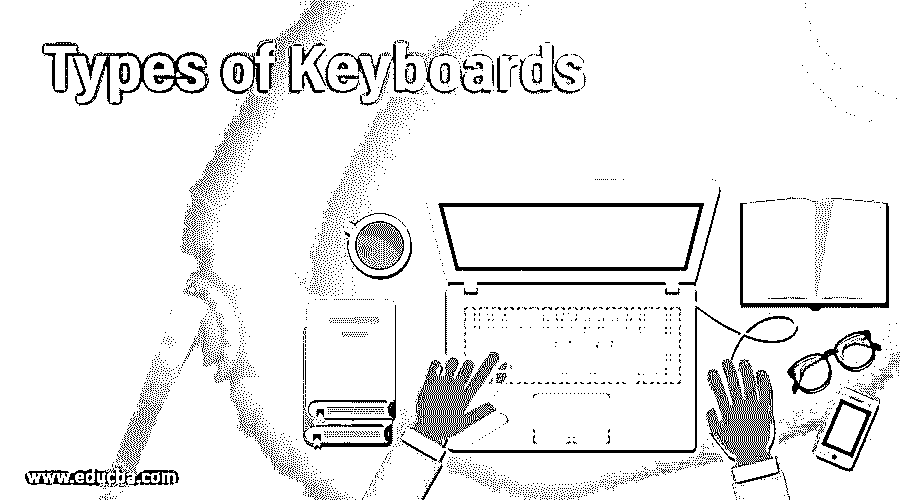

# 键盘的类型

> 原文：<https://www.educba.com/types-of-keyboards/>

## 键盘类型介绍

键盘是一种输入设备，有字母、数字和其他特殊字符和符号。它是计算机最常用的输入设备之一。在键盘的帮助下把数据输入计算机叫做打字。存在各种类型的键盘，例如便携式有线以及无线键盘、qwerty 键盘、虚拟键盘、USB 键盘、游戏键盘等。我们将详细了解这些类型的键盘，如下所示。

### 计算机键盘的类型

下面给出了不同类型的计算机键盘:

<small>网页开发、编程语言、软件测试&其他</small>

#### 1.多媒体键盘

包含所有多媒体按钮(如播放、暂停、下一个、我的电脑上一个、调高音量、静音和调低音量)的键盘称为多媒体键盘。还有启动媒体应用程序的特殊按钮、浏览器和计算器。

#### 2.无线键盘

无线键盘通过红外技术、2.4 GHz WiFi 或蓝牙连接到电脑屏幕或电视。因此，你可以在任何地方舒适地使用它。它与发射机和收发机的功能一起工作。发射器以无线电波的形式发送来自无线键盘的击键。然后主设备附近的收发机接收这些信号并进一步处理。这些键盘相对便宜，重量轻，容易获得。

#### 3.标准键盘

这个键盘在顶部有各种功能，如音量和亮度控制、标点符号、主屏幕快捷方式、数字 1 到 0。它的右边还有一个单独的数字键盘，字母 A-Z 按“QWERTY”顺序排列。这些键盘是最常见的，广泛用于正常的打字、日常浏览等。

#### 4.机械键盘

这种老式键盘的每个键都使用物理按钮。按键时会发出很大的声音。然而，它提供了精确的控制，更便宜，更耐用，在玩游戏时响应更快。

#### 5.虚拟键盘

智能手机、平板电脑中的键盘被称为虚拟键盘。Windows 操作系统也支持虚拟键盘。用户可以控制键盘何时在屏幕上出现和消失。这被自动设置为一个要求。当键入密码时，它是有用的和更安全的，因为键盘记录器实际上不能检测击键，因为存在不涉及携带虚拟键盘的物理对象。

#### 6.USB 键盘

USB(通用串行总线)键盘有一根线和一个 USB 棒，必须插入计算机的 USB 端口。使用该键盘需要在系统中安装键盘驱动程序。

#### 7.人体工程学键盘

这个键盘是从人体工程学的角度设计的。它有一个角度，可以让手自然落下，并为手腕提供支撑。它能最大限度地减轻手腕的压力。对于患有 RSI(重复性劳损)的人来说，这是一个非常好的替代选择，RSI 是由长时间打字引起的，如腕管综合征。
仿形键盘和分离键盘是两种符合人体工程学的键盘

#### 8.游戏键盘

这款键盘只有很少几个键是专门为游戏设计的，键盘中还包括图形。通过重新编程，游戏玩家只需轻轻一点就可以实现多种功能。这些键盘有 LED 背光，可通过编程设置各种颜色组合。因此，游戏键盘为黑暗中的游戏提供了全新的体验。

#### 9.笔记本电脑键盘

这种键盘类似于多媒体键盘，但提供了额外的功能，如键盘上的开关、音量控制、亮度控制。此外，还有一个跟踪器被用作光标。

#### 10.薄膜键盘

这些键盘包含压力垫，字符印刷在柔性表面上，因此称为薄膜键盘。这些键盘很便宜，但是不方便快速打字和玩游戏。

#### 11.拇指键盘

这种键盘具有较少的键并且尺寸较小，即拇指大小，所以它被称为拇指键盘。一些拇指键盘只包含算术按钮。这些广泛用于游戏和算术运算。

#### 12.柔性键盘

柔性键盘由硅树脂制成。按键之间的距离更小。这些键盘可以卷起来，但不能折叠。

#### 13.投影键盘

借助投影键盘，你可以在任何平面上打字。这些光学虚拟键盘是由 IBM 工程师发明的。它使用激光在任何表面上显示可视的虚拟键盘。当用户在键的全息图像上打字时，照相机或光学传感器捕捉到这些手指运动，然后由计算机软件转换成字符和动作。

#### 14.手持键盘

手持键盘是轨迹球和键盘的组合。按键之间的距离非常小。这种键盘最大限度地减少了传统键盘的打字时间。

### 结论–键盘的类型

市场上有许多键盘可供选择，因此很难选择最适合您特定需求的键盘。因此，在选择键盘时，有一些因素可以考虑，如端口、打字效率、键盘中的快捷键、USB、无线等连接类型。所以在这篇文章中，我们看到了各种类型的键盘及其功能。所以我希望这篇文章对你选择键盘有所帮助。

### 推荐文章

这是键盘类型的指南。这里我们讨论计算机中的以下键盘类型以及选择键盘时可以考虑的因素。您也可以看看以下文章，了解更多信息–

1.  [电脑线缆的种类](https://www.educba.com/types-of-computer-cables/)
2.  [计算机病毒的种类](https://www.educba.com/types-of-computer-virus/)
3.  [计算机网络的类型](https://www.educba.com/types-of-computer-network/)
4.  [计算机操作系统的类型](https://www.educba.com/types-of-computer-operating-system/)

