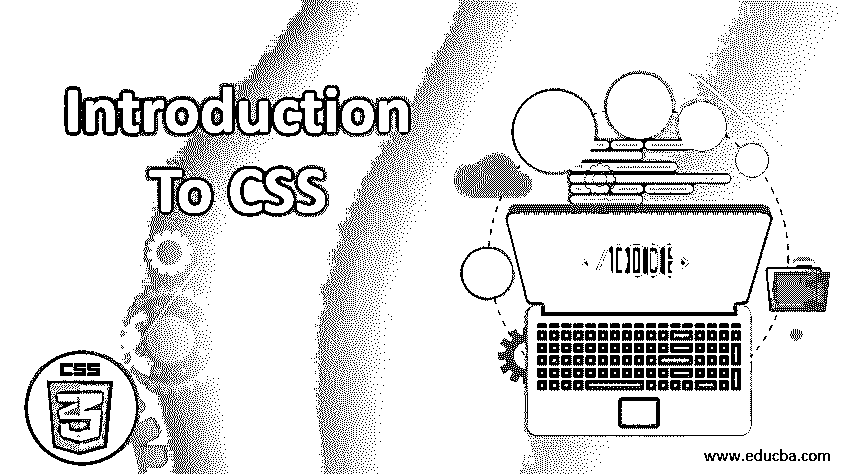

# CSS 简介

> 原文：<https://www.educba.com/introduction-to-css/>

## CSS 简介

层叠样式表，也就是众所周知的 CSS，是一个非常简单的设计过程，用来使网页更加美观。CSS 允许你放置样式来定制你的网页。利用这种样式特性的最大好处是 CSS 独立于 HTML 创建网页的方式。超文本标记语言和级联样式表之间的基本区别在于，前者主要是为网页提供景观的结构方式，而前者旨在提供强大的颜色编码和样式技术。它用于同时控制多个网页的布局。所有外部样式表都以 CSS 文件的形式存储。

### CSS 的主要组件

在上面的部分中，我们已经学习了 CSS 的介绍，所以现在我们继续学习 CSS 的主要组件如下:

<small>网页开发、编程语言、软件测试&其他</small>

**1。易于维护:**如果您打算进行任何全局更改，只需更改样式，您就可以看到所有其他网页中的所有其他元素都会自动更新。

**2。CSS 是省时的:**你只需写一次脚本，就可以多次重用同一张表。

**3。与原生前端相比，CSS 拥有更广泛的属性和列表。因此，与普通的 HTML 属性相比，HTML 页面可以有更明亮的外观和感觉。**

**4。轻松使用搜索引擎:** CSS 被认为是一种非常方便、易读的样式表单。这意味着搜索引擎不必花太多精力去阅读文本。

**5。高效的缓存存储:** CSS 可以用来在离线缓存机制的帮助下本地存储 web 应用程序，离线缓存机制可以用来查看离线网站。

### CSS 的特征

当我们讨论 CSS 及其组件的介绍时。现在我们要学习 CSS 的特点。CSS 的主要特征包括由客户端浏览器解释并应用于文档中各种元素的样式规则。主要特征包括:

1.  样式规则由选择器组件和声明块组件组成。
2.  选择器用于指向您想要样式化的 HTML 组件。
3.  在声明块中，一个或多个声明与分号一起包含。
4.  每个声明都有一个 CSS 属性名、一个分号和一个值。例如，颜色是属性，值是红色。字体大小是属性，15px 是值。
5.  CSS 声明以分号结束，这些块用花括号括起来。
6.  [CSS 选择器](https://www.educba.com/types-of-css-selectors/)是用来查找基于元素名称、id、属性、类等等的 HTML 元素的选择器。
7.  将通过元素的 ID 选择一个唯一的元素。
8.  如果希望选择具有特定 id 的特定元素，应该使用#函数和 id 属性。
9.  如果您希望选择具有特定类别的元素，则应书写句点字符和名称类别。
10.  **通用选择器:**如果你对选择某种类型的元素不感兴趣，通用选择器只是匹配元素名。
11.  **元素选择器:**这些选择器根据元素名称选择元素。
12.  **后代选择器:**当一个特定的元素位于另一个元素内部时，它被称为后代选择器。
13.  id 选择器:这个选择器使用 HTML 元素的 ID 来选择特定的元素。
14.  **类选择器:**选择具有特定类属性的元素。
15.  **将选择器分组:**将选择器分组是一个很好的选择，这样可以最小化代码。每个选择器都应该和一个逗号一起用于对选择器进行分组。

### CSS 的应用

在学习了 CSS 的介绍和 CSS 的特点之后，我们要学习 CSS 的应用。HTML 访问 CSS 有三种方式:

#### 1.在一条直线上的

内联样式表只用于影响它所在的标签。这实质上意味着页面上的小细节可以在不改变页面整体布局或页面上所有内容的情况下进行更改。这是有利的，就好像你在外部页面上有所有的东西，然后你需要添加额外的标签来改变细节。Inline 否决 external，这意味着小细节可以更改。它还重写了内部。

#### 2.内部的

只有当您想在单个标记中添加一个小的变化时，才会使用 internal。这是因为 inline 只影响其中包含的一个标签，而内部样式则放在 HTML 文档的头部。这意味着，如果您希望定制页面，只需滚动即可看到所有需要的更改。内部样式被放置在标签内部。相比之下，由于独立的样式和标签，这看起来更整洁、简单、优雅和有组织。

#### 3.外部的

外部样式表用于允许人们在完全不同的文档上格式化和重新创建他们的网页。这实际上意味着您可以有两个或更多的工作区，因为可以在文档中嵌入多个样式表，从而为您提供一个更加整洁的工作区。在这种情况下，可以很容易地访问样式表，这是一个很大的优势，但另一方面，外部工作表中的任何更改都会影响它所链接的所有父工作表。

### CSS 的优点和缺点

以下是优点和缺点:

#### 优势

下面是提到的优点:

1.  设备兼容性
2.  更快的网站速度
3.  易于维护
4.  持续和自发的变化
5.  重新定位的能力
6.  增强搜索引擎抓取网页的能力

#### 不足之处

以下是缺点:

1.  跨浏览器相关问题
2.  易受伤害的
3.  多层次导致的问题
4.  缺乏安全感
5.  分裂

### 结论

CSS 赋予了网页设计者强大的力量，这样，只需使用一个文件，就可以对一个网站中所有页面的网页布局进行广泛的修改。它有助于设计光和一个具有高响应性的创造性网站，并在显示时给观众留下深刻印象。因此，它是当今网站不可或缺的一部分，不容忽视。

### 推荐文章

这是一个关于 CSS 入门的指南。这里我们已经讨论了 CSS 的主要组件、特征、优点和缺点。您也可以阅读以下文章，了解更多信息——

1.  [CSS 面试问题](https://www.educba.com/css-interview-questions/)
2.  [CSS 伪元素](https://www.educba.com/css-pseudo-elements/)
3.  [CSS 文本缩进](https://www.educba.com/css-text-indent/)
4.  [CSS 非选择器](https://www.educba.com/css-not-selector/)

