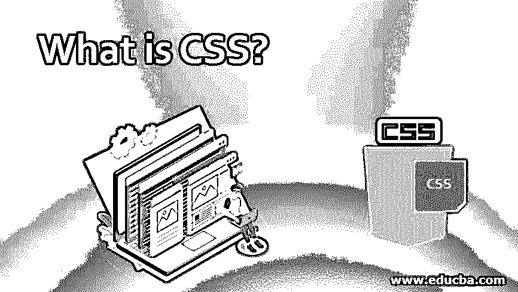
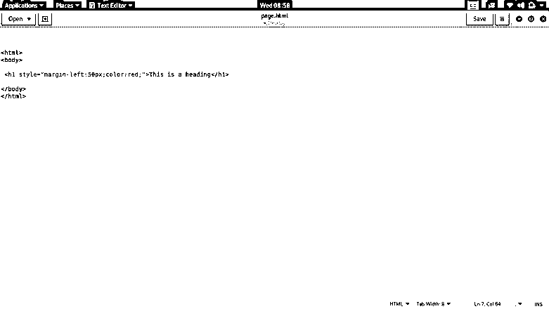
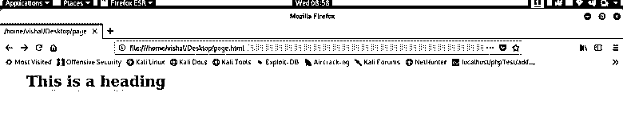
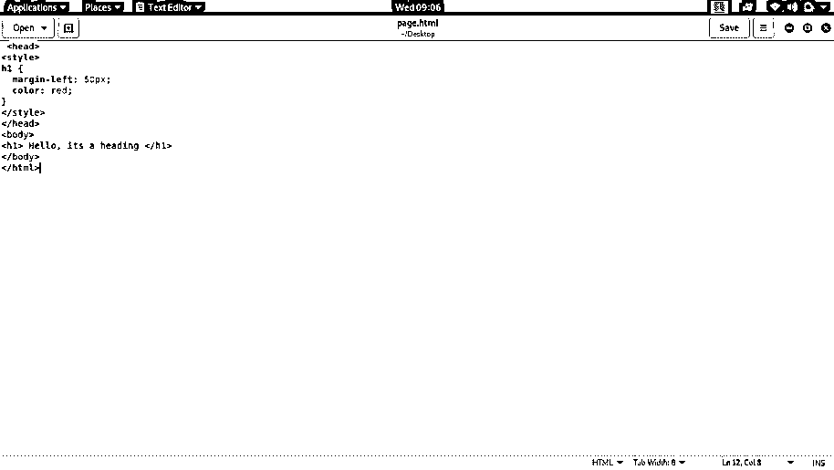
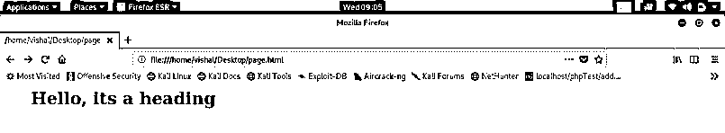
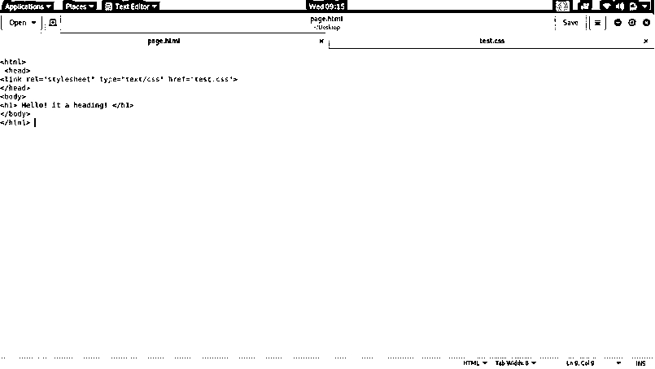
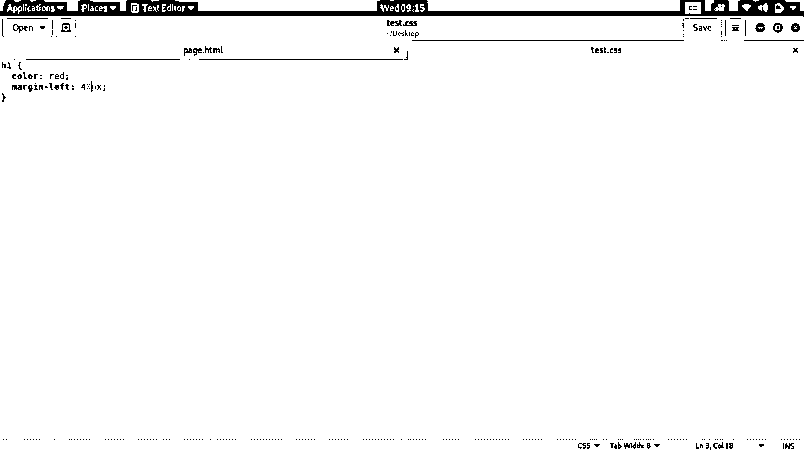
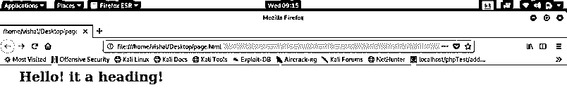

# 什么是 CSS？

> 原文：<https://www.educba.com/what-is-css/>

## CSS 简介

级联样式表被称为 CSS，处理网页的外观和感觉。使用 CSS，您可以控制文本颜色、字体样式、段落之间的距离、列的大小和显示、背景图像或颜色的使用、布局设计、不同设备和屏幕大小的显示变化以及一系列其他效果。CSS 学习和理解起来很简单，但它能有力地控制 HTML 文档的提交。CSS 通常与 HTML 或 XHTML 标记语言结合在一起。

### 什么是 CSS？

你一定在网上看过网页。例如，当你打开脸书时，你会看到一个交互式屏幕，在那里你可以看到图像，播放视频，写评论，并做一些活动。嗯，我的朋友，这就是我们所说的网页。因此，要创建网页，我们需要 HTML，一种用于创建网页结构的标记语言。

<small>网页开发、编程语言、软件测试&其他</small>

HTML 的局限性在于，我们只能给网页赋予形状和大小，却不能让它看起来有吸引力，这就是它的用武之地。它代表级联样式表，允许我们利用不同的属性来使网页看起来漂亮、有吸引力或专业。改变表格或区域的结构，给文本着色，设置空白和填充，选择文本字体，这些都是我们可以借助它来做的事情。

这可以被定义为用于修改网页的外观或结构的样式表语言。简单来说，这就是用来装饰网页的语言。网页通常由结构、设计和客户网站功能组成。HTML 提供结构，客户端站点功能由一种叫做 JavaScript 的脚本语言提供，设计由 CSS 提供。

CSS 的当前版本是 CSS 4，发布于 2017 年 3 月 24 日。最新版本比上一个版本更快，上一个版本是 CSS 3。它不能单独使用，必须与 HTML 集成才能实现其效果。根据它与 HTML 的集成方式，它有三种类型:内嵌、内部和外部。在内联中，代码必须写在同一行；在内部，代码必须在 head 标签内的 style 标签和外部标签之间定义，文件必须与 HTML 页面连接。

### CSS 是如何让工作变得如此简单的？

级联样式表使网页交互更加容易。它允许我们设计网页以提供良好的用户体验，并允许用户轻松导航。此外，它以某种体面的方式描绘了网页，这仅仅用 HTML 是做不到的。除了它的好处之外，它使页面有点重，但是另一方面，它也可以相应地用于管理网页大小。

一方面，它为用户提供了工作的便利，另一方面，它也为网页设计者提供了实现的便利。根据您需要添加的 CSS 代码的数量，您可以在内联、内部和外部 CSS 样式中进行选择。对于每种样式模式，它都提供了一种非常简单的机制来在网页上引入样式。

### 你能用 CSS 做什么？

以下几点展示了 CSS 的能力。

#### 1.修改网页结构

我们可以改变表格的形状以及赋予网页结构的 div。它提供的属性可以用来弯曲矩形的顶点，并做很多类似的事情。

#### 2.使用字体

它允许我们改变文本的字体和颜色。我们可以选择任何一种颜色，只需在相应的属性中写下它的名字。简单地说，它也可以装饰文本。

#### 3.改善用户体验

通过使用级联样式，sheet developer 可以提高网页的质量，最终获得令人惊叹的用户体验。它也使用户导航变得容易。

#### 4.创造良好的效果

通过使用 CSS，人们可以实现像阴影效果，这使得事情看起来非常有吸引力。阴影生成可以参与结构和其他元素，如文本。

### 使用 CSS

接下来是最有用也是最关键的部分，它将告诉我们如何使用 CSS，或者实现它，或者将网页与它集成。

这里我们将看到如何使用不同类型的样式。

#### 1.内嵌 CSS

在内联 CSS 中，我们将 CSS 代码和 HTML 标签放在一行中。通常，当我们只需要使用一次这种格式或者这种格式只需要添加几个属性时，我们会使用内联 CSS。尽管它在实际的 web 开发中并不经常使用，但是我们应该学习所有的东西。

**输入:**

**输出:**

*   这是输入的图像；您将能够看到代码是用淡紫色编写的，并且与 HTML 代码一起出现。
*   为了从左边距向标题提供边距，使用了 left 属性，50 PX 是定义边距应该有多长的属性值。
*   为了改变标题的颜色，使用了 color 属性。红色是使标题看起来是红色的属性值。

#### 2.内部 CSS

当特性被分配给任何标签时，级联样式表被称为是内部的，因此无论标签在哪里被定义，它将默认继承分配给该标签的所有特性。为了引入 internal，CSS 代码必须写在 head 部分的 style 标记之间。

**输入:**

**输出:**

*   这里，我们在 h1 标记中应用了与内联 CSS 示例中相同的属性。唯一的区别是它在网页上的定义方式。
*   为了实现内部，这段代码写在之间。
*   h1 {属性..}表示无论属性是什么；这些将自动应用于 h1 标签之间的所有文本。

#### 3.外部 CSS

之所以称之为外部，是因为在这种类型中，必须创建一个 CSS 文件，然后将该文件与网页相链接，以引入已定义标签的功能。它使得主网页的尺寸非常小，因为不需要在网页上编写 CSS 代码。所有代码都将包含在一个单独的 CSS 文件中，该文件将链接到该网页。

**HTML 文件输入:**

**CSS 文件输入:**

**输出:**

*   这里我们创建了一个名为 test.css 的单独文件，它使用 link 标记及其 real 和 style 属性链接到主 HTML 页面。
*   已经为 CSS 文件中的 h1 标记定义了属性。
*   CSS 文件与 HTML 文件成功链接后，它从 test.css 文件继承了 h1 标记的功能。

### 优势

它增加了网页的庄重感。它使 web 页面成为一个更好的交互平台，用户可以在这个平台上舒适地使用 web 应用程序。使用 CSS 可以完成很多事情。我们将关注 CSS 的一些常见好处，这些好处使它成为网页设计，或者说 UI 开发的一个非常重要的部分。

*   简化用户界面:有时仅仅使用 HTML 设计的网页看起来很难操作。给网页增加惊喜，让它看起来又酷又简单，这样用户就可以专注于他们的工作。
*   **装饰网页:**层叠样式表语言用于网页的装饰，使其看起来得体。CSS 中有几个属性可以用来共同设计网页。
*   **定制网页布局:**它有各种各样的属性，与网页的结构一起工作，使之成为开发者想要的样子。它允许 web 设计者定制应用程序界面，使其适合所需的领域。
*   **容易集成:**通过这个给我们提供了很多好处，把 [CSS 和 HTML](https://www.educba.com/html-vs-css/) 集成起来一点都不费劲。在网页上引入 CSS 有很多种方法，每一种都可以很容易地使用。
*   **轻松编码:**我们已经明白 CSS 不是一种编程语言，而是一种样式语言。有固定和有限数量的属性，人们必须记住，使 CSS 编码真的非常容易。

### 所需技能

下面给出了所需的技能:

*   了解我们需要什么样的技能来使用它是非常重要的。通过这一部分，我们对用 CSS 编码需要什么有了一些想法。但是，同样，我们将通过技能，可以帮助我们在 CSS 编码。
*   正如已经讨论过的，CSS 不是一种编程语言，所以很明显这里不需要逻辑，但是是的，它有一些应该记住的属性。根据需求，您将能够调整相应属性的值，但是在我们向任何属性添加值之前，我们必须知道它接受什么样的值。
*   要编写这样的代码，我们应该对 HTML 有所了解，因为 CSS 就是将它与 HTML 提供的布局很好地集成在一起，这样就可以生成一个像样的网页。所以我们需要用 CSS 编码的主要技能。

### 范围

它是一种让我们设计网页的常青风格语言。我们都知道，互联网是当代的一件大事，并将继续发展。由于互联网主要是访问网站提供的信息，网页设计师将不断获得一些机会。除了成为一名网页设计师，你还可以在用户界面开发方面发展自己的事业。

### 谁是学习 CSS 技术的合适受众？

很明显，任何渴望学习任何东西的人都可能是最好的观众，但更具体地说，在他们的学科中有网页设计的学生可以学习 CSS。在专业水平上，这是网页设计师的必备技术。我见过许多人总是想制作自己的网站，这样他们也可以成为本教程或 CSS 技术的最佳观众。

### 这项技术将如何帮助你的职业发展？

这在网页设计中起着至关重要的作用。随着互联网用户的指数增长，网站的数量也应该增加。而如果需求在增加，机会和增长一定会轰轰烈烈的到来。在接下来的几年里，网页设计师的数量应该会迅速增加。

此外，在任何组织中担任网页设计师的人都会非常精通这项技术，通常也会从事自由职业。Freelancer.com、upwork.com 等在线平台将自由职业者和想要雇佣自由职业者的人联系起来。网页设计也可以远程完成，所以从国外获得项目的机会很大。

### 结论

这是网页设计中最好也是最关键的部分。它允许开发者使网页看起来比仅仅使用 HTML 更好。它是一种样式语言，能够处理 web 页面的结构，并可以向标签添加各种功能，使事情看起来更好。它一直是几项技术中最好的，并将在更长时间内保持其地位。

### 推荐文章

这是一个什么是 CSS 的指南？在这里，我们讨论 CSS 的工作和优势，以及实施这项技术的顶级公司。您也可以浏览我们推荐的其他文章，了解更多信息——

1.  [CSS 和 CSS3](https://www.educba.com/css-vs-css3/)
2.  [CSS 命令](https://www.educba.com/css-commands/)
3.  [纯 CSS 工具提示](https://www.educba.com/pure-css-tooltip/)
4.  [CSS 字体改变](https://www.educba.com/css-font-change/)

