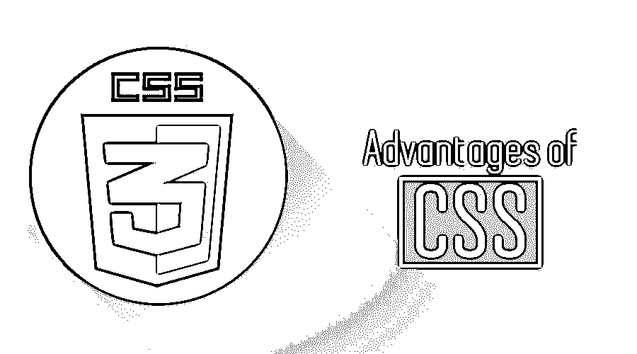

# CSS 的优势

> 原文：<https://www.educba.com/advantages-of-css/>

## CSS 优势介绍

想象一下，任何一个网站都有很好的彩色图片、结构化内容和数据展示。比如说 Myntra [网络应用](https://www.educba.com/what-is-web-application/)(电子商务)，这个网站是黑白色调的，没有图片，没有演示，也没有使用颜色。这就是全世界都知道的 CSS(又名[层叠样式表](https://www.educba.com/cheat-sheet-css/)的威力。 [CSS 是一种](https://www.educba.com/what-is-css/)样式表语言，用于在屏幕上显示细节；该样式表用于使结构化内容更易于呈现。

<small>网页开发、编程语言、软件测试&其他</small>

*   网站名称和徽标
*   家
*   大约
*   接触

以上场景描述了 CSS 在 web 开发中的重要性和优势。

### CSS 的六大优势

正如我们讨论 CSS 优势的介绍。让我们进一步了解 CSS 的优势如下:

1.  每个网站都有内容，都有预定义的结构或布局。这种布局用于呈现内容。这是 CSS 的主要[目的；它将文档结构与文档的表示分离开来。正如我们大多数人都知道 HTML 的这个基本定义一样，HTML 是关于结构的，而不是别的。有了 CSS，用户可以在需要的时候快速修改，但是对于 HTML 来说这不是一个简单的任务](https://www.educba.com/css-arrow/)[。早先我的网页的背景颜色是红色的(代码将是#ff000)。如果开发者想改变任何设计颜色，他只需要修改一行代码，这将反映在任何数量的网页上。他会(浅灰色代码# eeeeee)改变这一点，他的工作就完成了。](https://www.educba.com/html-works/)

2.  较少使用编码将提高页面效率，减少加载时间。加载时间越长，用户就越沮丧。了解编码中实际发生的事情以及 CSS 如何成为救世主是很有趣的。成像表字段是内置代码；这使得读取代码两次。第一次是理解表格的基本结构，第二次是实际显示表格中的内容。这项双重工作可能会降低网站的加载速度。现在是 CSS 的优势，虽然图像总是比上面参考中使用或讨论的最大代码大，因为我们在一个单独的文件中使用 CSS，代码[内置的 CSS 格式](https://www.educba.com/css-text-formatting/)将在第一次初始请求后缓存，无需再次下载页面。这是 CSS 优于 HTML 的关键行为之一。

3.  一致的方法是 CSS 提供给用户的东西，通过对你的网站做一个小的改变，同样的改变会反映在网站的其他部分。你的网站内容和布局越大，CSS 为你节省的时间就越多。它还检查并确保每个页面都是一致的，这也是 CSS 的基本优势。

4.  从商业角度来看，你在数字市场即互联网的存在是非常重要的。CSS 被认为是 web 开发最安全的编码方法之一，这也意味着你的网站比代码有更多的内容。CSS 的优势之一是它对数字营销非常[有帮助，你网页的每一次推广都给了你一个赢得生意的机会。因此，在 CSS 技术的帮助和使用下，更多的内容而不是代码公式最终会对数字营销和您的业务更好。](https://www.educba.com/digital-marketing-tips/)

5.  可访问性是考虑 CSS 优于其他技术的一个重要因素。在印度，网站在可访问性标准(W3C 规范)方面没有太大的压力。W3C 的工作原则是让残疾用户像正常用户一样平等地访问每个网站。首先，CSS 通过创建结构和文档使任何屏幕阅读器更容易精确地阅读内容，从而有利于可访问性。这对失聪用户很有帮助，因为他们依赖屏幕阅读器来使用 web 应用程序。一些屏幕阅读器的名称-

*   [女士旁白](https://en.wikipedia.org/wiki/Microsoft_Narrator)
*   [钳口](https://en.wikipedia.org/wiki/JAWS_(screen_reader))

以上只是冰山一角，因为故事是无穷无尽的。可访问区域非常大，并且充分利用了 CSS。除了上面提到的事实之外，CSS 在很多方面都有助于可访问性，让我们简单看一下——

*   间距、对齐和定位:意味着 CSS 及其更高版本对视觉布局的控制非常好，比如边距、浮动、文本缩进。这增加了视觉效果，对弱视用户很有帮助。
*   格式样式的用户覆盖
*   生成的内容是滚动条、框架和目录等线索

详细讨论见此[链接](https://www.w3.org/TR/CSS-access/)

6.  因为我们不能否认的事实是，无论开发什么，在发布之前都要经过测试。因此，每个 web 应用程序在交付给客户之前都必须通过测试标准。现在随之而来的是兼容性问题。在速度、内容加载、一致性、响应时间和信息呈现方面，您的网站兼容不同浏览器的速度如何？看到这个[链接](https://en.wikipedia.org/wiki/List_of_web_browsers)，因为有大量的网络浏览器，你不能忽略兼容性因素。CSS 样式表在上述所有方面增加了您的 web 适应性，并确保您的用户有一个统一的视图。

### **结论**

在我们的[网站开发](https://www.educba.com/web-design-and-development/)中，我们遇到了 CSS 的一些重要优势。它有广泛的可用性和使用案例，从开发和设计，以及它如何影响其他商业因素，如搜索引擎优化，数字营销和搜索引擎等。此外，在世界范围内考虑的非常关键的一点是 CSS 为其用户提供的可访问性优势。适者生存不仅是自然法则，而且已经被技术完全吸收。目前 CSS4 已经上市，很快 CSS5 或更新的版本也将上市。看到这些逐渐的增长，仅仅意味着 CSS 已经成功地表明了它的重要性，并且会长期存在。与其他技术(HTML)相比，它允许商业和网页设计者和开发者使用最少的努力来改变[网页布局和结构。](https://www.educba.com/css-layout/)

希望上面的陈述对我们的读者和想为你的企业开发网站的人来说足够有效，CSS 是一站式解决方案是我们所能说的。

CSS——一个更轻、更快、更灵敏的网站创建技术

### 推荐文章

这是 CSS 优势的指南。这里我们已经详细讨论了基本介绍和使用 CSS 的一些优点。您也可以阅读以下文章，了解更多信息——

1.  [学习顶级 CSS 命令](https://www.educba.com/css-commands/)
2.  [CSS 职业|职位和申请](https://www.educba.com/career-in-css/)
3.  [CSS 区分大小写|特性和优势](https://www.educba.com/is-css-case-sensitive/)
4.  [CSS vs JavaScript |找出区别](https://www.educba.com/css-vs-javascript/)

