# CSS 命令

> 原文：<https://www.educba.com/css-commands/>

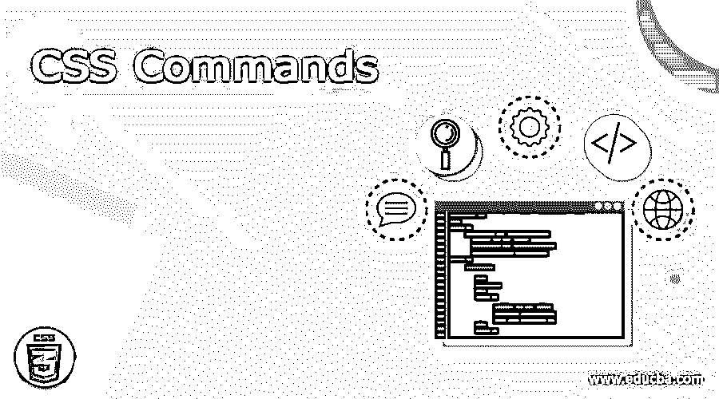

## CSS 命令简介

CSS 代表[级联样式表](https://www.educba.com/cheat-sheet-css/)。它用于描述以 HTML 这样的标记语言编写的文档的表示。它负责分离表示和内容，包括不同的布局、颜色和字体。这种分离提供了灵活性，也控制了不同的特征，这些特征[通过指定相关的 CSS 使得多个网页](https://www.educba.com/web-page-design-layout/)能够共享格式。CSS 规范由万维网联盟维护。除此之外，如果从移动设备访问内容，它还提供了有助于替代格式的特定规则。

### 基本 CSS 命令

下面提到了一些基本命令:

<small>网页开发、编程语言、软件测试&其他</small>

**1。CSS 语法:**CSS 命令中有一组需要遵循的规则。CSS 规则集由选择器和声明块组成。选择器用来指向用户想要样式化的 HTML 元素[。声明块可以包含一个或多个用分号分隔的声明。每个声明都应该包含一个属性名及其值，并用冒号分隔。](https://www.educba.com/uses-of-html/)

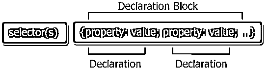

**2。id 选择器**:ID 选择器可以使用 HTML 元素属性的 ID，帮助选择特定的元素。它用于选择一个唯一的元素，并且该元素对于该页面应该是唯一的。为了选择具有特定 id 的元素，使用“#”，后跟该元素的 id。

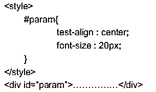

**3。类选择器:**为了选择一个特定的类属性，类选择器用于从该类中选择元素。为了利用特定 a 类周期(.)字符被使用。它后面是类名。这样，如果用户希望只使用特定的元素，那么只有那些元素可以由类指定。

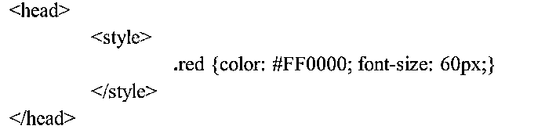

**4。分组选择器:**有时候元素有相同的样式定义。将它们组合在一起并最小化代码是一个更好的选择。对于组，选择器的用户可以使用逗号分隔每个选择器

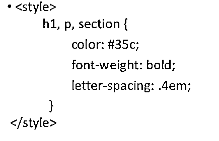

**5。注释:**这些 CSS 命令建议在编写代码时使用。它们清楚地说明了代码在做什么，并帮助您或其他不熟悉代码的人据此进行工作。浏览器会忽略注释。CSS 注释以/* */开始和结束。

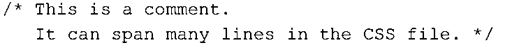

**6。display:**Block——许多 HTML 元素被设置为这种显示模式。默认情况下，[块级元素](https://www.educba.com/block-level-elements-in-html/)占用同样多的空间，它们不能与任何其他显示模式放在同一行。可以根据自己的意愿改变元素的高度和宽度。

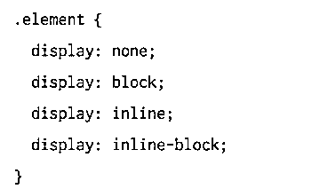

7 .**。CSS 中的颜色:**在这个 CSS 命令中，颜色可以在 RGB 公式中指定。每个参数定义这些颜色的强度，并定义一种新的颜色。例如，要显示黑色，所有颜色参数都应设置为 RGB(0，0，0)。

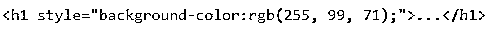

**8。背景色:**背景色属性定义了元素背景的颜色。通过给颜色命名，添加十六进制值或设置 [RGB 值](https://www.educba.com/rgb-color-model/)，可以轻松定义颜色

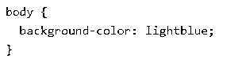

**9。背景图像:**背景图像可以设置为您选择的任何特定图像。一旦图像被设置，它就会重复，并覆盖整个元素。

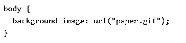

10。CSS Margins: CSS 命令有不同的边距属性，可以帮助在不同的元素周围创建空间，并且定义这些外部边界。CSS 可以有类似上边距、右边距、下边距和左边距的属性。

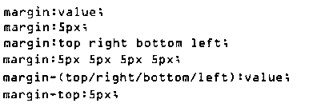

### 中间 CSS 命令

下面提到了一些中间命令:

**1。Class 和 ID 选择器:**除了 HTML 标签，用户可以定义自己的选择器，可以是 class 或 ID 的形式。这些的主要用途是，你可以拥有相同的 HTML 元素，并根据 ID 或必要的类以不同的方式呈现它。

**2。伪类:**这些类用于为给定的选择器指定特定的状态或关系。这些类也可以采用 selector:pseudo _ class { property:value；}.这个类通过简单地在选择器和伪类之间加一个冒号来定义。

**3。文本格式:**添加的文本可以使用格式属性进行定制和格式化。可以使用关键字“颜色”来更改颜色。文本的对齐也是如此。通过使用文本装饰，可以设置和删除装饰。可以针对案例进行转换。

**4。CSS 字体:**[CSS 中的字体](https://www.educba.com/css-font-properties/)有不同的族，像通用族和字体族。字体系列是一个文本系列。通用字体具有一组外观相似的字体系列，而字体具有特定的字体。

**5。图标:**通过使用图标库和添加指定图标类的名称，图标可以很容易地在 CSS 中使用。

**6。CSS 也可以显示表格，并帮助定制边框、宽度和高度。通过使用像“边框”、“宽度”和“高度”这样的关键字，用户可以很容易地在网页上设置表格。**

**7。定位:**该属性指定可用于任何元素的定位方法的类型。这个位置可以是静态的、相对的、固定的、绝对的或粘性的。

**8。溢出:**这个属性有助于控制太大而不适合一个区域的内容。

**9。float:**float 属性让元素知道它应该如何浮动。它指定哪些元素可以浮动在被清除的元素旁边。

10。不透明度:这个属性定义了任何元素的不透明度或透明度。

### 高级 CSS 命令

下面提到了一些高级命令:

**1。CSS 圆角:**通过使用‘border-radius’属性，一个元素可以被赋予圆角。您也可以从四个角中指定一个特定的角，并根据您的选择进行更改。

**2。边框图像**:你可以设置一个图像作为任何元素的边框。这可以通过使用边框图像属性来实现。它获取图像并将其分割成九个部分，然后将拐角放置在拐角处，中间部分被重复或拉伸。

### 提示和技巧

*   使用 reset.css 并重置所有基本样式。
*   使用速记 CSS 可以缩短编写命令 CSS 代码的方式。
*   使用 [CSS 调试工具](https://www.educba.com/introduction-to-css/)来调整、理解和调试 CSS 命令样式。

### 结论

CSS 命令有助于保持文档的信息内容独立，并有助于显示它。它有助于避免重复，易于维护代码，并使用不同风格的相同内容。

### 推荐文章

这是 CSS 命令的指南。在这里，我们讨论了概念，基本，中级和高级 CSS 命令以及有效使用的提示和技巧。您也可以阅读以下文章，了解更多信息——

1.  [MySQL 命令](https://www.educba.com/mysql-commands/)
2.  [PL/SQL 命令](https://www.educba.com/pl-sql-commands/)
3.  [SQL 命令](https://www.educba.com/sql-commands/)
4.  [角度命令](https://www.educba.com/angular-commands/)

