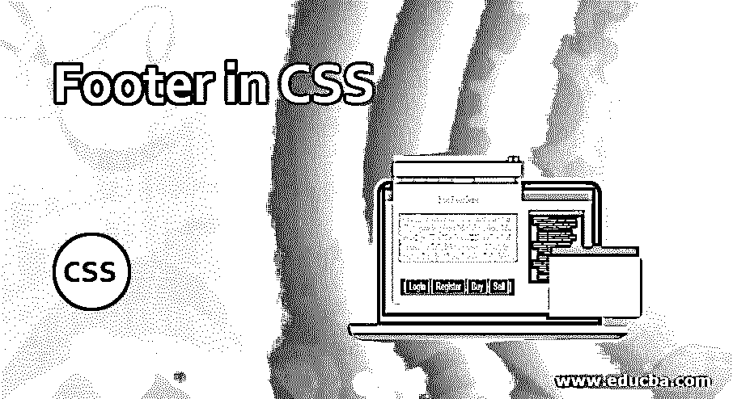
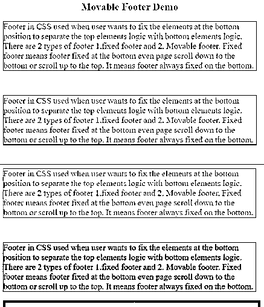
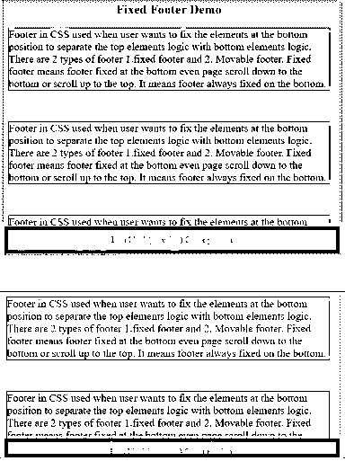
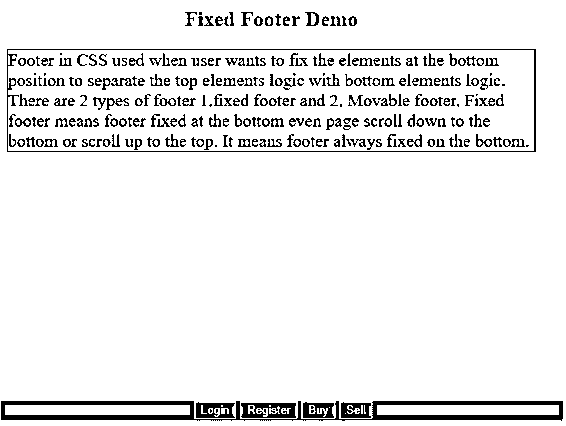

# CSS 中的页脚

> 原文：<https://www.educba.com/footer-in-css/>




## CSS 中页脚的介绍

当用户希望将元素固定在底部位置以将顶部元素的逻辑与底部元素的逻辑分开时，可以使用 CSS 中的页脚。有两种类型的页脚固定页脚和移动页脚。固定页脚是指页脚固定在底部，即使页面向下滚动到底部或向上滚动到顶部。这意味着页脚总是固定在底部。如今，几乎所有的网站都有固定页脚功能，因为当我们向下滚动到整个页面时，很难从页脚中选择不同的选项。如果我们想访问页脚元素，那么我们必须再次回到底部并选择选项。会消磨用户时间；因此，开发人员在 bootstrap 中提出了粘性页脚的概念。因此，他们中的大多数人更喜欢固定页脚而不是可移动页脚，因为可移动页脚总是随着页面滚动。

**优势:**

<small>网页开发、编程语言、软件测试&其他</small>

*   使用固定页脚轻松访问底部元素。
*   页脚将逻辑与页眉元素分开。

### 为什么 CSS 胜过 HTML？

在 HTML 中，开发人员必须为每个类、id、链接、按钮等分别编写样式。而在 CSS 中，即使我们有 1000 个 html 页面，我们也可以在一个 CSS 文件中编写公共逻辑，并且可以用<link>标签包含在 HTML 文件中。

**注意:** CSS 文件用。css 扩展。

### 页脚在 CSS 中是如何工作的？

CSS 中的 Footer 只不过是底部的一个类似导航条的结构；我们可以让导航栏在底部固定(粘贴页脚)或可移动，然后使用下面的语法。

**固定页脚的语法:**

```
<style>
.footer {
position: fixed;
}
</style>
<div class="footer">
<p>Footer</p>
</div>
```

**可移动页脚的语法:**

```
<style>
footer {
display: block;
}
</style>
<div class="footer">
<p>Footer</p>
</div>
```

### CSS 中页脚的例子

下面提到了不同的例子:

#### 示例 1–可移动页脚

**代码:**

```
<!DOCTYPE html>
<html>
<head>
<style type="text/css">
h2 {
text-align: center;
color: green;
}
.footer {
position: block;
width: 100%;
left: 0;
bottom: 0;
color: maroon;
text-align: center;
background-color: green;
}
.p1 {
border-style: solid;
border-color: red;
border-width: 1px;
font-size: 20px;
color: blue;
}
.p2 {
border-style: solid;
border-color: blue;
border-width: 1px;
font-size: 20px;
color: fuchsia;
}
.p3 {
border-style: solid;
border-color: brown;
border-width: 1px;
font-size: 20px;
color: red;
}
.p4 {
border-style: solid;
border-color: red;
border-width: 1px;
font-size: 20px;
color: lime;
}
div {
width: 600px;
}
</style>
</head>
<body>
<div class="container">
<h2>Movable Footer Demo</h2>
<p class="p1">Footer in CSS used when user wants to fix the elements at the bottom position to separate the top elements logic with bottom elements logic. There are 2 types of footer 1.fixed footer and 2\. Movable footer. Fixed footer means footer fixed at the bottom even page scroll down to the bottom or scroll up to the top. It means footer always fixed on the bottom. </p>
<br>
<p class="p2">Footer in CSS used when user wants to fix the elements at the bottom position to separate the top elements logic with bottom elements logic. There are 2 types of footer 1.fixed footer and 2\. Movable footer. Fixed footer means footer fixed at the bottom even page scroll down to the bottom or scroll up to the top. It means footer always fixed on the bottom.</p>
<br>
<p class="p3">Footer in CSS used when user wants to fix the elements at the bottom position to separate the top elements logic with bottom elements logic. There are 2 types of footer 1.fixed footer and 2\. Movable footer. Fixed footer means footer fixed at the bottom even page scroll down to the bottom or scroll up to the top. It means footer always fixed on the bottom.</p>
<br>
<p class="p4">Footer in CSS used when user wants to fix the elements at the bottom position to separate the top elements logic with bottom elements logic. There are 2 types of footer 1.fixed footer and 2\. Movable footer. Fixed footer means footer fixed at the bottom even page scroll down to the bottom or scroll up to the top. It means footer always fixed on the bottom.</p>
</div>
<div class="footer">
<p>I am block(movable) footer portion</p>
</div>
</body>
</html>
```

**输出:**




**说明:**在上面的例子中，你可以看到页脚随着上下滚动而移动。

#### 示例 2–固定页脚

**代码:**

```
<!DOCTYPE html>
<html>
<head>
<style type="text/css">
h2 {
text-align: center;
color: brown;
}
.footer {
position: fixed;
width: 100%;
left: 0;
bottom: 0;
color: maroon;
text-align: center;
background-color: green;
}
.p2 {
border-style: solid;
border-color: red;
border-width: 1px;
font-size: 20px;
color: blue;
}
.p4 {
border-style: solid;
border-color: blue;
border-width: 1px;
font-size: 20px;
color: fuchsia;
}
.p3 {
border-style: solid;
border-color: brown;
border-width: 1px;
font-size: 20px;
color: red;
}
.p1 {
border-style: solid;
border-color: red;
border-width: 1px;
font-size: 20px;
color: lime;
}
div {
width: 600px;
}
</style>
</head>
<body>
<div class="container">
<h2>Fixed Footer Demo</h2>
<p class="p1">Footer in CSS used when user wants to fix the elements at the bottom position to separate the top elements logic with bottom elements logic. There are 2 types of footer 1.fixed footer and 2\. Movable footer. Fixed footer means footer fixed at the bottom even page scroll down to the bottom or scroll up to the top. It means footer always fixed on the bottom. </p>
<br>
<p class="p2">Footer in CSS used when user wants to fix the elements at the bottom position to separate the top elements logic with bottom elements logic. There are 2 types of footer 1.fixed footer and 2\. Movable footer. Fixed footer means footer fixed at the bottom even page scroll down to the bottom or scroll up to the top. It means footer always fixed on the bottom.</p>
<br>
<p class="p3">Footer in CSS used when user wants to fix the elements at the bottom position to separate the top elements logic with bottom elements logic. There are 2 types of footer 1.fixed footer and 2\. Movable footer. Fixed footer means footer fixed at the bottom even page scroll down to the bottom or scroll up to the top. It means footer always fixed on the bottom.</p>
<br>
<p class="p4">Footer in CSS used when user wants to fix the elements at the bottom position to separate the top elements logic with bottom elements logic. There are 2 types of footer 1.fixed footer and 2\. Movable footer. Fixed footer means footer fixed at the bottom even page scroll down to the bottom or scroll up to the top. It means footer always fixed on the bottom.</p>
</div>
<div class="footer">
<p>I am block(movable) footer portion</p>
</div>
</body>
</html>
```

**输出:**




**解释:**即使我们上下滚动，你也能看到上例中固定的页脚。

#### 示例 3–带按钮的固定页脚

**代码:**

```
<!DOCTYPE html>
<html>
<head>
<style type="text/css">
h2 {
text-align: center;
color: brown;
}
.footer {
position: fixed;
width: 100%;
left: 0;
bottom: 0;
color: maroon;
text-align: center;
background-color: blue;
}
button
{
color: white;
background: green;
}
.p1 {
border-style: solid;
border-color: red;
border-width: 1px;
font-size: 20px;
color: maroon;
}
div {
width: 600px;
}
</style>
</head>
<body>
<div class="container">
<h2>Fixed Footer Demo</h2>
<p class="p1">Footer in CSS used when user wants to fix the elements at the bottom position to separate the top elements logic with bottom elements logic. There are 2 types of footer 1.fixed footer and 2\. Movable footer. Fixed footer means footer fixed at the bottom even page scroll down to the bottom or scroll up to the top. It means footer always fixed on the bottom. </p>
</div>
<div class="footer">
<button  class="b1">Login</button>
<button  class="b2">Register</button>
<button  class="b3">Buy</button>
<button  class="b4">Sell</button>
</div>
</body>
</html>
```

**输出:**




### 结论

CSS 中的页脚可以通过两种方式实现，比如固定页脚和可移动页脚。首先，页脚用于分隔页眉逻辑和页脚逻辑，并通过使用固定页脚来更快地访问底部元素。

### 推荐文章

这是一个 CSS 中的页脚指南。这里我们讨论 CSS 中的页脚的例子，以及它如何与固定页脚的语法一起工作。您也可以看看以下文章，了解更多信息–

1.  [文本装饰 CSS](https://www.educba.com/text-decoration-css/)
2.  [CSS 表格单元格填充](https://www.educba.com/css-table-cell-padding/)
3.  [CSS 梯度发生器](https://www.educba.com/css-gradient-generator/)
4.  [CSS 可见性](https://www.educba.com/css-visibility/)


