# 悬停在 CSS 中

> 原文：<https://www.educba.com/hover-in-css/>

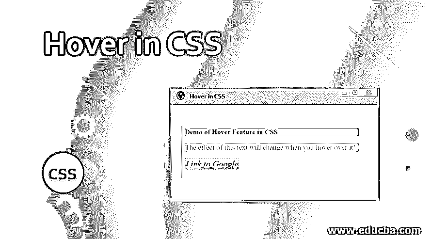


## CSS 中悬停的介绍

动态页面是时代的要求。网页越方便用户，越具体，越有可能被最终用户使用或浏览。当涉及到为网页提供动态属性时，级联样式表提供了许多功能。悬停功能就是其中之一。在样式化任何元素时使用该属性，我们可以确保当我们悬停在页面的该部分上时获得期望的效果。它使用起来很简单，但给页面带来了装饰性和生动的感觉，这总是可以被视为一个加分点。让我们来研究一下这个性质及其用途。在这个主题中，我们将学习 CSS 中的悬停。

**CSS 中悬停的语法和用法**

<small>网页开发、编程语言、软件测试&其他</small>

为了在 CSS 中创建任何悬停效果，我们为该元素创建一个伪类，描述什么效果必须悬停在该元素上。悬停属性的语法是:

```
p:hover{
background-color: green;
}
```

这个伪类可以具有类似于普通类的属性。这些属性将在该元素悬停时生效。这样，我们可以根据页面的整体设计或需求创建各种悬停效果。

### CSS 中的悬停示例

让我们来看看 CSS 中悬停功能的一些例子。

#### 示例#1

使用外部 CSS 演示对一个 HTML 元素的过度影响

*   在这个例子中，我们将使用外部 CSS，所以在这个过程中，我们将首先创建 CSS 页面。
*   在 CSS 页面中，我们将首先为段落元素

    定义样式。接下来，我们将创建一个伪类，并为同一个元素定义悬停效果。

*   此示例的 CSS 代码应该如下所示:

```
p{
font-size: 25px;
font-style: italic;
text-decoration: double;
background-color: lightpink;
color: green;
}
P:hover{
background-color: yellow;
font-style: normal;
color: black;
}
```

*   接下来，我们将创建一个 HTML 页面。这里，在 header 部分，我们将首先调用外部样式表。然后，在正文部分，我们将使用段落元素

    来演示悬停效果。

*   页面的 HTML 代码可以类似于下面的代码片段:

```
<html>
<head>
<title>Hover in CSS</title>
<link rel = "stylesheet" href = "hover.css">
</head>
<body>
<h2>Demo of Hover Feature in CSS</h2>
<p>The effect of this text will change when you hover over it!</p>
</body>
</html>
```

*   现在，当一个人打开这个页面时，它看起来像这样:

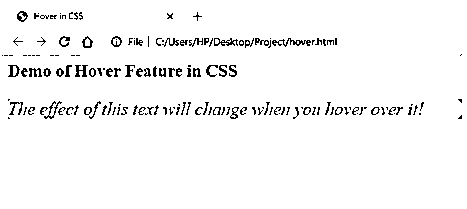


*   一旦你将鼠标悬停在粉色区域，它会变成这样:

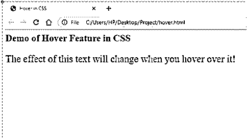


#### 实施例 2

使用外部 CSS 演示对多个 HTML 元素的过度影响

*   与前面的例子类似，我们将首先创建一个外部样式表。
*   我们将定义几个元素的样式，以及伪类来定义每个元素的悬停行为。
*   CSS 代码应该类似于下面的代码片段:

```
p{
font-size: 25px;
font-style: italic;
text-decoration: double;
background-color: lightpink;
color: green;
}
P:hover{
background-color: yellow;
font-style: normal;
color: black;
}
a{
color: red;
font-style: italic;
font-size: 30px;
font-weight: 14px;
border: lightpink dotted;
}
a:hover{
color: blue;
font-style: normal;
font-weight: unset;
}
h2{
color: purple;
background-color: lightgreen;
font-weight: 16px;
}
h2:hover{
color: palevioletred;
background-color: white;
}
```

*   接下来，我们将为 HTML 页面编写代码，其中的 header 部分将调用正在使用的外部样式表。
*   在 body 部分，我们将使用 CSS 页面中样式化的所有三个元素。
*   HTML 代码应该类似于下面共享的代码:

```
<html>
<head>
<title>Hover in CSS</title>
<link rel = "stylesheet" href = "hover.css">
</head>
<body>
<h2>Demo of Hover Feature in CSS</h2>
<p>The effect of this text will change when you hover over it!</p>
<a href="https://www.google.com/">Link to Google</a>
</body>
</html>
```

*   输出应该类似于下面的屏幕截图:

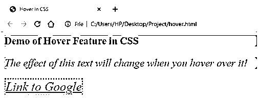


*   将鼠标悬停在每一项上，将得到以下输出:

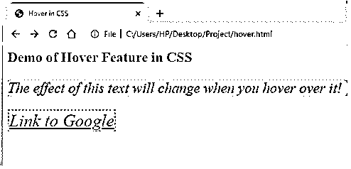


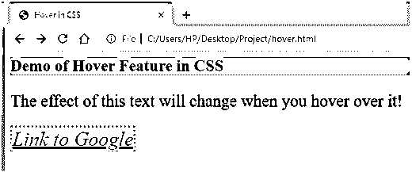


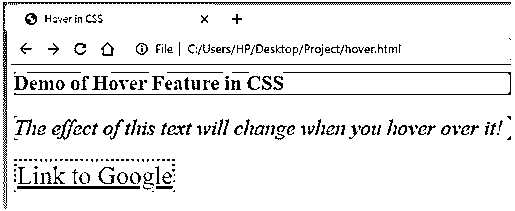


#### 实施例 3

使用内部 CSS 演示悬停功能

*   因为我们在这个例子中使用了内部 CSS，所以我们将直接在 HTML 页面的 header 部分编码样式。
*   HTML 页面的标题部分应该如下所示:

```
<head>
<title>Hover in CSS</title>
<style>
p{
font-size: 25px;
font-style: italic;
text-decoration: double;
background-color: lightpink;
color: green;
}
P:hover{
background-color: yellow;
font-style: normal;
color: black;
}
a{
color: red;
font-style: italic;
font-size: 30px;
font-weight: 14px;
border: lightpink dotted;
}
a:hover{
color: blue;
font-style: normal;
font-weight: unset;
}
h2{
color: purple;
background-color: lightgreen;
font-weight: 16px;
}
h2:hover{
color: palevioletred;
background-color: white;
}
</style>
</head>
```

首先，我们将对主体进行编码，以便使用所有三个元素，其样式已经在标题中定义。

*   HTML 代码应该类似于下面的代码片段:

```
<html>
<head>
<title>Hover in CSS</title>
<style>
p{
font-size: 25px;
font-style: italic;
text-decoration: double;
background-color: lightpink;
color: green;
}
P:hover{
background-color: yellow;
font-style: normal;
color: black;
}
a{
color: red;
font-style: italic;
font-size: 30px;
font-weight: 14px;
border: lightpink dotted;
}
a:hover{
color: blue;
font-style: normal;
font-weight: unset;
}
h2{
color: purple;
background-color: lightgreen;
font-weight: 16px;
}
h2:hover{
color: palevioletred;
background-color: white;
}
</style>
</head>
<body>
<h2>Demo of Hover Feature in CSS</h2>
<p>The effect of this text will change when you hover over it!</p>
<a href="https://www.google.com/">Link to Google</a>
</body>
</html>
```

*   保存此页面并通过浏览器打开它，将获得以下输出:

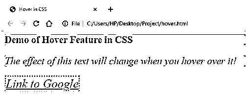


*   将鼠标悬停在每一项上，将得到以下输出:

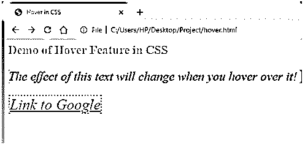


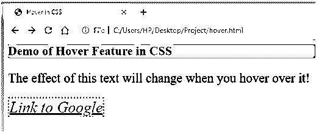


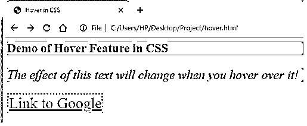


*   上面的几个例子解释了如何在 CSS 中使用 Hover 属性。人们可以根据设计方案对悬停伪类和设计的不同特征进行试验。

### 推荐文章

这是一个在 CSS 中悬停的指南。这里我们讨论 CSS 中悬停特性的一些例子，以及语法和用法。您也可以看看以下文章，了解更多信息–

1.  [CSS 验证器](https://www.educba.com/css-validator/)
2.  [CSS 中的可见性](https://www.educba.com/visibility-in-css/)
3.  [CSS 边框生成器](https://www.educba.com/css-border-generator/)
4.  [文本装饰 CSS](https://www.educba.com/text-decoration-css/)


