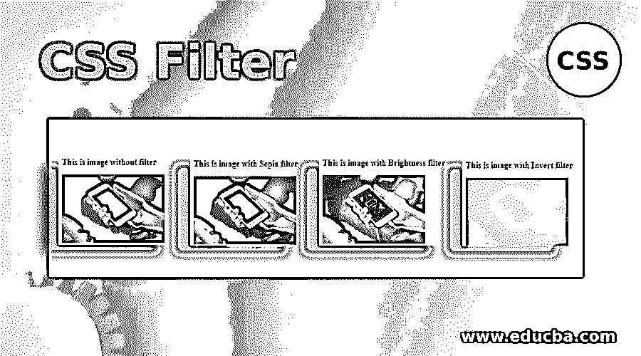
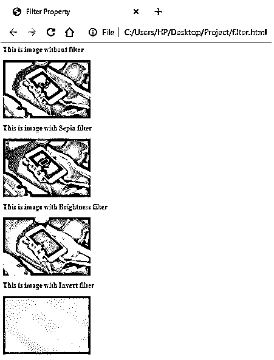
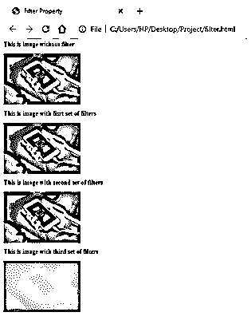
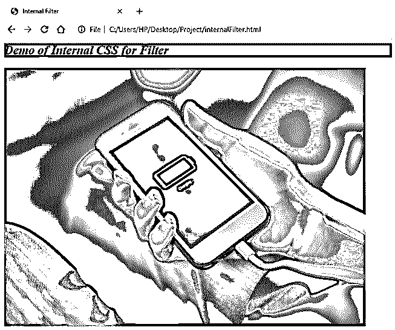

# CSS 过滤器

> 原文：<https://www.educba.com/css-filter/>




## CSS 滤镜简介

过滤器是当今每个应用程序都有的一个特性。无论是在 Instagram 还是脸书，编辑图片和应用滤镜已经变得非常容易。级联样式表还提供了一个过滤功能，可以在特定元素上应用选择的图形效果。此属性中有各种类型的滤镜，它们有助于呈现图像、背景或任何元素。这是一个很有价值的属性，因为我们可以通过样式本身定制我们的元素，也就是说，假设我们需要一个以棕褐色效果显示在页面上的图像。我们可以单独编辑图像，然后在我们的页面上使用编辑后的图像。或者我们可以使用 filter 属性并自定义图像在页面上的显示方式。在这个主题中，我们将学习 CSS 过滤器；让我们看看这个属性是如何工作的。

### CSS 过滤器语法及其工作原理？

CSS 中 filter 属性的语法如下:

<small>网页开发、编程语言、软件测试&其他</small>

**过滤器:选项(百分比/值)**

在这里，选项可以是所需过滤器的选择。CSS 提供的滤镜有模糊、亮度、对比度、色调旋转、反转、阴影、不透明度和棕褐色。他们每个人都以各自的名字行事。所需的筛选器数量取决于随属性一起提供的值。该值可以以百分比、小数、像素等形式给出。除了这些过滤器之外，该属性还提供了一个独特的功能。使用参数 url，开发人员可以调用 SVG 或 XML 文件中的可用特性。

让我们看一些例子来理解 CSS 过滤器是如何工作的。

#### 1.通过外部 CSS 演示单个过滤器

*   对于这个例子，我们将首先创建一个外部 CSS 文件，然后在为 HTML 部分编码时，我们将在代码中调用这个 CSS 文件。
*   在 CSS 文件中，我们将使用 filter 属性的不同参数定义几个类，这样它们就可以用于同一个元素，以区别每个滤镜的效果。
*   filter 属性的 CSS 文件的代码应该如下所示:

```
.imgFilter1{
filter: sepia(75%);
}
.imgFilter2{
filter: brightness(200%);
}
.imgFilter3{
filter: invert(0.45);
}
```

*   接下来，我们将创建一个 HTML 文件，其中我们将首先调用我们在上一步中创建的 CSS 文件。接下来，我们将拍摄一张图片，并使用不同的 CSS 类来查看滤镜对图片的效果。这方面的 HTML 代码应该如下所示:

```
<html>
<head>
<title>Filter Property</title>
<link rel = "stylesheet" href = "filter.css">
</head>
<body>
<h2>This is image without filter</h2>

<h2>This is image with Sepia filter</h2>

<h2>This is image with Brightness filter</h2>

<h2>This is image with Invert filter</h2>

</body>
</html>
```

*   保存这个 html 文件，并通过任何浏览器打开它，以获得所需的结果。结果应该是这样的:




#### 2.使用外部 CSS 演示多个过滤器

*   和前面的例子一样，对于这个例子，我们将使用外部 CSS 文件并在 HTML 代码中调用它。
*   在 CSS 代码中，我们将定义类，我们称之为 filter 属性。我们将为一个滤镜使用多个效果，而不是只为一个效果定义滤镜。相同内容的 CSS 代码如下:

```
.imgFilter1{
filter: brightness(100%) contrast(60%) blur(50%);
}
.imgFilter2{
filter: drop-shadow(60%) opacity(90%);
}
.imgFilter3{
filter: invert(0.45) sepia(0.60);
}
```

*   现在，我们将为 HTML 编码，我们将首先调用 CSS 文件，然后使用图像元素并调用 CSS 文件中定义的所有三个类。HTML 的编码应该是这样的:

```
<html>
<head>
<title>Filter Property</title>
<link rel = "stylesheet" href = "filter.css">
</head>
<body>
<h2>This is image without filter</h2>

<h2>This is image with fisrt set of filters</h2>

<h2>This is image with second set of filters</h2>

<h2>This is image with third set of filters</h2>

</body>
</html>
```

*   要获得输出，保存文件并通过浏览器打开它。输出应该是这样的:




#### 3.使用内联 CSS 演示 CSS 过滤器

*   因为我们在这个例子中使用了内部 CSS，所以我们将直接为 HTML 文件编码。
*   我们将在样式标签中包含样式，样式标签将包含在页面的 head 部分中。我们可以为图像(或任何其他元素)定义我们想要的过滤器。样式标签将如下所示:

```
<style>
img{
filter: grayscale(100%) ;
}
h2{
font-style: italic;
background-color: darkolivegreen;
}
</style>
```

*   现在，我们将为 HTML 主体编写代码，其中将包含图像元素，即，以演示灰度过滤器。HTML 页面的最终代码将如下所示:

```
<html>
<head>
<title>Internal Filter</title>
<style>
img{
filter: grayscale(100%) ;
}
h2{
font-style: italic;
background-color: darkolivegreen;
}
</style>
</head>
<body>
<h2>Demo of Internal CSS for Filter</h2>

</body>
</html>
```

*   保存该文件，并在浏览器中打开它，以获得以下输出:




在上面的例子中，我们展示了 CSS 过滤器的一些基本用法。但是，该属性的范围更广，可以与其他元素一起使用。此外，还可以尝试示例以外的组合。请注意，如果你想用 url 过滤，你必须知道 SVG 文件或 XML 文件的基本知识，然后通过 CSS 过滤器调用它来实现。然而，试着在你的代码中利用这个特性，看看它是如何为演示创造奇迹的！当然，你的作品越像样，获得的观众数量就越多。

### 推荐文章

这是一个 CSS 过滤器的指南。在这里，我们讨论 CSS 过滤器语法及其工作原理，以及示例和输出。您也可以阅读以下文章，了解更多信息——

1.  [CSS 可见性](https://www.educba.com/css-visibility/)
2.  [CSS 边框填充](https://www.educba.com/css-border-padding/)
3.  [CSS 闪烁文本](https://www.educba.com/css-blinking-text/)
4.  [CSS 颜色生成器](https://www.educba.com/css-color-generator/)


