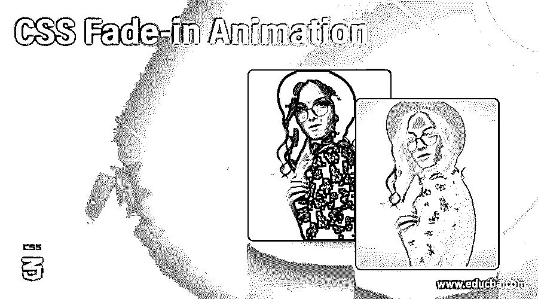
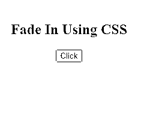
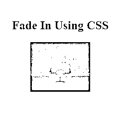
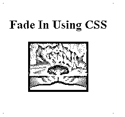

# CSS 淡入动画

> 原文：<https://www.educba.com/css-fade-in-animation/>




## CSS 淡入动画介绍

众所周知，CSS 为开发者提供了各种各样的特性。虽然其中一些可以直接实现，但一些可以通过修补现有功能来实现。例如，有不同类型的动画可以放在页面的不同元素上。淡入动画就是这样一种。在淡入动画的情况下，问题的对象在悬停时会变暗。现在，有很多方法可以达到这种效果。这可以用来高亮显示特定的按钮或图像。我们可以通过改变元素的不透明度来做到这一点。在这个主题中，我们将学习 CSS 淡入动画。

### CSS 淡入动画的方法和实例

为了通过 CSS 实现淡入效果，我们将使用不透明度、过渡和悬停功能。我们将指定对象/元素的原始不透明度，并且在为悬停特性创建的伪类中，我们将指定悬停时它必须转换到的不透明度。我们可以遵循使用外部 CSS 的方法，在外部创建一个样式表文件，并在 HTML 页面上调用它。或者我们可以遵循内部 CSS 并设计 HTML 代码 head 部分的元素。首先，让我们看看这个例子来理解淡入效果是如何工作的。

<small>网页开发、编程语言、软件测试&其他</small>

#### 使用外部 CSS 淡入按钮动画

1.由于这是外部 CSS，我们将首先创建 CSS 文件。然后，我们将为

定义样式。代码可以如下所示:

```
div{
background-color: aquamarine;
height: 100px;
width: 100px;
padding: 10px;
margin: 10px;
}
```

2.接下来，我们将设计一个类的样式，在这里我们将定义属性“不透明度”及其转换时间。我们最初将保持 50%的不透明度，这样它看起来比平常更亮。在伪悬停类中，我们将使不透明度为 100%，这样当最终用户悬停在它上面时，它会变暗。以下代码如下所示:

```
.cl1 {
opacity: 50%;
transition:opacity 0.5s
}
.cl1:hover {
opacity:100%;
transition:opacity 0.5s
}
```

3.结合代码，我们将得到如下 CSS 文件:

```
div{
background-color: aquamarine;
height: 200px;
width: 200px;
padding: 10px;
margin: 10px;
}
.cl1 {
opacity: 50%;
transition:opacity 0.5s
}
.cl1:hover {
opacity:100%;
transition:opacity 0.5s
}
```

4.接下来，我们将为 HTML 页面编码。由于这是一个外部 CSS 示例，我们将在 header 部分调用外部创建的 CSS 文件，如下所示:

```
<head>
<title>Fade In Animation Using CSS</title>
<link rel="stylesheet" type="text/css" href="fadeIn.css">
</head>
```

5.一旦完成，我们将移动到身体部分。我们已经设计了> div >元素的样式，并为动画效果定义了类 cl1。接下来，我们将调用 body 部分中的

元素，并调用类 cl1。这样，部分下的任何东西都会显示动画效果。它的代码如下:

```
<body>
<div class="cl1">
<center>
<h2>Fade In Using CSS</h2>
<button type="button">Click</button>
</center>
</div>
</body>
```

6.综合这些片段，最终的 HTML 代码将如下所示:

```
<html>
<head>
<title>Fade In Animation Using CSS</title>
<link rel="stylesheet" type="text/css" href="fadeIn.css">
</head>
<body>
<div class="cl1">
<center>
<h2>Fade In Using CSS</h2>
<button type="button">Click</button>
</center>
</div>
</body>
</html>
```

7.我们可以通过保存 html 文件并通过浏览器打开它来观察输出。我们将获得以下输出:




8.将鼠标悬停在方形区域上，我们将得到以下输出:


9.我们可以清楚地看到淡入效果是如何工作的。

#### 使用内部 CSS 淡入图像动画

1.由于这个例子使用了内部 CSS，我们将在 HTML 页面本身中定义样式。

2.我们将使用

3.在

4.

```
<style>
div{
background-color: aquamarine;
height: 200px;
width: 200px;
padding: 10px;
margin: 10px;
}
.cl1{
opacity: 50%;
transition: opacity 0.5s;
}
.cl1:hover{
opacity: 100%;
transition: opacity 0.5s;
}
</style>
```

5.一旦定义了样式，我们将移动到身体部分。首先，我们将调用

元素，就像我们在 header 部分中设计的那样。接下来，我们将调用类 cl1 和。然后，在部分，我们将调用图像。这样，图像将按预期显示淡入动画。

6.页面的正文部分可以编码为:

```
<div class="cl1">
<center>
<h2>Fade In Using CSS</h2>
</img>
</center>
</div>
```

7.结合 body 和 head 部分，我们得到的最终 HTML 代码如下:

```
<html>
<head>
<title>Fade In Animation Using CSS</title>
<style>
div{
background-color: aquamarine;
height: 200px;
width: 200px;
padding: 10px;
margin: 10px;
}
.cl1{
opacity: 50%;
transition: opacity 0.5s;
}
.cl1:hover{
opacity: 100%;
transition: opacity 0.5s;
}
</style>
</head>
<body>
<div class="cl1">
<center>
<h2>Fade In Using CSS</h2>
</img>
</center>
</div>
</body>
</html>
```

8.保存上面的 HTML 代码并通过浏览器打开它，将会得到下面的结果:




9.将鼠标悬停在方形区域上会得到以下结果:




10.因此，我们可以在上面两张截图中看到投影的淡入效果。这种情况发生在物体被悬停的时候。

在上面的两个例子中，我们学习了如何使用内部或外部 CSS 结合 HTML 来实现淡入动画。如果其他地方需要动画，也可以探索和使用其他选项。为了保持代码的优化，使用外部 CSS 是很重要的。许多其他功能也可以按照类似的方式实现，以定制正在开发的页面。这完全取决于开发人员的选择，他们希望以什么方式进行并达到预期的结果。

### 推荐文章

这是一个 CSS 淡入动画的指南。这里我们讨论如何使用内部或外部 CSS 结合 HTML 实现淡入动画。您也可以看看以下文章，了解更多信息–

1.  [菜单图标 CSS](https://www.educba.com/menu-icon-css/)
2.  [CSS 加载器](https://www.educba.com/css-loader/)
3.  [CSS 栏](https://www.educba.com/css-column/)
4.  [GridView CSS](https://www.educba.com/gridview-css/)


