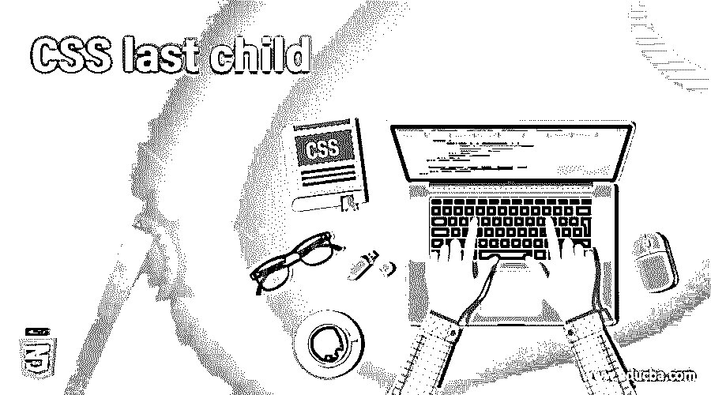
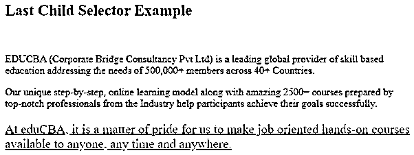
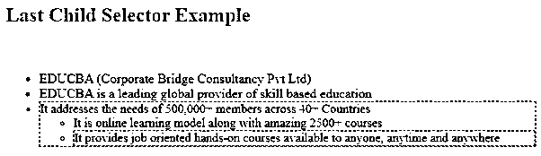
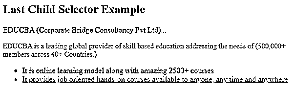
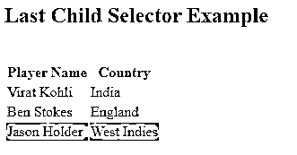

# CSS 最后一个孩子

> 原文：<https://www.educba.com/css-last-child/>




## CSS last-child 简介

:last-child 选择器显示其父级最后一个子级的每个元素。简单地说，伪 class:last-child CSS 定义了一组兄弟元素中的最后一个元素。:last-child 选择器使您能够直接定位其定义元素中的最后一个元素。在 CSS 选择器级别 3 规范中，这被称为“结构伪类”，表明这是用于基于其父内容和兄弟内容关系来设计内容的。

如果您希望选择容器中的最后一个段落并设置其样式，无论它是否是最后一个子元素，您都可以使用:last-of-kind 选择器，顾名思义，它将选择其类型的最后一个项目，无论它是否是其父元素的最后一个子元素。

<small>网页开发、编程语言、软件测试&其他</small>

**语法和参数**

CSS 最后一个子选择器的语法可以写成如下所示:

```
element-name :last-child {
//CSS_style_properties
}
```

该语法使用以下参数:

element-name:该参数指示其父元素中的元素类型。

CSS_style_properties:该参数确定可以应用于最后一个子元素的 CSS 样式。

例如，考虑下面的代码:

```
<ul>
<li> This is first element </li>
<li> This is second element </li>
<li> This is third element </li>
</ul>
```

您可以对最后一个孩子应用 CSS，如下所示:

```
li:last-child {
font-size: 15px;
color: blue;
}
```

这会将 CSS 样式应用到列表中的最后一个元素，字体大小为 15px，颜色为蓝色。

### CSS 中最后一个孩子的选择器是如何工作的？

与其他伪类一样，last-child 伪类可以与其他选择器(例如:hover)聚集在一起，以选择具有悬停样式的选定元素。伪元素也可以链接到::before 和::after。最后一个子选择器通常被称为结构化伪类，这意味着它可以基于父内容和子内容用于样式化内容。

### CSS 最后一个孩子的例子

现在，我们将看到一些例子来描述 CSS 中最后一个子选择器的用法。

#### 示例#1

**代码:**

```
<!DOCTYPE html>
<html lang="en">
<head>
<meta charset="utf-8">
<title> CSS Last Child Selector Example </title>
<style>
p:last-child {
text-decoration: underline;
font-size: 20px;
color: red;
}
</style>
</head>
<body>
<h2> Last Child Selector Example </h2>
<br>
<div class = "mytext">
<p> EDUCBA (Corporate Bridge Consultancy Pvt Ltd) is a leading global provider of skill based education addressing the needs of 500,000+ members across 40+ Countries. </p>
<p> Our unique step-by-step, online learning model along with amazing 2500+ courses prepared by top-notch professionals from the Industry help participants achieve their goals successfully. </p>
<p> At eduCBA, it is a matter of pride for us to make job oriented hands-on courses available to anyone, any time and anywhere. </p>
</div>
</body>
</html>
```

**输出:**




在上面的例子中，我们选择了最后一个段落作为最后一个子元素，p 标签将通过“p:last-child”选择器来选择。最后一个孩子被选中，字体大小为 20px，输出中显示带下划线的文本。

#### 实施例 2

**代码:**

```
<!DOCTYPE html>
<html lang="en">
<head>
<meta charset="utf-8">
<title> CSS Last Child Selector Example </title>
<style>
ul li {
color: green;
}
ul li:last-child {
border: 1px dashed blue;
color: green;
font-size: 15px;
}
</style>
</head>
<body>
<h2> Last Child Selector Example </h2>
<br>
<ul>
<li> EDUCBA (Corporate Bridge Consultancy Pvt Ltd) </li>
<li> EDUCBA is a leading global provider of skill based education </li>
<li>
It addresses the needs of 500,000+ members across 40+ Countries
<ul>
<li> It is online learning model along with amazing 2500+ courses </li>
<li> It provides job oriented hands-on courses available to anyone, anytime and anywhere </li>
</ul>
</li>
</ul>
</body>
</html>
```

**输出:**




在上面的例子中，有序列表用绿色指定。在第一个有序列表中，最后一句将有一个蓝色虚线边框。同样的事情适用于在第一有序列表中定义的另一有序列表。该列表的文本字体大小为 15px。

#### 实施例 3

**代码:**

```
<!DOCTYPE html>
<html lang="en">
<head>
<meta charset="utf-8">
<title> CSS Last Child Selector Example </title>
<style>
li:last-child {
text-decoration: underline;
color: fuchsia;
}
p:last-child {
font-size: 15px;
color: red;
}
span:last-child::before {
content: "(";
color: orangered;
}
span:last-child::after {
content: ")";
color: orangered;
}
</style>
</head>
<body>
<div class="container">
<h2> Last Child Selector Example </h2>
<p>
EDUCBA (Corporate Bridge Consultancy Pvt Ltd)...
</p>
<p>
EDUCBA is a leading global provider of skill based education addressing the needs of 500,000+ members across 40+ Countries.
</p>
</div>
<ul>
<li> It is online learning model along with amazing 2500+ courses </li>
<li> It provides job oriented hands-on courses available to anyone, any time and anywhere </li>
</ul>
</body>
</html>
```

**输出:**




如上面的例子所示，我们使用了两个段落，并在页面上排列了一个列表。容器中定义的第二段将是最后一个子段，因此它的字体大小为 15px，文本颜色为红色。在这一段中，span 标记使用 CSS 的 content 属性，并且可以与:after 和:before 伪元素一起使用。这里，它将在文本开始之前将橙色应用于左括号，并将相同的颜色应用于右括号的末尾。有序列表的最后一行将具有紫红色和下划线，如图所示。

#### 实施例 4

**代码:**

```
<!DOCTYPE html>
<html lang="en">
<head>
<meta charset="utf-8">
<title> CSS Last Child Selector Example </title>
<style>
tr:last-child {
background: sandybrown;
}
</style>
</head>
<body>
<h2> Last Child Selector Example </h2>
<br>
<div class="container">
<table>
<tr>
<th> Player Name </th>
<th> Country </th>
</tr>
<tr>
<td> Virat Kohli</td>
<td> India </td>
</tr>
<tr>
<td> Ben Stokes </td>
<td> England </td>
</tr>
<tr>
<td> Jason Holder </td>
<td> West Indies </td>
</tr>
</table>
</div>
</body>
</html>
```

**输出:**




在上面的例子中，我们使用了 HTML 表，其中最后一个子选择器将设置 tr 标签的样式。在表格中，表格的最后一行，即最后一个 tr 标记，将使用 sandybrown 作为背景色，并且最后一个子选择器不会对表格的其余行进行样式化。

### 结论

到目前为止，我们已经学习了 CSS 最后一个孩子选择器以及它在不同场景中的用法。:last-child 选择器被添加到 CSS 选择器模块 3 中，表明旧版本的浏览器不支持此功能。然而，现代的浏览器支持是完美的，新的伪选择器在生产过程中被普遍使用。:last-child 选择器使我们能够识别父元素中的一个元素，也就是最后一个子元素。

### 推荐文章

这是一个 CSS 的指南，最后一个孩子。在这里，我们讨论了 CSS 中最后一个孩子的选择器是如何工作的，以及代码和输出的例子。您也可以看看以下文章，了解更多信息–

1.  [CSS 文本颜色](https://www.educba.com/css-text-color/)
2.  [CSS 位置固定](https://www.educba.com/css-position-fixed/)
3.  [CSS 分页](https://www.educba.com/css-page-break/)
4.  [CSS 标度()](https://www.educba.com/css-scale/)


