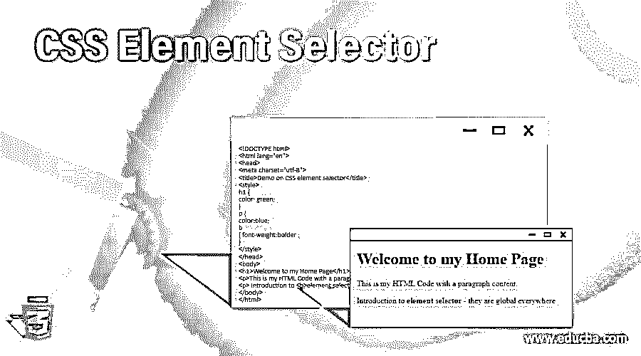
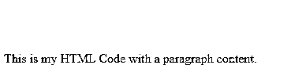
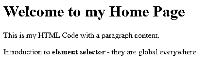
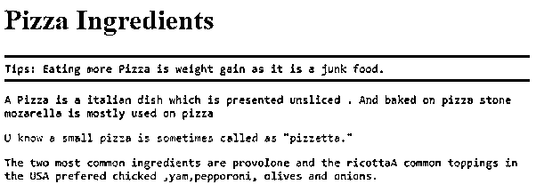
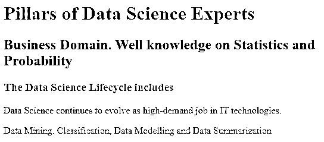
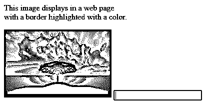
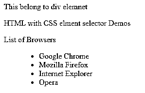
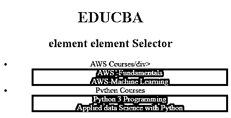

# CSS 元素选择器

> 原文：<https://www.educba.com/css-element-selector/>

## CSS 元素选择器简介

CSS 元素选择器，也称为标签选择器，定义为一个选择器，用于选择网页上指定名称的所有 HTML 元素，并且是一个强大的选择器。它们是 CSS 最重要的方面，因为它们有助于识别直接应用样式的 HTML 元素，也是最基本的选择器。这可能出现在许多模式(标签)中，如

或

# ，它们被制成简单的元素名称到丰富的模式。

**语法和参数**

<small>网页开发、编程语言、软件测试&其他</small>

`Element selector
{
CSS Declarations;
}`

在这里，元素是标签选择器，在选择器之后是一个 CSS 声明，其中使用了花括号。在此范围内，它可能是一个为目标元素提供了值的属性。

### 元素选择器在 CSS 中是如何工作的？

仅仅使用简单的 CSS，我们就可以获得更好的输出，同时更快地实现目标。在这里，我们将看到元素选择器工作来完成结果。将样式应用于许多具有相同功能的元素而不为每个元素使用一个类是非常有益的。

例如，HTML 代码是

要选择所有标题级别 1，应用 h1 选择器

`<h1> The style is applied for the heading </h1>`

各个 CSS 代码的结构如下

元素选择器的目标是将 CSS 应用于 HTML 文档中 h1 元素的每个实例。
h1

`{
Colour: yellow;
}`

因此，直接将样式分配给标签元素在这里被称为元素选择器。在这里，标签将其内容更改为黄色。甚至段落标签也可以使用 CSS 规则来设置样式。为了分组，元素分组选择器用于选择具有特定样式定义的所有元素。组元素选择器的主要好处是很容易编辑这三个属性。我们可以证明这一点:

`h1, h2, p {
text-align: right;
color: blue;
}`

### CSS 元素选择器的示例

让我们在下一节中尝试一个例子来看看它是如何工作的。

#### 示例#1

在 H1 元素上使用简单的元素选择器。

**代码:**

`<!DOCTYPE html>
<html lang="en">
<head>
<meta charset="utf-8">
<title>Demo on CSS element selector</title>

</head>
<body>
<h1>Welcome to my Home Page</h1>

This is my HTML Code with a paragraph content.

</body>
</html>`

在上面带有段落内容简单规则的代码中，它们下面的文本颜色被改为红色——因此，元素选择器在这里表现很好。

**输出:**

随着字体样式的改变，示例可以给出如下:

`<html>
<head>

</head>
<body>

  This text is formatted as original.

 Select and Style all p elements with font-weight too 

</body>
</html>`

当我们在浏览器中执行上述代码时，我们可以在默认模式下看到第一个文本，下一行的

元素根据 CSS 样式规则根据字体改变样式。

**输出:**

#### 实施例 2

h1、p、b 标签上的元素选择器。

**代码:**

`<!DOCTYPE html>
<html lang="en">
<head>
<meta charset="utf-8">
<title>Demo on CSS element selector</title>

</head>
<body>
<h1>Welcome to my Home Page</h1>

This is my HTML Code with a paragraph content.

 Introduction to <b>element selector </b>- they are global everywhere 

</body>
</html>`

**输出:**

#### 实施例 3

带有类的元素选择器

**代码:**

`<!DOCTYPE html>
<html>
<head>
<meta charset="utf-8">
<title>CSS element selectors with class </title>

</head>
<body>
<h1 id="pizza">Pizza Ingredients</h1>

Tips: Eating more Pizza is weight gain as it is a junk food.

A Pizza is a italian dish which is presented unsliced . <strong class="alias"> And baked on pizza stone</strong> mozarella is mostly used on pizza 

U know a small pizza is sometimes called as  "pizzetta."

The two most common ingredients are <strong>provolone</strong> and the <strong>ricotta</strong>A common toppings in the USA prefered  chicked ,yam,pepporoni, olives and onions.

</body>
</html>`

**输出:**

#### 实施例 4

使用分组选择器的元素选择器

**代码:**

`<html>
<head>

</head>
<body>
<h1>Pillars of Data Science Experts</h1>
<h2>Business Domain. Well knowledge on Statistics and Probability</h2>
<h3>The Data Science Lifecycle includes</h3>
Data Science continues to evolve as high-demand job in IT technologies.

Data Mining. Classification, Data Modelling and Data Summarization

</body>
</html>`

从上面的代码中，我们可以看到分组选择器是如何设计 HTML 文档的样式的。现在，输出看起来像这样。

**输出:**

#### 实施例 5

标签上的元素选择器

**代码:**

`<html>
<head>

</head>
<body>

This image displays in a web page   with a border highlighted with a color.

<input type="text" name="login name">
</body>
</html>`

**输出:**

#### 实施例 6

列表项上的元素选择器

**代码:**

`<!DOCTYPE HTML>
<html>
<head>
<title> CSS Element - List elements </title>

</head>
<body>

This belong to div elemnet

HTML with CSS elment selector Demos 

List of Browsers

<ul>
<li> Google Chrome </li>
<li> Mozilla Firefox </li>
<li> Internet Explorer</li>
<li> Opera</li>
</ul>
</body>
</html>`

上面的代码目标是

**输出:**

#### 实施例 7

元素-元素选择器

**代码:**

`<!DOCTYPE html>
<html>
<head>
<title>
Demo on element element Selector
</title>

</head>
<body style="text-align: center;">
<h1 style = "color: green;">
EDUCBA
</h1>
<h2>element element Selector</h2>
<ul>
<li>

AWS Courses/div>
<ul>
<li>AWS -Fundamentals</li>
<li>AWS-Machine Learning</li>
</ul>
</li>
<li>

Python Courses

<ul>
<li>Python 3 Programming</li>
<li>Applied data Science with Python</li>
</ul>
</li>
</ul>
</body>
</html>`

**输出:**

### 结论

总之，在本文中，我们已经看到了带有语法和示例的基本元素选择器。元素选择器的主要好处是它们是全局的，这意味着无论样式表包含在哪里，这些规则都会影响元素。还有几个其他的选择器来讨论元素选择器，比如 id，attribute。

### 推荐文章

这是一个 CSS 元素选择器的指南。这里我们讨论元素选择器如何在 CSS 和例子中工作，以及代码和输出。您也可以看看以下文章，了解更多信息–

1.  [CSS 偏斜()](https://www.educba.com/css-skew/)
2.  [CSS 文本效果](https://www.educba.com/css-text-effects/)
3.  [CSS 分页](https://www.educba.com/css-page-break/)
4.  [CSS 矩阵](https://www.educba.com/css-matrix/)

