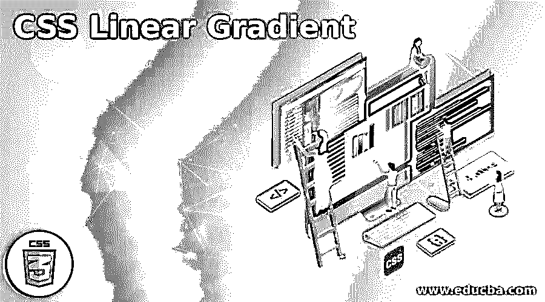
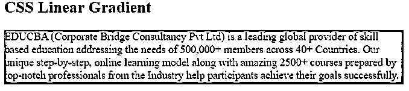
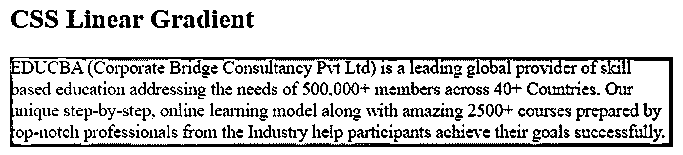
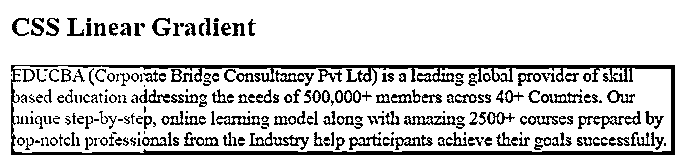
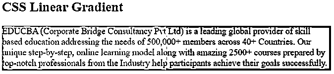

# CSS 线性渐变

> 原文：<https://www.educba.com/css-linear-gradient/>




## CSS 线性渐变的定义

渐变是图像数据类型的 CSS 元素，表示两种或多种颜色之间的过渡。如同每一个梯度一样，线性梯度没有固有的维度；即没有正常或期望的尺寸，也没有推荐的比例。具体尺寸与相关元素的尺寸相匹配。

linear-gradient()函数创建一系列与渐变线相邻的彩色线，以获得平滑的渐变，该渐变与渐变线连接点的颜色相匹配。通过在此渐变线上包含更多颜色停止点，您可以在各种颜色之间创建一个非常可自定义的过渡。

<small>网页开发、编程语言、软件测试&其他</small>

### 语法和参数

外观属性的语法可以写成如下所示:

```
background-image: linear-gradient(direction, color1, color2, ......);
```

该语法包括以下参数:

*   **方向:**这代表一个起点和方向以及渐变效果。
*   **color1，color2…:** 该参数定义颜色值，前面有一个额外的停止位置，该位置是一个介于 0 和 100%之间的数字或沿渐变轴的长度。

```
For instance,
.myclass {
background-image: linear-gradient (to left, green, blue);
}
```

这里，线性渐变将从右侧添加颜色，从绿色开始，过渡到蓝色。向左侧移动表示方向参数，绿色和蓝色指定应用于元素的颜色数量。

### CSS 线性渐变属性在 CSS 中如何工作？

渐变线由一个角度和包含渐变图像的框的中心来指定。渐变颜色由两个或三个点来描述:起点、终点以及它们之间可选的颜色停止点。

初始步骤是渐变线上第一种颜色开始的位置。终点是最后一种颜色的终点。梯度线与来自同一象限的盒角的垂直线的交点代表这两点中的一点。

### CSS 线性渐变示例

现在，我们将看到一些例子来描述线性渐变属性在 CSS 中的用法。

#### 示例#1

**代码:**

```
<!DOCTYPE html>
<html lang="en">
<head>
<meta charset="utf-8">
<title> CSS Linear Gradient Example </title>
<style>
.gradient_class {
height: 80px;
background-color: green;
background-image: linear-gradient(coral, olive);
}
</style>
</head>
<body>
<h2> CSS Linear Gradient </h2>
<div class="gradient_class">
EDUCBA (Corporate Bridge Consultancy Pvt Ltd) is a leading global provider of skill based education addressing the needs of 500,000+ members across 40+ Countries. Our unique step-by-step, online learning model along with amazing 2500+ courses prepared by top-notch professionals from the Industry help participants achieve their goals successfully.
</div>
</body>
</html>
```

**输出:**




在上面的例子中，我们使用了名为'的类中的内容。“gradient_class”将与线性渐变属性一起显示。这里，CSS 将从顶部开始，珊瑚色将是开始的颜色，并过渡到橄榄色值。

#### 实施例 2

**代码:**

```
<!DOCTYPE html>
<html lang="en">
<head>
<meta charset="utf-8">
<title> CSS Linear Gradient Example </title>
<style>
.gradient_class {
height: 80px;
background-color: green;
background-image: linear-gradient(to right, coral, olive);
}
</style>
</head>
<body>
<h2> CSS Linear Gradient </h2>
<div class="gradient_class">
EDUCBA (Corporate Bridge Consultancy Pvt Ltd) is a leading global provider of skill based education addressing the needs of 500,000+ members across 40+ Countries. Our unique step-by-step, online learning model along with amazing 2500+ courses prepared by top-notch professionals from the Industry help participants achieve their goals successfully.
</div>
</body>
</html>
```

**输出:**




上面的例子与前面的例子非常相似，但是唯一的区别是在这个例子中我们使用了一个参数。即方向参数。这里，我们用指定的颜色从左到右显示渐变效果。

#### 实施例 3

**代码:**

```
<!DOCTYPE html>
<html lang="en">
<head>
<meta charset="utf-8">
<title> CSS Linear Gradient Example </title>
<style>
.gradient_class {
height: 80px;
background-color: green;
background-image: linear-gradient(to right, coral 20%, olive 20%);
}
</style>
</head>
<body>
<h2> CSS Linear Gradient </h2>
<div class="gradient_class">
EDUCBA (Corporate Bridge Consultancy Pvt Ltd) is a leading global provider of skill based education addressing the needs of 500,000+ members across 40+ Countries. Our unique step-by-step, online learning model along with amazing 2500+ courses prepared by top-notch professionals from the Industry help participants achieve their goals successfully.
</div>
</body>
</html>
```

**输出:**




在上面的例子中，我们使用渐变将纯色从一种颜色直接改变为另一种纯色。渐变属性从左向右移动，珊瑚色从 20%开始，橄榄色从 20%开始。这些被称为硬颜色停止褪色的颜色。这将有助于声明复制列或条纹的全高背景。

#### 实施例 4

**代码:**

```
<!DOCTYPE html>
<html lang="en">
<head>
<meta charset="utf-8">
<title> CSS Linear Gradient Example </title>
<style>
.gradient_class {
height: 80px;
background-color: green;
background-image: linear-gradient(90deg, coral 0 50%, olive 50% 100%);
}
</style>
</head>
<body>
<h2> CSS Linear Gradient </h2>
<div class="gradient_class">
EDUCBA (Corporate Bridge Consultancy Pvt Ltd) is a leading global provider of skill based education addressing the needs of 500,000+ members across 40+ Countries. Our unique step-by-step, online learning model along with amazing 2500+ courses prepared by top-notch professionals from the Industry help participants achieve their goals successfully.
</div>
</body>
</html>
```

**输出:**




在上面的例子中，我们使用了 90 度角的渐变，一个珊瑚色的左下半部分和一个橄榄色的右上半部分，在渐变从珊瑚色到橄榄色的地方有一条硬线条。可以使用< percentage >明确定义颜色停止方向。

### 结论

到目前为止，我们已经看到了 CSS 中线性渐变属性的工作。与此同时，我们也看到了很多关于创建线性渐变，它的语法的每一部分，和浏览器的兼容性。浏览器对线性渐变的支持是可靠的。在 linear-gradient 属性的帮助下，用户可以从左、右、上、下、左上、右上、左下、右下等等在 div 元素中插入多种颜色。渐变生成的颜色随着位置逐渐变化，从而提供平滑的颜色变换。

### 推荐文章

这是一个 CSS 线性渐变的指南。这里我们也讨论 css 线性渐变属性的定义以及它是如何在 css 中工作的？以及一个不同的示例及其代码实现。您也可以看看以下文章，了解更多信息–

1.  [Matlab 格式](https://www.educba.com/matlab-format/)
2.  [移动平均线 Matlab](https://www.educba.com/moving-average-matlab/)
3.  [卷积 Matlab](https://www.educba.com/convolution-matlab/)
4.  [震级 Matlab](https://www.educba.com/magnitude-matlab/)


