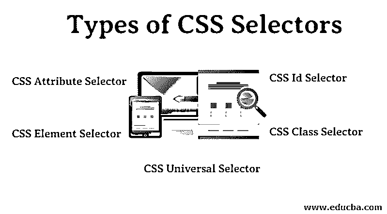

# CSS 选择器的类型

> 原文：<https://www.educba.com/types-of-css-selectors/>




## CSS 选择器类型介绍

CSS 选择器的类型用于选择我们想要样式化的内容。它有助于根据类、id、类型等选择元素。CSS 选择器是 CSS 规则集的一个组件。

### CSS 选择器的类型

有 5 种 CSS 选择器可供我们选择。我们将会看到以下重要的 CSS 选择器:

<small>网页开发、编程语言、软件测试&其他</small>

1.  CSS 通用选择器。
2.  CSS 元素选择器。
3.  CSS Id 选择器。
4.  CSS 类选择器。
5.  CSS 属性选择器。

#### 1.CSS 通用选择器

在 HTML 页面中，内容依赖于 HTML 标签。一对标签定义了特定的网页元素。CSS 通用选择器选择网页上的所有元素。

**举例:**

```
* {
color: blue;
font-size: 21px;
}
```

用花括号括起来的这两行代码将影响 HTML 页面上的所有元素。我们借助花括号开头的星号声明一个通用选择器。通用选择器可以与其他选择器结合使用。

#### 2.CSS 元素选择器

CSS 元素选择器也称为类型选择器。CSS 中的元素选择器试图匹配同名的 HTML 元素。因此，< ul >的选择器匹配 HTML 页面中所有的< ul >元素，即[所有的无序列表](https://www.educba.com/html-unordered-list/)。

让我们看一个元素选择器的例子。

```
ul {
border: solid 1px #ccc;
}
```

为了更好地理解这一点，让我们来看一个应用我们上面写的 CSS 代码的示例 HTML 代码。

```
<ul>
<li>A</li>
<li>B</li>
<li>C</li>
</ul>
<div class="demo">
<p>Demo text</p>
</div>
<ul>
<li>1</li>
<li>2</li>
<li>3 </li>
</ul>
```

在这个例子中，我们将主要找到三个元素，即

标签和另一个

标签。通常，这些改变并不适用于

#### 3.CSS ID 选择器

CSS ID 选择器帮助开发人员将开发人员创建的 ID 与其样式内容相匹配。ID 选择器借助于开发人员声明的 ID 名称前的井号(#)来使用。ID 选择器匹配每个具有 ID 属性的 HTML 元素，该属性的值与选择器的值相同，没有散列符号。

这里有一个例子:

```
#box {
width: 90px;
margin: 10px;
}
```

这个 CSS 代码可以用来匹配 id 为“box”的元素，如下句所示。

```
<div id="box"></div>
```

这里，标签

只是一个例子。我们可以为任何 HTML 标签编写 ID 属性。ID 选择器匹配元素中的 ID 属性，并查找其样式。在我们的示例中，只要任何元素包含 ID 属性“box ”,就应用该样式。

使用的 ID 值应该是唯一的。如果两个或更多的元素使用相同的 id，代码在技术上是无效的，但是元素的样式仍然适用，因此通常避免使用相同的 ID。

每个 HTML 页面每次都必须使用不同的 ID，这是非常严格的。除了面临刚性的问题，CSS 中的 ID 选择器还面临特异性的问题。

#### 4.CSS 类选择器

CSS 类选择器是所有选择器中最有用的选择器之一。它是通过使用一个点后跟类名来声明的。这个类名是由编码器定义的，就像 ID 选择器一样。类选择器搜索属性值与类名同名的每个元素，不带点号。

**举例:**

```
.square {
margin: 20px;
width: 20px;
}
```

这个 [CSS 代码可以用来](https://www.educba.com/css-triangle-generator/)匹配具有类' square '的元素，如下句所示。

```
<div class="square"></div>
```

这种样式也适用于所有其他 HTML 元素，这些元素的类属性值为“square”。具有相同 class 属性值的元素有助于我们重用样式并避免不必要的重复。此外，类选择器是有益的，因为它允许我们向特定元素添加几个类。通过用空格分隔每个类，我们可以向属性中添加多个类。

**举例:**

```
<div class="square bold shape"></div>
```

在这里，方形、粗体和形状是三种不同类型的类。

#### 5.CSS 属性选择器

CSS 属性选择器根据方括号中提到的属性和属性值来设置内容的样式。左方括号前面不能有空格。

```
input[type="text"] {
background-color: #fff;
width: 100px;
}
```

这段 CSS 代码将与下面的 HTML 元素相匹配。

```
<input type="text">
```

同样，如果属性“type”的值发生变化，属性选择器也不会与之匹配。例如，如果“type”的值从“text”更改为“submit ”,选择器将与属性不匹配。如果属性选择器只声明了属性，而没有属性值，那么它将匹配所有具有属性“type”的 HTML 元素，而不管值是“text”还是“submit”。

**举例:**

```
input[type] {
background-color: #fff;
width: 100px;
}
```

我们也可以使用属性选择器，在方括号外没有指定值。这将有助于我们只针对属性，而不考虑元素。在我们的示例中，它将基于属性“type”作为目标，而不考虑元素“input”。CSS 选择器帮助我们简化代码，使我们能够对不同的 HTML 元素使用和重用相同的 CSS 代码。它们帮助我们设计网页中特定的片段和部分。它们为我们提供了在网页中统一设计相似元素的选项。因此，CSS 选择器是 CSS 学习曲线的重要组成部分。

### 推荐文章

这是 CSS 选择器类型的指南。这里我们已经讨论了不同类型的 CSS 选择器，并给出了相应的例子。您也可以浏览我们推荐的其他文章，了解更多信息——

1.  [Cheatsheet CSS3](https://www.educba.com/cheat-sheet-css3/)
2.  [CSS 面试问题](https://www.educba.com/css-interview-questions/)
3.  [萨斯 vs SCSS](https://www.educba.com/sass-vs-scss/)
4.  [SASS 面试问题](https://www.educba.com/sass-interview-questions/)


