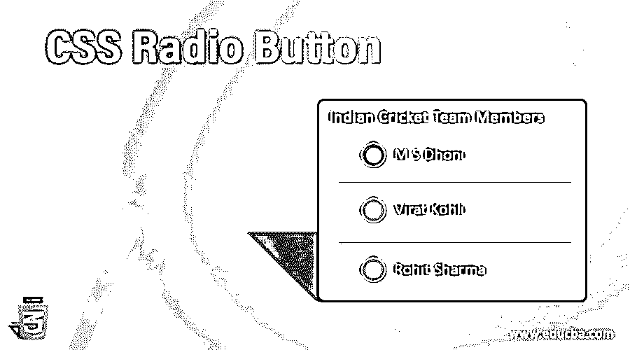
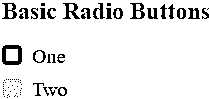
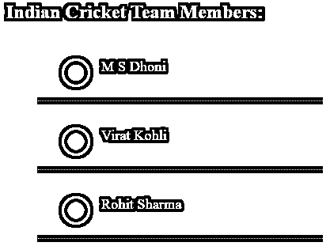
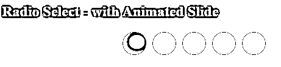

# CSS 单选按钮

> 原文：<https://www.educba.com/css-radio-button/>




## CSS 单选按钮介绍

当用户只需从一组项目中选择一项时，可以使用单选按钮。单选按钮通常用于需要多个选择但只有一个选择的表单中。但是，当您尝试选择多个选项时，单击尚未选择的单选按钮会取消选择之前选择的其他选项。

单选按钮就像复选框一样。主要区别在于，它们只需要从一个列表中选择多个项目。性别选择(男，女)是单选按钮适合输入项目的一个明显例子。

<small>网页开发、编程语言、软件测试&其他</small>

### 句法

单选按钮的语法可以编写如下:

```
<input type="radio" name="myradio" value="radio_value"  id="radio_demo" class="form-radio" checked>
<label for="radio_demo">Radio</label>
```

以下是单选按钮的属性:

*   **类型:**定义输入类型控制，将设置为单选。
*   **name:** 用于给控件一个已经发送给服务器识别的名称，并获取值。
*   **值:**该值可以在用户选择单选框时使用。
*   **选中:**默认情况下，当您想要选择单选按钮时，将使用该属性。

### CSS 中的单选按钮是如何工作的？

当确定了两个或更多互斥的选项时，将使用单选按钮，并且用户必须选择一个选项。换句话说，点击一个未被选中的单选按钮将会删除列表中之前被选中的任何其他按钮。单选按钮包括较低的认知负荷，因为它们永久地保持所有选项可见，以便用户可以容易地分析它们。单选按钮对于难以有效移动鼠标的用户来说也更容易使用。

### 实现 CSS 单选按钮的示例

现在，下面描述一些例子:

#### 示例#1

**代码:**

```
<!DOCTYPE html>
<html>
<head>
<meta charset="utf-8">
<title> CSS Radio Button Example </title>
<style>
.container {
display: block;
position: relative;
padding-left: 30px;
margin-bottom: 10px;
cursor: pointer;
font-size: 20px;
}
.container input {
position: absolute;
opacity: 0;
}
.radio_class {
position: absolute;
top: 0;
left: 0;
height: 20px;
width: 20px;
background-color: #eee;
border-radius: 25%;
}
.container:hover input ~ .radio_class {
background-color: #4863A0;
}
.container input:checked ~ .radio_class {
background-color: #728C00;
}
.container .radio_class:after {
top: 10px;
left: 10px;
width: 10px;
height: 10px;
border-radius: 80%;
background: white;
}
</style>
</head>
<body>
<h2> Basic Radio Buttons </h2>
<label class="container">One
<input type="radio" checked="checked" name="radio">

</label>
<label class="container">Two
<input type="radio" name="radio">

</label>
</body>
</html>
```

**输出:**在浏览器中打开文件，会产生如下结果。




**解释:**在上面的例子中，我们已经创建了自定义单选按钮，其中代码将在单选按钮被选中时添加背景色，并在用户鼠标悬停在单选按钮上时添加另一种背景色。班级打电话来了。radio_class 是为单选按钮添加 CSS 样式而定义的。check 属性将用于指定默认单选按钮。单选按钮是在容器中创建的，并添加了 CSS 样式，这些样式可以在每个选定元素的内容之后定义。

#### 实施例 2

**代码:**

```
<!DOCTYPE html>
<html>
<head>
<meta charset="utf-8">
<title> CSS Radio Button Example </title>
<style>
body{
background: #222222;
}
.container{
display: block;
position: relative;
margin: 20px auto;
height: auto;
width: 400px;
padding: 10px;
}
h2{
color: #ffffff;
}
ul li{
color: #00FA9A;
display: block;
position: relative;
border-bottom: 1px dotted #DAA520;
}
ul li input[type=radio]{
position: absolute;
visibility: hidden;
}
ul li label{
display: block;
position: relative;
font-weight: 200;
font-size: 1.15em;
padding: 25px 25px 25px 80px;
margin: 8px auto;
height: 20px;
z-index: 9;
cursor: pointer;
}
ul li:hover label{
color: #FAEBD7;
}
ul li .radio_demo{
display: block;
position: absolute;
border: 3px solid #AAAAAA;
border-radius: 100%;
height: 30px;
width: 30px;
top: 25px;
left: 30px;
z-index: 5;
}
ul li .radio_demo::before {
position: absolute;
content: '';
border-radius: 80%;
height: 20px;
width: 20px;
top: 5px;
left: 5px;
margin: auto;
transition: background 0.25s linear;
}
input[type=radio]:checked ~ .radio_demo {
border: 3px solid #0DFF92;
}
input[type=radio]:checked ~ .radio_demo::before{
background: #0DFF92;
}
</style>
</head>
<body>
<div class="container">
<h2> Indian Cricket Team Members: </h2>
<ul>
<li>
<input type="radio" id="option_one" name="selector">
<label for="option_one"> M S Dhoni</label>
<div class="radio_demo"></div>
</li>
<li>
<input type="radio" id="option_two" name="selector">
<label for="option_two"> Virat Kohli</label>
<div class="radio_demo">
<div class="inside"></div>
</div>
</li>
<li>
<input type="radio" id="option_three" name="selector">
<label for="option_three"> Rohit Sharma </label>
<div class="radio_demo">
<div class="inside"></div>
</div>
</li>
</ul>
</div>
</body>
</html>
```

**输出:**




**解释:**在上面的例子中，单选按钮是通过使用不同种类的 CSS 样式创建的。我们使用 ul 和 li 标签将单选按钮定义为列表项。它们在名为 container 的父元素中指定，包含单选按钮各自的 CSS 样式。标签被用于选项，各种 CSS 样式被用于选项，当用户将鼠标悬停在单选按钮标签上时，标签还定义了颜色。该代码还在鼠标悬停在单选按钮上之前和之后显示各自的颜色。

#### 实施例 3

**代码:**

```
<!DOCTYPE html>
<html lang="en">
<head>
<meta charset="utf-8">
<title> CSS Radio Button Example </title>
<style>
body{
background:grey;
color:#fff;
}
#myradio{
position:relative;
width:40%;
margin:0 auto;
}
input[type="radio"]{
position:absolute;
right:2000%;
}
label{
float:left;
width:15%;
padding-bottom:15%;
margin:0 2%;
background:#A0522D;
border-radius:60%;
cursor:pointer;
}
#slider{
position:absolute;
left:0%;
top:0;
width:10%;
padding-bottom:9%;
margin:2% 0 0 6%;
background:#fff;
transition:transform 2s;
border-radius:60%;
animation-timing-function: ease-in-out;
transition: 0.3s left .06s ease-in-out;
}
#radio1:checked  ~ #slider{ animation-name: one; left:0; }
#radio2:checked  ~ #slider{ animation-name: two; left:15%; }
#radio3:checked  ~ #slider{ animation-name: three; left:35%; }
#radio4:checked  ~ #slider{ animation-name: four; left:65%; }
#radio5:checked  ~ #slider{ animation-name: five; left:85%; }
@keyframes one{ 20%, 80% { transform:scale(0.6); } }
@keyframes two{ 20%, 80% { transform:scale(0.6); } }
@keyframes three{ 20%, 80% { transform:scale(0.6); } }
@keyframes four{ 20%, 80% { transform:scale(0.6); } }
@keyframes five{ 20%, 80% { transform:scale(0.6); } }
</style>
</head>
<body>
<h2> Radio Select - with Animated Slide </h2>
<div id="myradio">
<label for="radio1"></label>
<input  id="radio1" name="radio" type="radio" />
<label for="radio2"></label>
<input  id="radio2" name="radio" type="radio" />
<label for="radio3"></label>
<input  id="radio3" name="radio" type="radio" />
<label for="radio4"></label>
<input  id="radio4" name="radio" type="radio" />
<label for="radio5"></label>
<input  id="radio5" name="radio" type="radio" />

</div>
</body>
</html>
```

**输出:**




**解释:**在上面的例子中，我们在单选按钮中创建了动画幻灯片。这里，当移动到下一个按钮时，单选按钮使用了过渡效果。该代码使用 at-rule @keyframes 通过指定关键帧样式来管理 CSS 动画过程中所需的步骤。@keyframes 规则规定了动画的代码。id“slider”用于定义过渡和动画效果。

### 优势

单选按钮的一些优点是:

*   当只接受一个选项时，单选按钮被设计为显示多个项目的列表。
*   单选按钮的信息通常比文本框这样的开放式输入更准确。
*   用户可以轻松快速地检查选项。

### 结论

到目前为止，我们已经看到单选按钮是一个重要的输入控件，当用户需要输入时，它可以作为同义词使用。为了改善表单的用户体验，拥有适当的控件来接受用户的输入是非常重要的。根据定义，单选按钮总是正好有一个首选项，如果没有默认选项，您就不应该查看它们。仅使用单选按钮来改变设置，而不是作为动作按钮来使事情发生。直到用户单击命令按钮，更改的设置才会生效。

### 推荐文章

这是一个 CSS 单选按钮指南。这里我们讨论一个 CSS 单选按钮的介绍，语法，它是如何工作的例子。您也可以浏览我们的其他相关文章，了解更多信息——

1.  [CSS 顺序](https://www.educba.com/css-order/)
2.  [CSS 光标](https://www.educba.com/css-cursor/)
3.  [CSS 右边距](https://www.educba.com/css-margin-right/)


