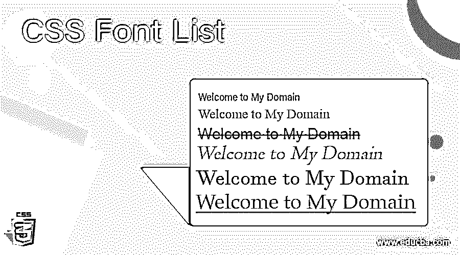
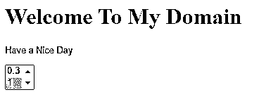

# CSS 字体列表

> 原文：<https://www.educba.com/css-font-list/>




## CSS 字体列表介绍

CSS 字体列表是它们自己的属性和元素，用来设置字体并在网页中显示它们，主要取决于字体家族。此外，我们基于客户需求使用了所有类型的场景网页。速记属性用于字体系列。已经安装在字体系列上并由浏览器定义的可用字体不支持所有类型的字体；我们需要使用带有关键字值或任何内置值的多种字体；它必须是字母数字格式。

**语法和参数**

<small>网页开发、编程语言、软件测试&其他</small>

CSS 代码是使用样式标签与 html 页面一起编写的；我们可以遵循一些规则和语法来定制网页，这样会更有吸引力。我们可以使用字体样式列表来创建具有用户友好环境的 web 应用程序，它们的属性、特性和元素由用户定义的值来指定。

```
<html>
<head>
<style>
.first
{
font-family: Times New Roman, Arial, Serif, Verdana, Tahoma, Calibri etc ; //numeric format values supported with some default font-families
}
</style>
</head>
<body>
---some html codes----
</body>
</html>
```

上面的代码是用值初始化字体系列的基本语法，就像 css 样式表中使用的一些字体样式一样。对于用户自定义的格式，我们使用了不同数量的受支持字体，一些子字体属性被用作关键字类型值或预定义值。使用这些类型的支持值，我们可以称之为字体样式表中使用的参数或参数集。

### CSS 中的字体列表是怎么做的？

CSS 字体样式代码用于许多字体样式子属性，用默认值指定的属性。它将支持两种类型，如文本、数字、特殊字符等。使用这些类型的值；我们可以启用其 css 属性的特定属性，以使演示更加用户友好，客户满意度对于业务角度非常重要。我们可以使用 html 代码中的字体列表元素属性；此外，它还是默认的 html 标记、ID 或一些内置类之一。当我们在 html 中使用 css 字体、字体系列时，它依赖于带有字体粗细、字体大小等的基于标签的元素。这些是默认的，在 css 样式代码中最广泛使用，用于计算和操作正确放置在页面上的字体，它有更多的功能，如不同范围的粗细和 css 样式中的显示。它有助于 CSS 样式代码中的元素。它主要用于 html 的标签，因为

字体列表不支持所有浏览器；它们可能会根据用户的要求而变化，所以我们必须在用户屏幕上使用不同的字体。它用 css 字体家族来定义，用户浏览器的优先级会用多个字体家族来选择。通常，字体分为两种类型的字体系列 1。特定字体系列和 2。通用字体系列。具体的字体是 Arial、Verdana 和 Tahoma。通用字体几乎是所有类型的用户浏览器，如 serif、Sans-serif、Times New Roman、Calibre 等。在字体系列中，一些属性接受数值类型的值；其中一些是字母数字值，带有一些扩展格式，如像素、%，等等。这些是一些默认的扩展，这些值可以用于关键字类型的值或一些预定义类型的字母数字值。

### CSS 字体列表示例

下面是 CSS 字体列表的例子:

#### 示例#1

**代码:**

```
<!DOCTYPE html>
<html>
<head>
<title>Welcome To My Domain</title>
<style>
.first > div {
background-color:green;
padding: 0 20px;
font-family: 'Open Sans';
}
div.second {
font-family: "Times New Roman", Calibri, serif;
}
div.third {
font-family: Arial, Helvetica, sans-serif;
}
div.four {
font: 80% sans-serif;
font-family: Arial,
}
div.five {
font: 13px/11px sans-serif;
font-family: serif,
}
div.six {
font-weight: 500;
font: 1rem monospace;
white-space: nowrap;
font-family: Helvetica,
}
</style>
</head>
<body>
<div class="first">
<h3>Have a Nice day</h3>
<div class="second">Welcome</div>
<div class="third">Welcome</div>
<div class="four">Welcome</div>
<div class="five">Welcome</div>
<div class="six">Welcome</div>
</div>
<div class="first">
<h3>Welcome Users</h3>
<div class="second">
Have a nice Day
<p>Gud day</p>
</div>
<div class="second">
Welcome
<p>Welcome</p>
</div>
<div class="opacity80">
Gud day
<p>Welcome</p>
</div>
<div class="opacity70">
Gud day
<p>Welcome</p>
</div>
<div class="opacity60">
Gud day
<p>Welcome</p>
</div>
<div class="opacity50">
Gud day
<p>Welcome</p>
</div>
<div class="opacity40">
Gud day
<p>Welcome</p>
</div>
<p><small>Welcome <code>To</code> My Domain</small></p>
</div>
</body>
</html>
```

**输出:**


#### 实施例 2

**代码:**

```
<!DOCTYPE html>
<html>
<head>
<title>Welcome To My Domain</title>
<style>
div.first {
font-family: inherit;
font-family: initial;
font-family: unset;
}
div.second {
font-family: "Times New Roman", Calibri, serif;
}
div.third {
font-family: Arial, Helvetica, sans-serif;
}
div.four {
font: 80% sans-serif;
font-family: Arial,
}
div.five {
font: 13px/11px sans-serif;
font-family: sans-serif;
font-family: monospace;
font-family: cursive;
font-family: fantasy;
font-family: system-ui;
font-family: ui-serif;
font-family: ui-sans-serif;
font-family: ui-monospace;
font-family: ui-rounded;
font-family: emoji;
font-family: math;
font-family: fangsong;
}
div.six {
font-weight: 500;
font: 1rem monospace;
white-space: nowrap;
font-family:Georgia, serif;
}
</style>
</head>
<body>
<div class="first">
<h3>Have a Nice day</h3>
<div class="second">Welcome</div>
<div class="third">Welcome</div>
<div class="four">Welcome</div>
<div class="five">Welcome</div>
<div class="six">Welcome</div>
</div>
<div class="first">
<h3>Welcome Users</h3>
<div class="second">
Have a nice Day
<p>Gud day</p>
</div>
<div class="second">
Welcome
<p>Welcome</p>
</div>
</div>
<small>Welcome <code>To</code> My Domain</small></p>
</div>
</body>
</html>
```

**输出:**


#### 实施例 3

**代码:**

```
<!DOCTYPE html>
<html>
<head>
<style>
#first {
font-weight: lighter;
font-family: Lucida Console, Courier, monospace,Verdana, Arial, Helvetica, sans-serif,cursive;
font: 80% sans-serif;
}
</style>
</head>
<body>
<h1>Welcome To My Domain</h1>
<p id="first">Have a Nice Day</p>
<select onchange="demo(this);" size="2">
<option>0.2
<option>0.3
<option selected="selected">1
</select>
</body>
</html>
```

**输出:**




### 结论

字体系列列表用于在网页中放置字体，这些字体具有使用一些扩展格式(如像素、%)的数值类型。，它还检查并确认网页中的其他数据不受影响，它通常支持所有类型的浏览器。

### 推荐文章

这是一个 CSS 字体列表的指南。在这里，我们讨论了字体列表是如何在 CSS 和例子中完成的，以及代码和输出。您也可以看看以下文章，了解更多信息–

1.  [CSS in React](https://www.educba.com/css-in-react/)
2.  [CSS 组合子](https://www.educba.com/css-combinators/)
3.  [CSS 位置固定](https://www.educba.com/css-position-fixed/)
4.  [CSS 屏蔽](https://www.educba.com/css-masking/)


