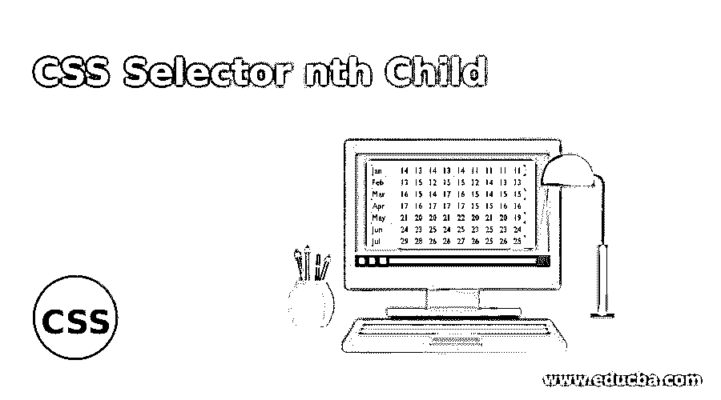
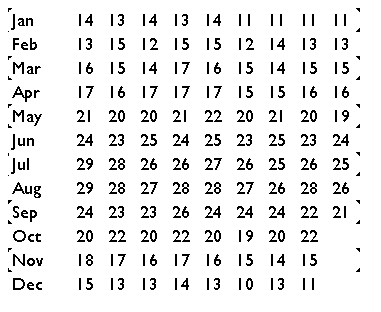
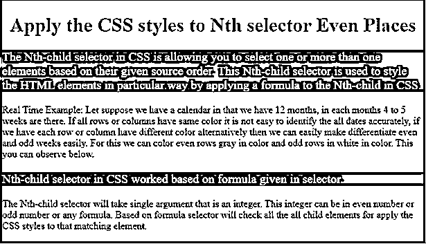
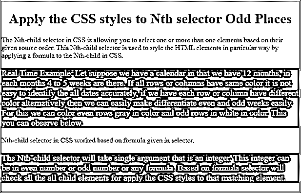
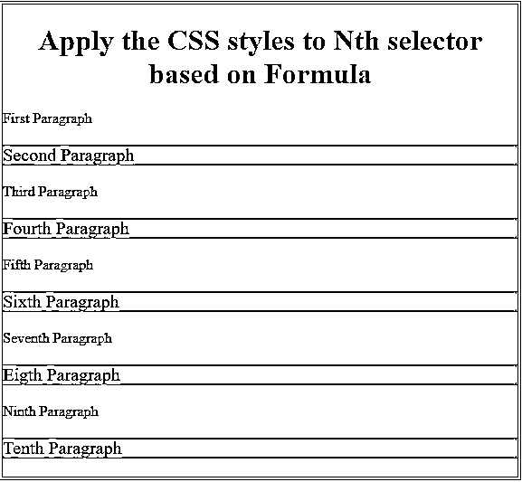

# CSS 选择器第 n 个子级

> 原文：<https://www.educba.com/css-selector-nth-child/>




## CSS 选择器第 n 个子代介绍

CSS 中的 n-child 选择器允许您根据给定的源顺序选择一个或多个元素。这个第 n 个子元素选择器通过将一个公式应用到 CSS 中的第 n 个子元素来以特定的方式设计 HTML 元素的样式。

**实时示例:**假设我们有一个日历，其中有 12 个月，每个月有 4 到 5 周。如果所有的行或列都有相同的颜色，就不容易准确地识别所有的日期，如果我们让每一行或每一列都有不同的颜色，那么我们就很容易区分偶数和奇数周。为此，我们可以将偶数行涂成灰色，奇数行涂成白色。这一点你可以在下面观察到。

<small>网页开发、编程语言、软件测试&其他</small>

**语法:**

```
tr:nth-child(even)
{
background: lightgray;
}
tr:nth-child(odd)
{
background:white;
}
```

**输出:**




### CSS 中的第 n 个子选择器是如何工作的？

CSS 中的第 n 个子选择器基于选择器中给出的公式工作。第 n 个子选择器将接受一个整数参数。这个整数可以是偶数或奇数或任何公式。基于公式选择器将检查所有的所有子元素，以便将 CSS 样式应用到匹配的元素。

**语法:**

```

One
Two
Three
Four
Five
Six
Seven
Eight

.child:nth-child(4n) {
Color:green;
}
```

**解释:**上述 child:n-child 选择器将颜色应用于所有 4n 个元素(4，8，12，16……)表示< article class=" child " >四个< /article >和< article class=" child " >八个< /article >。

**Note:** Internet Explorer and below version not support this concept.

### 实现 CSS 选择器第 n 个子级的示例

以下是 CSS 选择器第 n 个子级的示例:

#### 示例# 1–偶数位置的第 n 个子选择器

**代码:**

```
<!DOCTYPE html>
<html>
<head>
<!--CSS Styles-->
<style>
p:nth-child(even) /*apply the styles to only even paragraphs content*/
{
background: red;
color:white;
font-size: 20px;
}
h1
{
color:blue;
text-align: center;
}
.div
{
border: solid 4px green;
}
</style>
</head>
<body>
<div class="div">
<h1>Apply the CSS styles to Nth selector Even Places</h1>
<p>The Nth-child selector in CSS is allowing you to select one or more than one elements based on their given source order. This Nth-child selector is used to style the HTML elements in particular way by applying a formula to the Nth-child in CSS.</p>
<p>Real Time Example: Let suppose we have a calendar in that we have 12 months, in each months 4 to 5 weeks are there. If all rows or columns have same color it is not easy to identify the all dates accurately, if we have each row or column have different color alternatively then we can easily make differentiate even and odd weeks easily. For this we can color even rows gray in color and odd rows in white in color. This you can observe below.</p>
<p>Nth-child selector in CSS worked based on formula given in selector. </p>
<p>The Nth-child selector will take single argument that is an integer. This integer can be in even number or odd number or any formula. Based on formula selector will check all the all child elements for apply the CSS styles to that matching element.</p>
</div>
</body>
</html>
```

**输出:**

**

** 

#### 示例 2–奇数位置的第 n 个子选择器

**代码:**

```
<!DOCTYPE html>
<html>
<head>
<!--CSS Styles-->
<style>
p:nth-child(odd) /*apply the styles to only odd paragraphs content*/
{
font-size: 20px;
background: green;
color: white;
}
h1
{
color: maroon;
text-align: center;
}
.div
{
border: double 4px brown;
}
</style>
</head>
<body>
<div class="div">
<h1>Apply the CSS styles to Nth selector Odd Places</h1>
<p>The Nth-child selector in CSS is allowing you to select one or more than one elements based on their given source order. This Nth-child selector is used to style the HTML elements in particular way by applying a formula to the Nth-child in CSS.</p>
<p>Real Time Example: Let suppose we have a calendar in that we have 12 months, in each months 4 to 5 weeks are there. If all rows or columns have same color it is not easy to identify the all dates accurately, if we have each row or column have different color alternatively then we can easily make differentiate even and odd weeks easily. For this we can color even rows gray in color and odd rows in white in color. This you can observe below.</p>
<p>Nth-child selector in CSS worked based on formula given in selector. </p>
<p>The Nth-child selector will take single argument that is an integer. This integer can be in even number or odd number or any formula. Based on formula selector will check all the all child elements for apply the CSS styles to that matching element.</p>
</div>
</body>
</html>
```

**输出:**

**

** 

#### 示例# 3–带公式的第 n 个子选择器

**代码:**

```
<!DOCTYPE html>
<html>
<head>
<!--CSS Styles-->
<style>
p:nth-child(2n+1)/*apply the styles to only 2n+1 places paragraphs content like 2*1+1=3, 2*2+1=5, 2*3+1=7 etc.*/
{
font-size: 20px;
background: orange;
color: navy;
}
h1
{
color: navy;
text-align: center;
}
.div
{
border: double 4px fuchsia;
}
</style>
</head>
<body>
<div class="div">
<h1>Apply the CSS styles to Nth selector based on Formula</h1>
<p>First Paragraph</p>
<p>Second Paragraph</p>
<p>Third Paragraph</p>
<p>Fourth Paragraph</p>
<p>Fifth Paragraph</p>
<p>Sixth Paragraph</p>
<p>Seventh Paragraph</p>
<p>Eigth Paragraph</p>
<p>Ninth Paragraph</p>
<p>Tenth Paragraph</p>
</div>
</body>
</html>
```

**输出:**




### 结论

CSS 中的第 n 个子选择器用于指定位置的元素样式。我们可以将这个第 n 个子选择器应用于任何 HTML 元素，比如段落(

)、标题(

# 、

## 、…)、表格(、, ..), footer (

), etc. We can apply this nth sub-selector to odd, even and formula related numbers.

### 推荐文章

这是一个 CSS 选择器 n 子的指南。在这里，我们讨论 CSS 选择器第 n 个孩子和它的不同的例子及其代码实现的简要概述。您也可以浏览我们推荐的其他文章，了解更多信息——

1.  [CSS 在技术中的应用](https://www.educba.com/what-is-css/)
2.  [CSS 的六大优势介绍](https://www.educba.com/advantages-of-css/)
3.  [十大 CSS 面试问题指南](https://www.educba.com/css-interview-questions/)
4.  [CSS 中按钮的一些属性](https://www.educba.com/button-in-css/)


