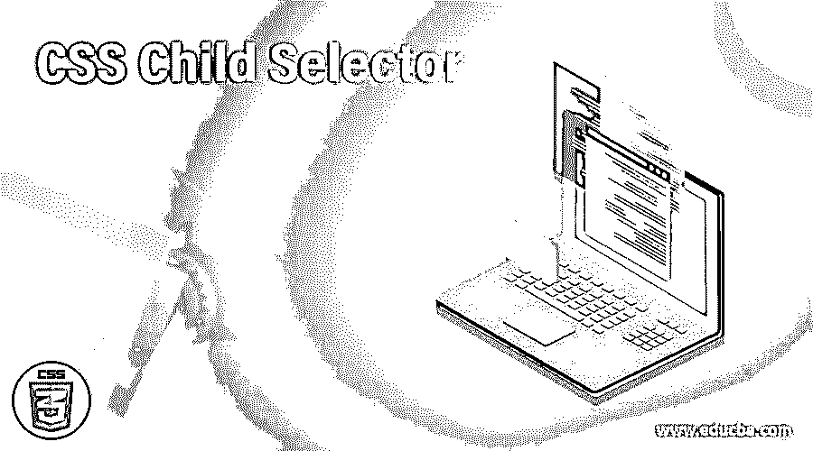
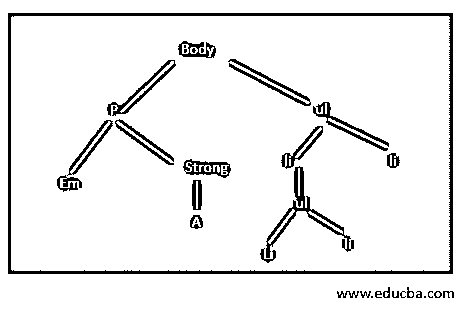
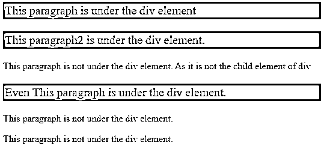
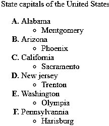
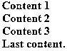
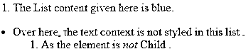
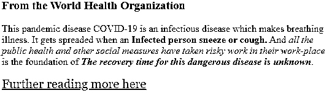
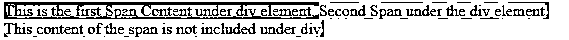

# CSS 子选择器

> 原文：<https://www.educba.com/css-child-selector/>




## CSS 子选择器简介

CSS 子选择器被定义为只选择直接子元素的 CSS 选择器，它比上下文选择器更清晰。这个选择器使用了出现在两个不同选择器之间的大于符号“>”，它比后代选择器更具体，这有助于简化 CSS 样式代码。第二个选择器应该是元素的直接子元素。

**语法**

<small>网页开发、编程语言、软件测试&其他</small>

CSS 选择器的一般格式如下所示

```
Element1 > element 2
{
// style properties code….;
}
```

元素 1 是父元素，元素 2 是子选择器。

### CSS 中的子选择器是如何工作的？

工作过程非常简单。这个子选择器有两个选择器，用“>”符号分开。第一个选择器说它是父元素，第二个选择器说它是带有样式属性的子元素。

这里，让我们为一个给定的 HTML 文档取一个样本树结构




例如，如果一个 HTML 代码是这样的:在上面的图中，每个元素要么是父元素，要么是子元素，从而形成父子关系。这里的根元素是 body 元素，它有两个子元素 p 和 ul 元素。所以这里的 p 元素只有一个父元素，它可能有很多子元素 em 和 strong。要选择 p，我们需要给出一个类似 body > p 的规则。假设我们需要使用选择器选择“A”元素，我们将给出一个类似 strong > A 的规则，它类似于 p > A；不可能使用子选择器。

```
Div  > p
{
font-size: 12px;
}
```

所以在上面的示例代码中，

元素是父元素，后面跟着一个子元素

。所以上面的语句规则使得任何段落的大小为 12px。

这个选择器被认为是一个精确的操作符，当加上通用的选择器时，它给出了一些令人惊讶的可能性。

### 实现 CSS 子选择器的示例

在这一节中，我们将通过例子简要地探讨子选择器。所以让我们开始吧。

#### 示例#1

**代码:**

```
<!DOCTYPE html>
<html>
<head>
<style>
div > p {
background-color: salmon;
font-size : 20px;
padding : 3px;
}
</style>
</head>
<body>
<div>
<p>This paragraph is under the div element</p>
<p>This paragraph2 is under the div element. </p>
<p>This paragraph is not under the div element. As it is not the child element of div</p>
<p> Even This paragraph is under the div element. </p>
</div>
<p>This paragraph is not under the div element. </p>
<p>This paragraph is not under the div element. </p>
</body>
</html>
```

**解释:**这里我们使用 div > p 选择器，它说 div 是父元素，它选择子元素 p，子元素 p 是子元素。在这里，子元素用颜色突出显示。上面代码的子选择器应该是这样的。

**输出:**




#### 实施例 2

**代码:**

```
<!DOCTYPE html>
<html>
<head>
<title> Example for CSS Child Selector</title>
</head>
<body>
<p> State capitals of the United States</p>
<style>
ol > li {
color : blue;
font-weight:bolder;
}
li > span {
color: green;
font-weight: normal;
}
</style>
<ol type="A">
<li> Alabama
<ul>
<li>Montgomery</li>
</ul>

</li>
<li>Arizona
<ul>
<li>Phoenix</li>
</ul>

</li>
<li> California
<ul>
<li>Sacramento</li>
</ul>

</li>
<li> New jersey
<ul>
<li>Trenton</li>
</ul>

</li>
<li>Washington
<ul>
<li>Olympia</li>
</ul>
</li>
<li> Pennsylvannia
<ul>

<li>Harisburg</li></ul>
</li>
</ol>
</body>
</html>
```

**解释:**这段代码说 ol 标签元素是父元素，li 是子元素。就像我们有许多【李】>子素一样。这意味着<李>是被样式化的直接子元素。选中的所有东西都以绿色突出显示。现在输出看起来像这样。

**输出:**




#### 实施例 3

**代码:**

使用子选择器定位粗体元素

```
<html>
<style type="text/css">
div.select > b {
color: orange;
}
</style>
<body>
<div class="select">
<b>Content 1</b>
<div>
<b>Content 2</b>
<div>
<b>Content 3</b>
</div>
</div>
<b>Last content.</b>
</div>
</body>
</html>
```

**解释:**上面的代码说子选择器选择 div 类，后面跟着< b >元素。因此，第一个 b 元素内容和最后一个 b 元素是时尚的。

**输出:**




#### 实施例 4

**代码:**

```
<html>
<title> Child Selector</title>
<style>
body > ol > li
{
color: #6A5ACD;
}
</style>
<body>
<ol>
<li>The List content given here is blue.</li>
</ol>
<div>
<ul>
<li>Over here, the text context is not styled in this list .
<ol>
<li>As the element is <em>not</em> Child .</li>
</ol>
</li>
</ul>
</div>
</body>
</html>
```

**输出:**




对于上面相同的 html 代码。让我们看看子元素的不同选择。

**代码:**

```
body > div > ul
{
color: #BA55D3;
}
Output:
```


现在你可以在第二行看到样式的变化，因为我已经在底层做了一个子选择器。

#### 实施例 5

**代码:**

```
<!DOCTYPE html>
<html>
<head>
<title>HTML: The strong and em tags</title>
<style>
body > p > a {color: #BA55D3;
font-size: 20px;
font-family: Georgia, Times, "Times New Roman", serif;}
</style>
</head>
<body>
<h3>From the World Health Organization </h3>
<p>This pandemic disease COVID-19 is an infectious disease which makes breathing illness. It gets spreaded when an <strong>Infected person sneeze or cough.</strong> And <em> all the public health and other social measures have taken risky work in their work-place</em> is the foundation of <strong><em>The recovery time for this dangerous disease is unknown</em></strong>.</p>
<p><a href="https://www.who.int/health-topics/coronavirus#tab=tab_1">Further reading more here</a></p>
</body>
</html>
```

**输出:**




#### 实施例 6

使用 Span 和 div 元素的子选择器演示

**代码:**

```
<html>
<style>
span {
background-color: #00FFFF;
}
div > span {
background-color: #FF4500;
}
</style>
<div>
This is the first Span Content under div element.
Second Span under the div element.

</div>
This content of the span is not included under div.
</html>
```

**输出:**




### 结论

因此，在本文中，我们解释了如何使用 CSS 子选择器及其语法和示例。有了这个子选择器，我们可以建立强大的网站，这些网站可能是有挑战性和有价值的。最后，它概述了基本工作，并介绍了如何在 HTML 元素中实现这个元素，这对 web 开发人员非常有益。此外，我们对什么是子选择器以及如何在实际情况中使用它们有了正确的了解。

### 推荐文章

这是一个 CSS 子选择器的指南。这里我们讨论一个 CSS 子选择器的介绍，语法，它是如何工作的例子。您也可以浏览我们的其他相关文章，了解更多信息——

1.  [CSS 选择器第 n 个子节点](https://www.educba.com/css-selector-nth-child/)
2.  [CSS 中心分区](https://www.educba.com/css-center-div/)
3.  [CSS 分页后属性](https://www.educba.com/css-page-break-after-property/)
4.  [CSS Flexbox 属性](https://www.educba.com/css-flexbox-properties/)


