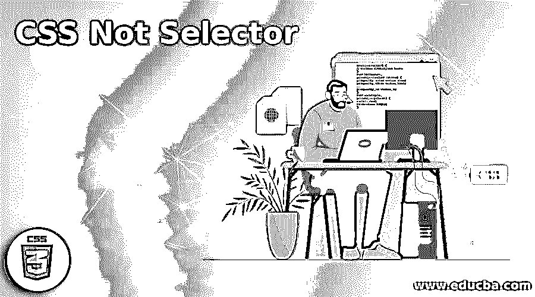
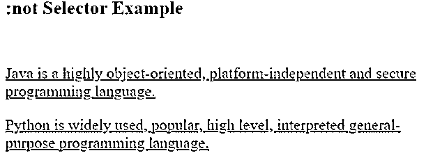
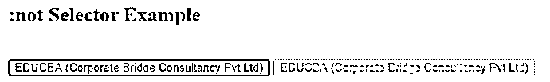
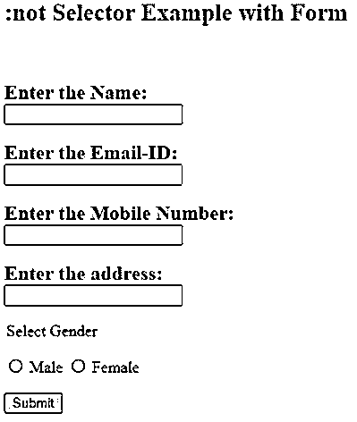

# CSS 非选择器

> 原文：<https://www.educba.com/css-not-selector/>




## CSS 非选择器的定义

名为:not 选择器的 CSS 伪类描述了不适合选择器列表的元素。对于 CSS:not 选择器接受单个选择器作为参数，然后组合一个或多个没有被参数定义的元素。假设我们想要一个没有特定类的项目被选中。似乎没有带:not 选择器的逻辑组合子，但它们可以像' and '一样有效地组合。

:not 选择器将以下任何一个作为参数:

<small>网页开发、编程语言、软件测试&其他</small>

*   选择器类型(如 p、span 等。)
*   类的选择器(例如，元素，。侧边栏等。)
*   选择器 ID(例如，带有#id_name)
*   伪类中的选择器(例如:第一个子代:最后一个类型)
*   选择器属性(例如[type="checkbox])
*   通用选择器(*)

### 语法和参数

CSS not 选择器的语法可以写成如下所示:

```
:not(selector) {
// define CSSstyles here
}
For instance,
p:not(selector_name) {
property_one: value_one;
property_two: value_two;
...
property_n: value_n;
}
For example,
p:not(.myclass) {
color: red;
font-size: 15px;
}
```

这会将 CSS 样式应用于所有“p”元素，不包括名为“的指定类的元素。我的班级。

### CSS 中的 Not 选择器是如何工作的？

当我们使用 CSS :notselector 时，它并不匹配 CSS 应用程序中排除的所有元素。CSS:no selector 语句可能的值元素名、类名、Id 名或值属性被左右方括号包围。我们还可以全局使用:notselector，而不将其添加到元素中，收集文档中不包含在参数中的所有元素。像其他伪元素和伪类的选择器一样，我们可以使用:not 选择器来处理其他伪类和伪元素。

### CSS Not 选择器的示例

现在，我们将看到一些使用:not 选择器的示例，如下所示:

#### 示例#1

**代码:**

```
<!DOCTYPE html>
<html lang="en">
<head>
<meta charset="utf-8">
<title>CSS :not Selector Example </title>
<style>
p:not(.mytext) {
color:#ff0000;
text-decoration: underline;
font-size: 20px;
}
</style>
</head>
<body>
<h2> :not Selector Example </h2>
<br>
<p> Java is a highly object-oriented, platform-independent and secure programming language. </p>
<p> Python is widely used, popular, high level, interpreted general-purpose programming language. </p>
<p class="mytext"> HTML is abbreviated as Hyper Text Mark up Language the most expanded language used worldwide to display the result in the web pages. </p>
</body>
</html>
```

**输出:**




在上面的例子中，我们对'使用了 not 选择器。“我的文本”类。这里，首先，两个段落将具有在这个类中指定的 CSS 样式。用'定义的行。“mytext”类将不具有 CSS 样式，因为它被定义为不选择最后一行，并且不应该对该段落应用样式。

#### 实施例 2

**代码:**

```
<!DOCTYPE html>
<html lang="en">
<head>
<meta charset="utf-8">
<title>CSS :not Selector Example </title>
<style>
button:not([DISABLED]){
color:orangered;
border: 2px solid green;
}
</style>
</head>
<body>
<h2> :not Selector Example </h2>
<br>
<button> EDUCBA (Corporate Bridge Consultancy Pvt Ltd) </button>
<button disabled="disabled"> EDUCBA (Corporate Bridge Consultancy Pvt Ltd) </button>
</body>
</html>
```

**输出:**




在上面的例子中，我们使用了按钮类型属性。启用一个按钮，禁用另一个按钮。not 选择器已应用于具有禁用属性的按钮。CSS 样式将应用于除禁用按钮之外的另一个按钮。另一个按钮将带有橙色文本和绿色边框。

#### 实施例 3

**代码:**

```
<!DOCTYPE html>
<html lang="en">
<head>
<meta charset="utf-8">
<title>CSS :not Selector Example </title>
<style>
label:not(.radio_class) {
font-weight: bold;
display:block;
color: blue;
font-size: 20px;
}
</style>
</head>
<body>
<h2> :not Selector Example with Form </h2>
<br>
<form method="post" action="#">
<p>
<label for="name"> Enter the Name: </label>
<input type="text" id="name" name="name" required>
</p>
<p>
<label for="email"> Enter the Email-ID: </label>
<input type="email" id="email" name="email" required>
</p>
<p>
<label for="number"> Enter the Mobile Number: </label>
<input type="number" id="number" name="number">
</p>
<p>
<label for="address"> Enter the address: </label>
<input type="address" id="address" name="address">
</p>
<legend> Select Gender </legend>
<p>
<input type="radio" id="male" name="radio_demo">
<label for="male" class="radio_class"> Male </label>
<input type="radio" id="female" name="radio_demo">
<label for="female" class="radio_class"> Female </label>
</p>
<button type="submit">Submit</button>
</form>
</body>
</html>
```

**输出:**




在上面的例子中，我们显示了带有 not 选择器的表单。的。radio_class 用于定义表单元素的 CSS 样式。性别部分有一个用 not 选择器指定的标签。这些标签将不具有已定义的 CSS 样式，因为它是用 not 选择器指定的。除了标签之外，其余的元素将有样式，包括文本颜色为蓝色，字体大小为 20px，字体粗细为粗体。

#### 实施例 4

**代码:**

```
<!DOCTYPE html>
<html lang="en">
<head>
<meta charset="utf-8">
<title>CSS :not Selector Example </title>
<style>
li:not(.mylist) {
color: red;
font-size: 15px;
font-weight: bold;
line-height:2;
}
</style>
</head>
<body>
<h2> :not Selector Example with List </h2>
<br>
<ul>
<li> EDUCBA (Corporate Bridge Consultancy Pvt Ltd) </li>
<li> EDUCBA is a leading global provider of skill based education </li>
<li class="mylist"> It is online learning model along with amazing 2500+ courses </li>
<li> It provides job oriented hands-on courses available to anyone, anytime and anywhere </li>
</ul>
</body>
</html>
```

**输出:**


在上面的例子中，我们对有序列表使用了 not 选择器。“mylist”类将用于定义有序列表元素的 CSS 样式。not 选择器不会像 CSS 中定义的那样设置相应句子的样式，其他列表元素将设置为红色，字体大小为 15px，字体粗细为粗体，行高为 2。

### 结论

到目前为止，我们已经学习了 not 选择器以及不同场景中的例子。:not 选择器匹配未用参数标识的项。移动的参数不包括特定的选择器或任何带有伪元素的选择器。只有 Chrome、Firefox、Safari、Internet Explorer 9+和 Opera 等现代浏览器支持:not 选择器。

### 推荐文章

这是一个 CSS 而不是选择器的指南。在这里，我们也讨论了 css 中 not 选择器的定义和工作原理。以及一个不同的示例及其代码实现。您也可以看看以下文章，了解更多信息–

1.  [CSS 溢出换行](https://www.educba.com/css-overflow-wrap/)
2.  [CSS in React](https://www.educba.com/css-in-react/)
3.  [CSS 背景剪辑](https://www.educba.com/css-background-clip/)
4.  [CSS 文本颜色](https://www.educba.com/css-text-color/)


