# CSS 字体属性

> 原文：<https://www.educba.com/css-font-properties/>

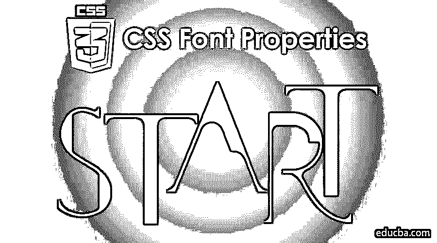

## CSS 字体属性介绍

以下文章提供了 CSS 字体属性的概要。级联样式表，通常被称为 CSS，是一种简单的设计语言，旨在使制作的网页看起来更简单。CSS 处理网页的外观和体验。应用 CSS，你可以控制文本的颜色，字体的风格，段落之间的间距，列的大小和显示方式，背景图片或颜色的使用，布局风格，显示设备的变化，屏幕大小以及其他各种效果。CSS 易于理解和掌握；但是，它可以有效地控制 HTML 文档的演示。大多数情况下，CSS 通常与标记语言 [HTML](https://www.educba.com/html-fonts-styles/) 或简单的 XHTML 结合在一起。

*   CSS 指的是层叠样式表。
*   CSS 确定了 HTML 元素应该如何在屏幕上、纸上显示，也包括媒体。
*   CSS 会节省很多工作。例如，它可以同时控制多个网页的布局。
*   外部样式表将保存在 CSS 文件中。

### 不同的 CSS 字体属性

以下是不同的 CSS 字体属性:

<small>网页开发、编程语言、软件测试&其他</small>

**字体集合:**在 CSS 中，您可以通过在样式规则中设置 font-family 属性来选择要用于特定元素中的文本的字体，但是在我们进入 font-family 的细节之前，我们必须了解如何使用字体名称，因为当我们创建网页时，我们并不总是知道用户将使用什么来查看网页。

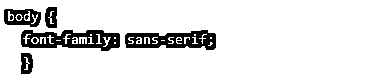

#### 标准 CSS 中的五种字体类别

*   第一类是衬线字体。属于这一类别的特定字体的一个例子是 Times 或 Times New Roman 以及 Baskerville、Century 和 Schoolbook。

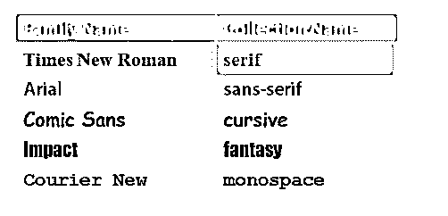

*   那些是特定的字体名称，如巴斯克维尔、世纪和教科书；当在文字处理器中选择字体时，这些是你可能会在下拉列表中看到的字体名称，因为文字处理器确切地知道你的机器上安装了什么。但是对于 CSS 来说，所有这些字体都属于衬线字体的范畴。

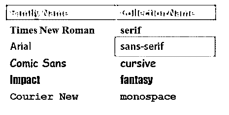

*   还有一组无衬线字体，属于这一类的流行字体是 Arial。如果你不知道，衬线，所以在一封信的结尾有一些小线条，让这些字母看起来花哨和修饰。例如，你可以看到下面 R 字母的区别。

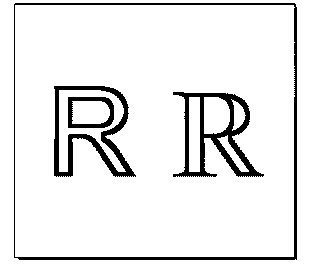

*   左边的 R 是 Arial，它是无衬线的，字面上没有修饰，而右边的 R 是 Times New Roman，它在这里和那里包含一些额外的小笔画。一般来说，人们发现无衬线字体在 LCD 和 LED 显示器上更容易阅读。

*   也有草书字体的类别，看起来有点像手写字母和幻想字体，可以看起来像任何东西，但大多数设计不会大量使用这些字体，因为它们可能很难阅读，也有点不可预测。

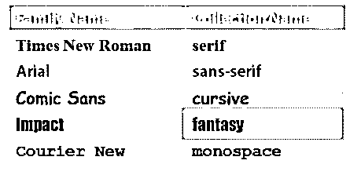

*   最后，还有一个等宽字体的类别。这些字体为每个字母提供了相等的间距，这可能是您想要在文本编辑器中使用的字体，您[使用该字体来创建 CSS](https://www.educba.com/css-triangle-generator/) 并且您想要在网页上使用该字体来显示网页中的代码。

**网络浏览器中的结果:**

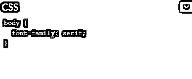

**输出:**

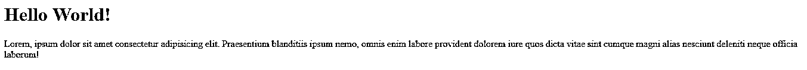

**Results in the Web Browser:**

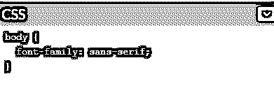

**输出:**

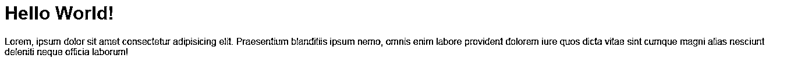

**网络浏览器中的结果:**

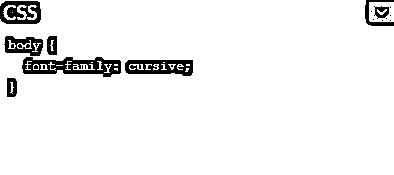

**输出:**

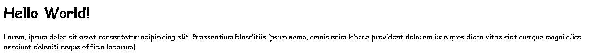

**网络浏览器中的结果:**

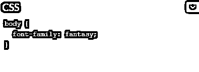

**输出:**

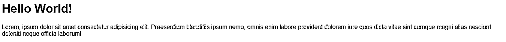

**网络浏览器中的结果:**

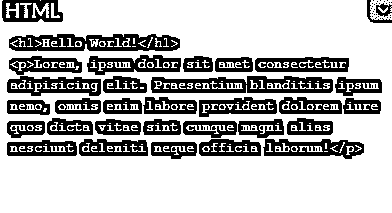

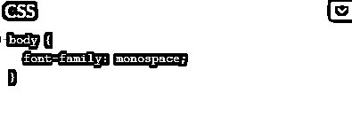

**输出:**

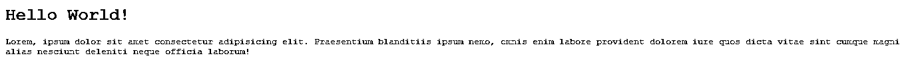

### 字体系列

下面的解释显示了字体系列:

*   许多 CSS 设计会将 font-family 属性设置为特定字体的名称，如 Arial。然而，您想要的特定字体，如 Arial，在给定用户的系统上总是不可用的。这也是你可以在逗号分隔的列表中指定尽可能多的字体的原因之一，浏览器将使用第一个匹配的字体。

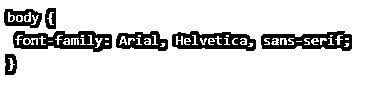

根据上面的截图，我们有 1 个 st 选择，2 个 nd 选择，如果这两种字体都不可用，我们就退回到通用的无衬线字体，因为即使浏览器没有任何其他字体，它也必须为该类别提供默认字体。当然，这就提出了一个问题，在网页设计中使用什么样的字体是安全的。一般来说，Arial、Verdana、Times 和 Courier 是不会错的，但我们也在这里提供了一个列表，列出了在多个平台上常见的其他字体。

*   Helvetica 是一种常见的字体，您可以在许多样式表中看到，但 Helvetica 在 Windows 上不可用。Windows 提供 Arial。

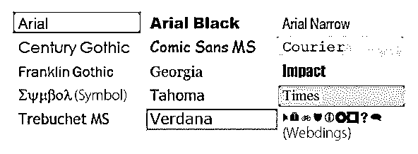

*   字体系列是被继承的属性之一。因此，如果我们在正文级别设置它，那么该正文内的段落、div 和锚点将默认选择该字体系列，除非我们覆盖它。例如，这里的这个头，这个 h1 标记，从主体继承了 font-family，但并不一定是这样。

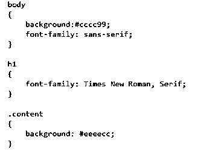

**输出:**

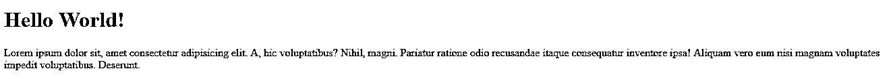

我们可以说，对于 h1，字体系列应该是 Times New Roman，Serif，如果你刷新网页，这种变化已经反映出来了。

### 字体大小和样式

以下是关于字体大小和样式的详细信息:

*   你想要控制的字体的另一个特征是大小，当设置大小时，你首先必须在绝对或相对单位之间进行选择。

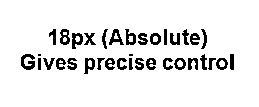

*   绝对大小通常以像素为单位，像素可以让您非常精确地控制字体大小。

*   相对单位，如百分比或关键字更大或更小或 ems，允许您根据基线设置字体大小，因此 2em 将是基线大小的两倍，而 0。8em 是基线的 80%。今天，许多人使用 ems 进行相对字体大小调整。一个原因是相对大小允许用户使用浏览器放大文本，这是他们可能想做的事情，因为文本对他们来说很难看到。相对大小允许这样做。

**网络浏览器中的结果:**

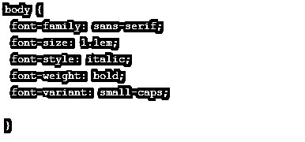

**输出:**

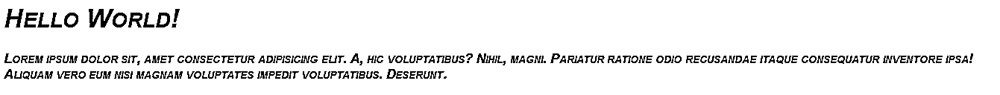

*   您可以设置的其他一些字体属性包括强制使用斜体的字体样式或使字体加粗的字体粗细。font-variant 属性将引入一种只使用大写字母的字样。

**网络浏览器中的结果:**

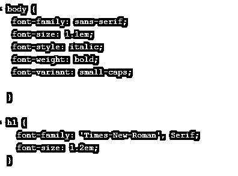

**输出:**

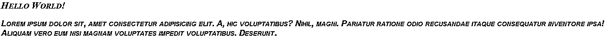

*   我们要做的第一件事是稍微弱化 h1 元素。它需要是一个 h1 元素，因为它是这个页面的主要标题，但对我们来说它有点太大了。因此，让我将字体大小设置为 1.2ems。这将使字体大小降低一点，因为通常情况下，h1 标记将远远超过 1.2ems。我们要解决的下一个问题是这里列出的代码。我们希望这是一个等宽字体，下面的代码有几个不同的实现方法。

**网络浏览器中的结果:**

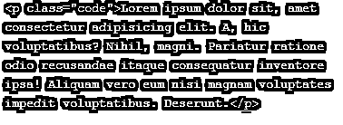

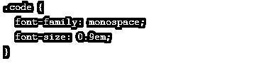

**输出:**

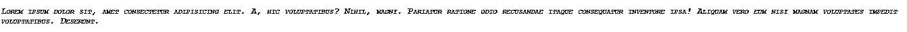

**网络浏览器中的结果:**

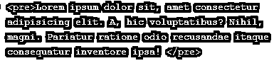

**输出:**

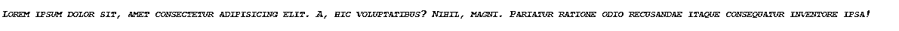

这里我们希望[使用前置标签](https://www.educba.com/pre-tag-in-html/)，这意味着这是预格式化的文本，请不要试图操纵它。

**网络浏览器中的结果:**

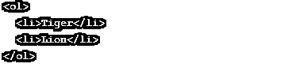

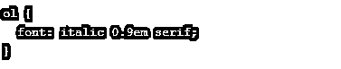

**输出:**

它是字体样式的速记属性。像字体风格斜体，字体大小 0.9em 和字体系列衬线。

**网络浏览器中的结果:**

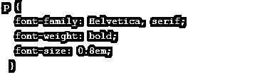

**输出:**

### 结论

如何使用 CSS 指定字体，以及 Arial 等特定字体与 serif 和 sans-serif 等通用类别的 web 字体之间的区别。我们还管理字体大小以及相对大小与绝对大小的利弊；最后，我们使用字体属性，并学习用字体系列加载字体。

### 推荐文章

这是 CSS 字体属性的指南。这里我们已经讨论了不同的 CSS 字体属性和五种字体类别。您也可以浏览我们推荐的其他文章，了解更多信息——

1.  [什么是 CSS？](https://www.educba.com/what-is-css/)
2.  [CSS 简介](https://www.educba.com/introduction-to-css/)
3.  [职业生涯中的](https://www.educba.com/career-in-css/) [CSS](https://www.educba.com/career-in-css/)
4.  [CSS 的优势](https://www.educba.com/advantages-of-css/)

