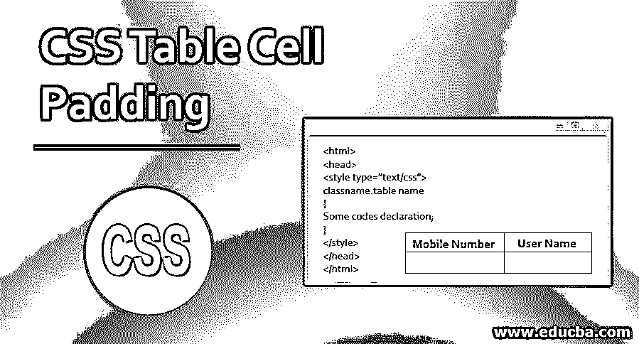
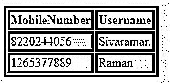
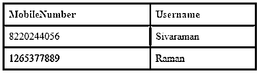
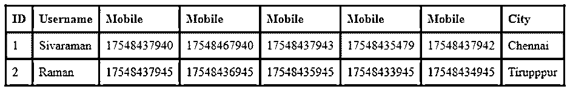

# CSS 表格单元格填充

> 原文：<https://www.educba.com/css-table-cell-padding/>




## CSS 表格单元格填充简介

table 标签已经熟悉了 HTML 概念，包含单元格填充是 HTML 的属性。该属性在表格单元格内创建了一些空间，因此我们在 HTML 的元素和表格侧之间创建了一个空白空间或将其命名为填充。就像 CSS 填充属性或允许样式文档中有相同类型空格的属性一样。我们可以设置 CSS Padding 属性来对齐表格单元格，也可以为表格单元格的每一边设置不同的填充。使用该属性对表格单元格没有限制。

**语法:**

<small>网页开发、编程语言、软件测试&其他</small>

通过使用

语法如下:

```
<html>
<head>
<style type="text/css">
classname.table name
{
Some codes declaration;
}
</style>
</head>
</html>
```

上面的代码描述了 HTML 中 CSS 样式标签填充属性的基本语法。我们将使用类名和表名来设置网页中的填充样式。

### CSS 中的表格单元格填充是如何工作的？

*   在 CSS 中单元格填充属性不启用意味着它自动设置默认值。基本上，单元格填充用于表格单元格及其边框之间的间距。标签将使用单元格填充和单元格间距属性，它们用于网页，但它在 Html5 版本中不受支持，因此代表它将在网页中使用 CSS 属性，如填充和边框间距属性。所以这是一个基于用户运行环境的浏览器兼容性问题。

*   当我们使用 CSS 填充属性时，它有许多功能来查看更复杂的网页。我们对表格单元格的每一侧使用填充属性，而不仅仅是单个填充属性。我们将对表格单元格的每一侧应用多组不同的填充属性。我们可以应用这两种不同的方法来跟踪元素的不同侧面。
*   我们使用填充类型，如顶部填充、底部填充、左侧填充和右侧填充属性，这是将它用于 CSS 属性中的填充样式的方法之一。另一种方法与前一种方法相同，但是这里将为填充类型中的设置使用速记属性。与第一种方法相比，这种方法更快，并且与第一种方法相比需要更少的代码，其余的事情与前一种方法相同。
*   我们没有为 CSS 元素的所有边提供任何特定的值，我们可以用数字 1 来赋值，只有一个值应用于 CSS 元素的所有边。如果有多个值，一个分配给第一个值的顶部和底部填充，另一个分配给左侧和右侧填充。我假设有三个值，第一个被设置为顶部填充，第二个被设置为左右填充，最后一个被设置为底部填充。
*   如果我们主要在 HTML 端使用一些 CSS 模型，比如 box-model，我们使用的标签是最终的标签，它包含了所有的页面。默认的填充是 0，所以我们在文本和它的边缘之间的空间中使用一些文本来包装 div 标签，因为 div 标签主要在添加填充样式等时非常严格地遵循盒子模型。表格单元格可以被解释为松耦合浏览器的一种。所有 HTML 块级元素的默认宽度大约为 100%，高度将取决于元素的内容。
*   所有块级元素都具有宽度和高度属性。填充将根据特定的尺寸添加到元素的每一侧。我们可以使用百分比(%)，像素(px)等单位格式，我们将在网页中的元素的所有边使用相同的单位格式，但它不能接受 CSS 中填充样式的负值。我们可以使用速记属性来填充元素，同样的一个是空白样式。我们在 CSS 中的

    元素样式块中使用填充属性，它将影响表中四边的值。

### CSS 表格单元格填充的示例

以下是一些例子:

#### 示例#1

**代码:**

```
<html>
<head>
<style>
table, th, td {
border: 3px solid blue;
}
</style>
</head>
<table>
<tr>
<th>MobileNumber</th>
<th>Username</th>
</tr>
<tr>
<td>8220244056</td>
<td>Sivaraman</td>
</tr>
<tr>
<td>1265377889</td>
<td>Raman</td>
</tr>
</table>
</html>
```

**输出:**




#### 实施例 2

**代码:**

```
<html>
<head>
<style>
table {
border-collapse: collapse;
width: 93%;
}
th, td {
text-align: left;
padding: 7px;
border: 3px solid blue;
}
tr:nth-child(even){background-color: green}
th {
background-color: red;
color: blue;
}
</style>
</head>
<table>
<tr>
<th>MobileNumber</th>
<th>Username</th>
</tr>
<tr>
<td>8220244056</td>
<td>Sivaraman</td>
</tr>
<tr>
<td>1265377889</td>
<td>Raman</td>
</tr>
</table>
</html>
```

**输出:**




#### 实施例 3

**代码:**

```
<html>
<head>
<style>
table {
border-collapse: collapse;
width: 93%;
}
th, td {
text-align: left;
padding: 7px;
border: 3px solid blue;
}
tr:nth-child(even){background-color: green}
</style>
</head>
<div style="overflow-x:auto;">
<table>
<tr>
<th>ID</th>
<th>Username</th>
<th>Mobile</th>
<th>Mobile</th>
<th>Mobile</th>
<th>Mobile</th>
<th>Mobile</th>
<th>City</th>
</tr>
<tr>
<td>1</td>
<td>Sivaraman</td>
<td>17548437940</td>
<td>17548467940</td>
<td>17548437943</td>
<td>17548435479</td>
<td>17548437942</td>
<td>Chennai</td>
</tr>
<tr>
<td>2</td>
<td>Raman</td>
<td>17548437945</td>
<td>17548436945</td>
<td>17548435945</td>
<td>17548433945</td>
<td>17548434945</td>
<td>Tirupppur</td>
</tr>
</table>
</div>
</html>
```

**输出:**




在上面的例子中，填充属性用于表格数据，第一个是 css 表格的基本填充样式示例，第二个是我们使用一些颜色来突出显示表格单元格中的值，最后一个示例使用菜单栏样式，如水平和垂直，这里基本上水平是为数据启用的，所以我们可以设置属性 have overflow:x，它将在 CSS 表格中自动启用。

### 结论

在 CSS 样式中，我们不能在网页中的表格行组、表格页眉组、表格页脚组、表格行、表格列和表格列组元素中应用 CSS 填充。在 CSS3 中，可能的填充值的百分比格式被删除，并且它还建议负值作为自动增量值。该规范处于草案状态，仅在将来的规范中可能包括。

### 推荐文章

这是一个 CSS 表格单元格填充指南。在这里，我们讨论了 CSS 中表格单元格的填充是如何工作的，并给出了相应的例子。您也可以浏览我们推荐的其他文章，了解更多信息——

1.  [CSS 形状生成器](https://www.educba.com/css-shape-generator/)
2.  [CSS 三角形生成器](https://www.educba.com/css-triangle-generator/)
3.  [CSS 内联样式](https://www.educba.com/css-inline-style/)
4.  [CSS 布局](https://www.educba.com/css-layout/)


