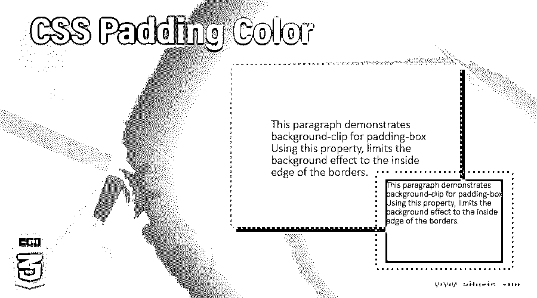
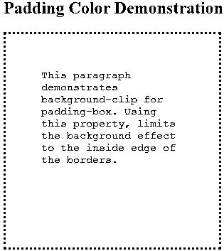
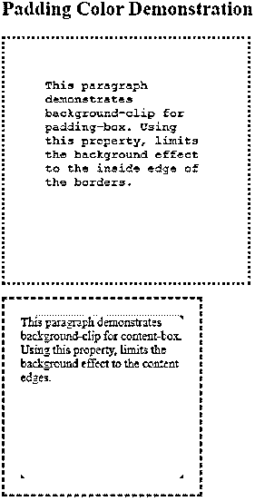
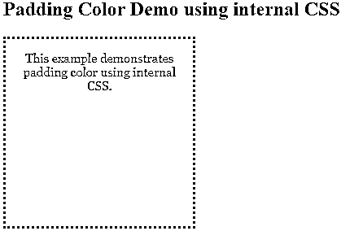

# CSS 填充颜色

> 原文：<https://www.educba.com/css-padding-color/>




## CSS 填充颜色介绍

CSS 中有许多功能可以实现，使用直接链接到它们的属性。其中一些功能包括设置字体风格，背景颜色，决定显示的文本大小，当我们悬停在某个元素上时会发生什么。然而，有许多功能是不能直接实现的。一个这样的特征是填充的颜色。padding 属性中没有定义填充颜色的参数。所以我们利用背景剪辑，在页面上获得特殊的效果。让我们来看看这个特性是如何工作的。

### 如何获取填充色？

正如引言中所讨论的，使用背景翻转属性有助于我们限制或扩展特定背景需要应用于元素的限制。If 提供了三个特定的参数:内容框、填充框、边框。

<small>网页开发、编程语言、软件测试&其他</small>

它的语法如下:

```
background-clip: padding-box (or content-box or border-box)
```

当我们将背景剪辑限定为填充框时，它会将背景扩展到边框的内边缘。背景不适用于此处的边框。这就是我们如何实现填充颜色，通过使用不同的属性。

### 填充颜色是如何工作的？

让我们看几个例子来了解这个过程是如何工作的:

#### 1.使用外部 CSS 的背景剪辑填充颜色

*   由于我们在这个例子中使用了外部 CSS，我们将首先创建一个 CSS 文件。
*   在 CSS 文件中，我们将创建一个类，其中我们将指定背景剪辑限制在填充框内。除此之外，我们还将为该类指定其他属性。

**代码:**

```
.padding{
background-color: lightgreen;
padding: 50px;
background-clip: padding-box;
height: 200px;
width: 200px;
border: dotted darkred;
font-size: 15px;
font-family: 'Courier New', Courier, monospace;
}
```

*   现在，CSS 代码已经完成，我们将继续 HTML 文件。在 header 部分，我们将首先调用外部 CSS 文件。

```
<head>
<title>Padding color using CSS</title>
<link rel = "stylesheet" href = "padding.css">
</head>
```

*   现在，在主体部分，我们将为段落元素编写代码，调用在 CSS 文件中创建的类，以便演示样式和填充颜色。
*   最终的 HTML 代码应该类似于下面的代码片段:

**代码**

```
<html>
<head>
<title>Padding color using CSS</title>
<link rel = "stylesheet" href = "padding.css">
</head>
<body>
<h2>Padding Color Demonstration</h2>
<p class="padding">This paragraph demonstrates background-clip for padding-box. Using this property, limits the background effect to the inside edge of the borders.</p>
</body>
</html>
```

**输出:**一旦保存了这段代码，并且通过浏览器打开了 HTML 文件，您将能够看到以下输出:




*   你可以看到，背景色只限于边框内部。这是通过 CSS 实现填充颜色的一种方式。

#### 2.使用内容框和填充框的背景剪辑，通过外部 CSS 来演示不同之处。

*   和前面的例子一样，这个例子也涉及外部 CSS，所以我们将首先创建 CSS 文件。
*   在 CSS 文件中，我们将定义两个不同的类，分别为 padding-box 和 content-box 设置背景剪辑属性。这个想法是为了理解这两者的不同之处。

**代码:**

```
.content{
background-color: lightblue;
padding: 20px;
font-size: 15px;
height: 200px;
width: 200px;
border: dashed pink;
background-clip: content-box;
}
.padding{
background-color: lightgreen;
padding: 50px;
background-clip: padding-box;
height: 200px;
width: 200px;
border: dotted darkred;
font-size: 15px;
font-family: 'Courier New', Courier, monospace;
}
```

*   下一步，我们将为 HTML 文件编码。现在，由于我们使用外部 CSS，我们将调用 head 部分中的 CSS 文件，如下所示:

**代码:**

```
<head>
<title>Padding color using CSS</title>
<link rel = "stylesheet" href = "padding.css">
</head>
```

*   在 body 部分，我们将使用 paragraph 元素两次，这样我们设计的两个类都将被包含在内。最终的 HTML 代码应该是这样的:

**代码:**

```
<html>
<head>
<title>Padding color using CSS</title>
<link rel = "stylesheet" href = "padding.css">
</head>
<body>
<h2>Padding Color Demonstration</h2>
<p class="padding">This paragraph demonstrates background-clip for padding-box. Using this property, limits the background effect to the inside edge of the borders.</p>
<p class="content">This paragraph demonstrates background-clip for content-box. Using this property, limits the background effect to the content edges.</p>
</body>
</html>
```

**输出:**保存这个 html 文件，通过浏览器打开，可以看到上面代码的输出。它看起来会像这样:




*   你可以清楚地看到，当我们在背景剪辑中使用填充框时，它延伸到边界边缘，但在内容框的情况下，它仅限于内容。

#### 3.通过内部 CSS 使用背景剪辑填充颜色

*   由于我们使用内部 CSS，我们将直接为 HTML 文件编码。
*   在 head 部分，我们将样式化

**代码:**

```
<style>
p{
font-size: 15px;
height: 200px;
width: 200px;
padding: 15px;
border: dotted black;
background-color: yellow;
color: blueviolet;
background-clip: padding-box;
font-family: Georgia, 'Times New Roman', Times, serif;
text-align: center;
}
</style>
```

*   一旦样式完成，我们将继续到主体部分和段落元素

    的代码，这样就可以演示定义的样式。

*   最终的 HTML 文件应该编码如下:

**代码:**

```
<html>
<head>
<title>Padding color using Internal CSS</title>
<style>
p{
font-size: 15px;
height: 200px;
width: 200px;
padding: 15px;
border: dotted black;
background-color: yellow;
color: blueviolet;
background-clip: padding-box;
font-family: Georgia, 'Times New Roman', Times, serif;
text-align: center;
}
</style>
</head>
<body>
<h2>Padding Color Demo using internal CSS</h2>
<p>This example demonstrates padding color using internal CSS.</p>
</body>
</html>
```

**Output:** 相同的代码保存为 HTML 文件，并通过浏览器打开时，将给出以下输出:




*   因此，在上面的几个例子中，我们学习了如何为任何元素获取彩色填充。在为特定需求设计样式时，这可以为开发人员带来优势。

### 推荐文章

这是一个 CSS 填充颜色的指南。在这里，我们讨论了 CSS 填充颜色的介绍，如何获得填充工作，以及例子。您也可以浏览我们的其他相关文章，了解更多信息——

1.  [CSS 梯度发生器](https://www.educba.com/css-gradient-generator/)
2.  [CSS 文本轮廓](https://www.educba.com/css-text-outline/)
3.  [CSS 覆盖图](https://www.educba.com/css-overlay/)
4.  [CSS 盒子模型](https://www.educba.com/css-box-model/)


