# CSS 文本格式

> 原文：<https://www.educba.com/css-text-formatting/>

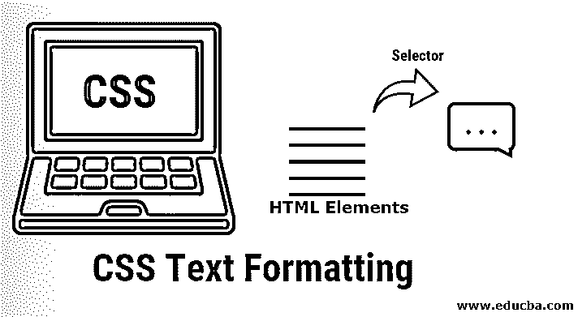


## CSS 文本格式简介

在以前，您必须使用旧版本的 CSS 来表示文本。您可以使用<font>标签来更改内容的阴影和字体，但是，利用预先特征化的文本尺寸阻碍了测量。在 HTML 标签的[帮助下，各种影响如强度和穿透在基本结构中是可以想象的。目前，用户可以使用各种 CSS 文本格式属性来以自己的方式排列网页上的文本。](https://www.educba.com/what-is-html/)</font>

在这一章中，你将会看到许多 CSS 文本格式属性。CSS 文本格式化属性被用来设计文本、样式化文本、描述几种格式化样式等。这些属性为您提供了字符、空格、单词、段落等等的可视化表示。

<small>网页开发、编程语言、软件测试&其他</small>

### CSS 文本格式属性列表

下面是 CSS 文本格式属性的列表。

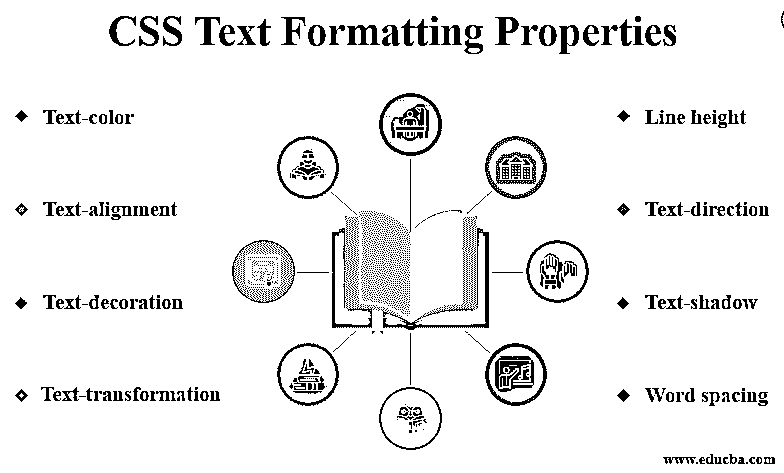


CSS 中文本格式化方式的细节:-

#### 1)文本颜色

这个属性可以用来改变文本的颜色。它可以通过使用颜色属性来定义。

**示例**:文字颜色的说明

**代码:**

```
<!DOCTYPE html>
<html>
<head>
<title>CSS Text Color Property</title>
</head>
<body>
<p style="color: crimson;">Hello world….</p>
<p style="color: royalblue;">Welcomw to EDUCBA…</p>
</body>
</html>
```

**输出:**

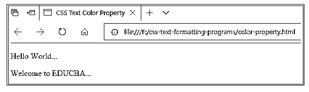


#### 2)文本对齐

这个属性可以用来改变文本的水平方向。可以通过使用左对齐、右对齐、居中、两端对齐属性来定义。

**示例**:文本对齐示意图

**代码:**

```
<! DOCTYPE html>
<html>
<head>
<title>Text Alignment Property</title>
</head>
<body>
<p style="text-align:left;">Hello World...</p>
<p style="text-align:center;">Welcome to EDUCBA...</p>
<p style="text-align:right;">Educational Consultant...</p>
</body>
</html>
```

**输出:**


#### 3)文字装饰

这个属性可以用来修饰文本。它可以通过使用下划线、上划线、删除线属性来定义。

**示例**:文字装饰的图示

**代码:**

```
<!DOCTYPE html>
<html>
<head>
<title>Text DecorationProperty</title>
</head>
<body>
<p style="text-decoration:line-through;">Hello World...</p>
<p style="text-decoration:underline;">Welcome to EDUCBA...</p>
<p style="text-decoration:overline;">Educational Consultant...</p>
</body>
</html>
```

**输出:**

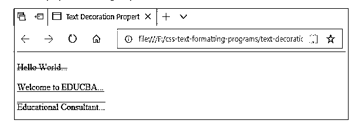


#### 4)文本转换

这个属性可以用来改变文本的大小写。它可以通过使用大写、大写、小写属性来定义。

**示例**:文本转换的说明

**代码:**

```
<!DOCTYPE html>
<html>
<head>
<title>Text Transformation Property</title>
</head>
<body>
<p style="text-transform: capitalize;">hello world...</p>
<p style="text-transform: uppercase;">Welcome to educba...</p>
<p style="text-transform: lowercase;">Educational Consultant...</p>
</body>
</html>
```

**输出:**

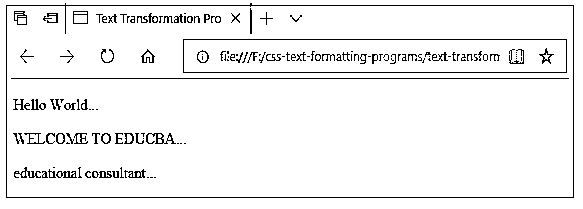


#### 5)文本缩进

该属性可用于缩进文本的第一行。可以用 px，cm，pt 属性来定义。

**示例**:文本缩进的图示

**代码:**

```
<!DOCTYPE html>
<html>
<head>
<title>Text Indentation Property</title>
</head>
<body>
<p style="text-indent:20px;">Hello World...</p>
<p style="text-indent:5cm;">Welcome to Educba...</p>
<p style="text-indent:30pt;">Educational Consultant...</p>
</body>
</html>
```

**输出:**

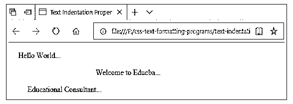


#### 6)单词间距

这个属性可以用来在单词之间留出空间。它可以通过使用单词间距属性来定义。

**例**:字间距图解

**代码:**

```
<!DOCTYPE html>
<html>
<head>
<title>Word Spacing Property</title>
</head>
<body>
<p style="word-spacing:5px;">Hello World...</p>
<p style="word-spacing:10px;">Welcome to Educba...</p>
<p style="word-spacing:20px;">Educational Consultant...</p>
</body>
</html>
```

**输出:**

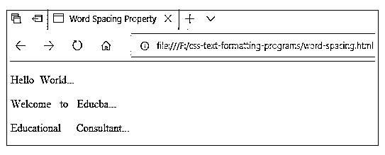


#### 7)字母间距

该属性可用于在字符之间留出空间。它可以通过使用字母间距属性来定义。

**示例**:字母间距示意图

**代码:**

```
<!DOCTYPE html>
<html>
<head>
<title>Letter Spacing Property</title>
</head>
<body>
<p style="letter-spacing:5px;">Hello World...</p>
<p style="letter-spacing:10px;">Welcome to Educba...</p>
<p style="letter-spacing:15px;">Educational Consultant...</p>
</body>
</html>
```

**输出:**

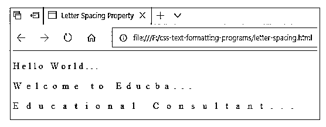


#### 8)行高

该属性可用于在行间留出空间。可以使用行高属性来定义。

**示例**:行高图解

**代码:**

```
<!DOCTYPE html>
<html>
<head>
<title>Line Height Property</title>
<style>
h3
{
line-height:2.5;
}
h4
{
line-height:150%;
}
</style>
</head>
<body>
<h3>
EDUCBA (Corporate Bridge Consultancy Pvt Ltd) is a  <br> leading global provider of skill based education
</h3>
<h4>
At eduCBA, it is a matter of pride to us to make job oriented<br> hands on courses available to anyone, anytime and anywhere.
</h4>
</body>
</html>
```

**输出:**

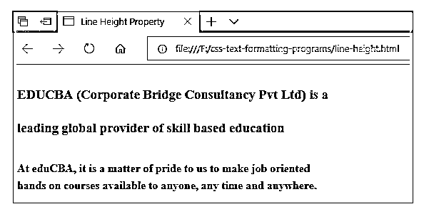


#### **9)文本方向**

这个属性可以用来改变文本的方向。它可以通过使用 rtl 属性来定义。它从右向左设置方向。

**示例**:文字方向的图示

**代码:**

```
<html>
<head>
<title>Text Direction Property</title>
</head>
<body>
<p style = "direction:rtl;">
Hello World...Welcome to Educba...
</p>
</body>
</html>
```

**输出:**

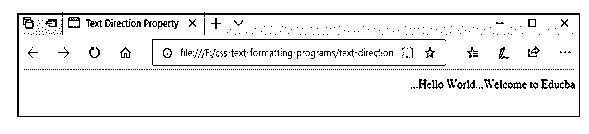


#### 10)文本-阴影

这个属性可以用来给文本添加阴影。它可以通过使用文本阴影属性来定义。它使用左位置、顶部位置、模糊大小、[颜色名称](https://www.educba.com/color-name-in-html/)等组件。

**示例**:文字阴影的图示

**代码:**

```
<!DOCTYPE html>
<html>
<head>
<title>Text Shadow Property</title>
<style>
h3
{
text-shadow:3px 3px 2px lightblue;
}
h4
{
text-shadow:3px 3px 2px plum;
}
</style>
</head>
<body>
<h3>
Hello World...Welcome to EDUCBA...
</h3>
<h4>
EDUCBA (Corporate Bridge Consultancy Pvt Ltd) is a skill based education
</h4>
</body>
</html>
```

**输出:**

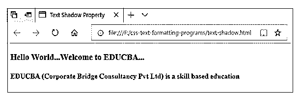


#### 11) Ems

这是一个可扩展的规模单位。这个 em 属性可以用来根据周围的文本定义文本的大小。文本的默认大小是 1em，等于 12pt。2em 等于 24pt 等等。

**示例**:EMS 属性图解

**代码:**

```
<!DOCTYPE html>
<html>
<head>
<title>Ems Property</title>
<style>
h3
{
font-size: 0.8em;
}
h4
{
font-size: 1.2em;
}
</style>
</head>
<body>
<h3>
Hello World...Welcome to EDUCBA...
</h3>
<h4>
EDUCBA (Corporate Bridge Consultancy Pvt Ltd) is a skill based education
</h4>
</body>
</html>
```

**输出:**

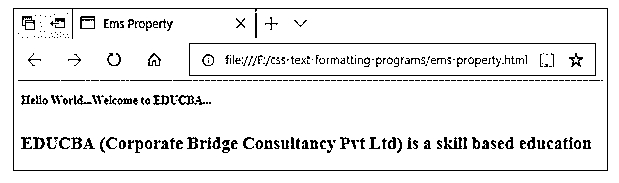


#### 12)字体系列

此属性用于为所选文本提供各种类型的字体系列名称。例如，Helvetica、Calibri、Arial、Sans-serif、Times、Courier New 等。

**示例**:字体系列属性的图示

**代码:**

```
<!DOCTYPE html>
<html>
<head>
<title>Font Family Property</title>
</head>
<body>
<p style="font-family:cursive;font-size:10pt;">Hello World...</p>
<p style="font-family:sans-serif;font-size:15pt;">Welcome to Educba...</p>
<p style="font-family:Georgia, serif;font-size:20pt;">Educational Consultant...</p>
</body>
</html>
```

**输出:**

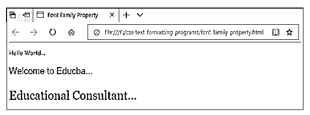


### 结论

到目前为止，我们已经研究了 CSS 中的文本格式化方法。您可以看到文本以不同类型的文本格式属性呈现。这些属性是 CSS 在网页上显示文本的非常重要的方面，这样用户或读者可以通过在网站上看到你的文本而被吸引。在网页上非常容易和有效地利用这些文本属性。

### 推荐文章

这是一个 CSS 文本格式的指南。在这里，我们已经详细讨论了 CSS 文本格式属性的介绍和列表，以及示例代码和正确的输出。您也可以浏览我们推荐的其他文章，了解更多信息——

1.  [什么是 CSS？](https://www.educba.com/what-is-css/)
2.  [CSS 命令](https://www.educba.com/css-commands/)
3.  CSS 箭
4.  [CSS 三角形生成器](https://www.educba.com/css-triangle-generator/)


