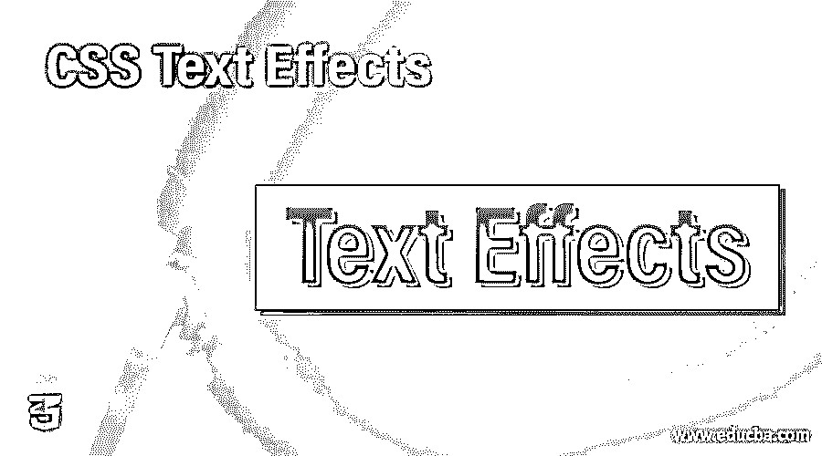
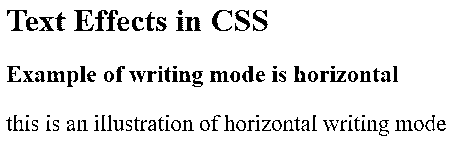
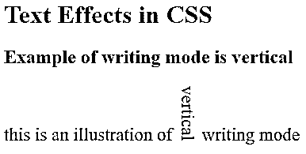
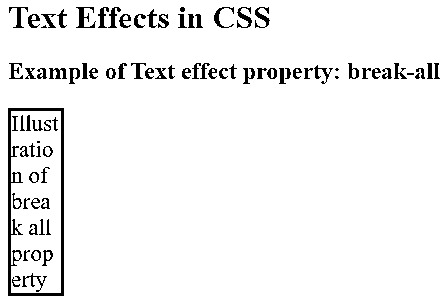
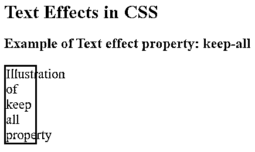
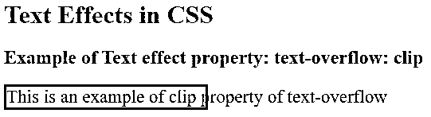
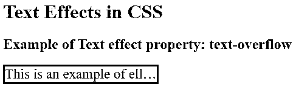
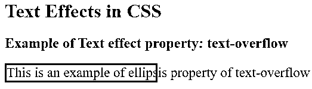
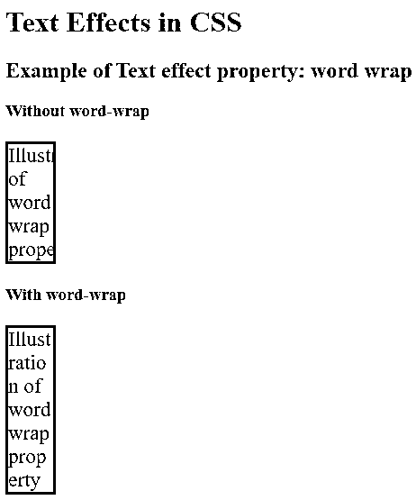

# CSS 文本效果

> 原文：<https://www.educba.com/css-text-effects/>




## CSS 文本效果介绍

CSS 文本效果的许多属性有助于在使用 CSS 的 HTML 页面中的句子中提供各种样式。因此，通过使用 CSS 的各种文本效果，单词将获得各种模式、方向和设计。利用其参数的各种值来获得更好的网页设计，该网页设计符合网页开发中所需的设计。在本文中，我们将通过许多示例演示网页设计者通过使用 CSS text effects 属性可以应用于 HTML 页面文本的技术。

### CSS 文本效果的示例

下面是一些例子:

<small>网页开发、编程语言、软件测试&其他</small>

#### 示例# 1–写入模式属性

在第一个示例中，我们将演示写入模式属性。这指定了文本的方向，无论是垂直还是水平。在本例中，我们演示了水平书写模式，这是一种从左到右的水平布局。

**代码:**

```
<!DOCTYPE html>
<html>
<head>
<style>
p.wMH {
writing-mode: horizontal-tb;
font-size: 23px;
}
</style>
</head>
<body style = "text-align: auto;">
<h1 style = "color:blue">
Text Effects in CSS
</h1>
<h2>Example of writing mode is horizontal</h2>
<p class="wMH">
this is an illustration of horizontal writing mode
</p>
</body>
</html>
```

**输出:**




#### 示例 2–垂直书写模式

这里，我们将演示另一个写模式属性。这指定了文本的方向，无论是垂直还是水平。在本例中，我们演示了垂直书写模式。垂直书写模式很少使用，但在任何类似这样的情况下仍然是一个非常方便的工具。

**代码:**

```
<!DOCTYPE html>
<html>
<head>
<style>
p {
font-size: 23px;
}
span.wMH {
writing-mode: vertical-rl;
font-size: 23px;
}
</style>
</head>
<body style = "text-align: auto;">
<h1 style = "color:blue">
Text Effects in CSS
</h1>
<h2>Example of writing mode is vertical</h2>
<p>
this is an illustration of vertical  writing mode
</p>
</body>
</html>
```

**输出:**




#### 示例 3–工作中断属性

在本例中，我们将向您演示工作中断属性。该属性将指示是否在句子中断开单词以使其保持在边界区域内。在这种情况下，我们已经显示了“break all”属性，其中单词被分成多个部分以包含在边界线内。将单词保持在边界内是有用的。

**代码:**

```
<!DOCTYPE html>
<html>
<head>
<style>
p.brkAll {
width: 50px;
border: 3px solid black;
word-break: break-all;
text-align: left;
font-size: 23px;
}
</style>
</head>
<h1 style = "color:blue">
Text Effects in CSS
</h1>
<body style= "text-align: auto;">
<h2>Example of Text effect property: break-all</h2>
<p class="brkAll">
Illustration of break all property
</p>
</body>
</html>
```

**输出:**




#### 例 4–保留所有工间休息财产

在这种情况下，我们将展示工作中断属性的另一个演示。此属性将指示是否将单词作为句子拆分，以使其保持在边界区域内。在这种情况下，我们显示了“保留所有”属性，其中单词飞出了边界线。

**代码:**

```
<!DOCTYPE html>
<html>
<head>
<style>
p.keepAll {
width: 50px;
border: 3px solid black;
word-break: keep-all;
text-align: left;
font-size: 23px;
}
</style>
</head>
<h1 style = "color:blue">
Text Effects in CSS
</h1>
<body style= "text-align: auto;">
<h2>Example of Text effect property: keep-all</h2>
<p class="keepAll">
Illustration of keep all property
</p>
</body>
</html>
```

**输出:**




#### 示例 5–剪辑文本溢出属性

在这个例子中，我们将向您演示文本溢出属性。该属性将指定单词是否在有限的区域内。在这种情况下，我们已经显示了“clip”属性，其中单词被剪切到其边界线之外。如果我们将鼠标悬停在该区域，您将看到整个文本，因为代码是这样编写的，以便于查看。

**代码:**

```
<!DOCTYPE html>
<html>
<head>
<style>
div.txtOf {
white-space: nowrap;
width: 250px;
overflow: hidden;
border: 3px solid black;
font-size: 23px;
text-overflow: clip;
}
div.txtOf:hover {
overflow: visible;
}
</style>
</head>
<body style = "text-align: auto">
<h1 style = "color:blue">
Text Effects in CSS
</h1>
<h2>
Example of Text effect property: text-overflow: clip
</h2>
<div class="txtOf">
This is an example of clip property of text-overflow
</div>
</body>
</html>
```

**输出:**





#### 示例 6–省略号文本溢出属性

在这个例子中，我们将展示文本溢出属性的另一个演示。该属性将指定单词是否在有限的区域内。在这种情况下，我们已经显示了“省略号”属性，其中省略号将出现在 cut 之前，以指示该句子有一个延续。如果将鼠标悬停在文本上，我们可以看到整个文本。

**代码:**

```
<!DOCTYPE html>
<html>
<head>
<style>
div.txtOf {
white-space: nowrap;
width: 250px;
overflow: hidden;
border: 3px solid black;
font-size: 23px;
text-overflow: ellipsis;
}
div.txtOf:hover {
overflow: visible;
}
</style>
</head>
<body style = "text-align: auto">
<h1 style = "color:blue">
Text Effects in CSS
</h1>
<h2>
Example of Text effect property: text-overflow
</h2>
<div class="txtOf">
This is an example of ellipsis property of text-overflow
</div>
</body>
</html>
```

**输出:**







#### 示例 7–自动换行属性

在本例中，我们将向您演示自动换行属性。自动换行会将整个文本限制在其区域内，以防止溢出。如果您看到了输出，您就可以理解如果我们不在它上面放置自动换行，单词会如何溢出。

**代码:**

```
<!DOCTYPE html>
<html>
<head>
<style>
p {
width: 50px;
overflow: hidden;
border: 3px solid black;
text-align: left;
font-size: 23px;
}
p.Wrp {
word-wrap: break-word;
}
</style>
</head>
<body style = "text-align: auto;">
<h1 style = "color:blue">
Text Effects in CSS
</h1>
<h2>
Example of Text effect property: word wrap
</h2>
<h3>Without word-wrap</h3>
<p>
Illustration of word wrap property
</p>
<h3>With word-wrap</h3>
<p class="Wrp">
Illustration of word wrap property
</p>
</body>
</html>
```

**输出:**




### 结论

“CSS 文本效果”的学习到此结束。在本文中，我们提供了几个例子，说明在超文本标记语言页面的 CSS 代码中使用 text effects 属性值的方法。这篇文章将会对参与前端开发和用 CSS 设计超文本标记语言的网页设计者很有帮助。

### 推荐文章

这是一个 CSS 文本效果的指南。在这里，我们还讨论了 CSS 文本效果的定义，以及不同的例子和代码实现。您也可以看看以下文章，了解更多信息–

1.  [CSS 伪类](https://www.educba.com/css-pseudo-classes/)
2.  [CSS 伪元素](https://www.educba.com/css-pseudo-elements/)
3.  [CSS 矩阵](https://www.educba.com/css-matrix/)
4.  [CSS 格式化程序](https://www.educba.com/css-formatter/)


