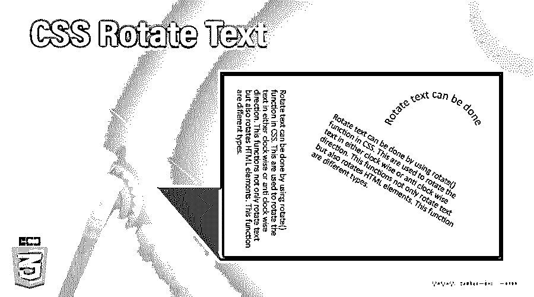
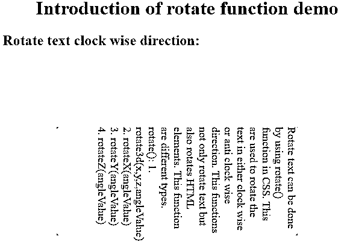
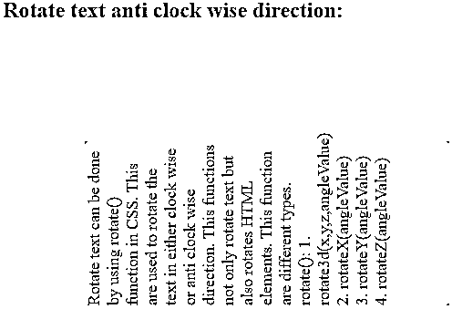
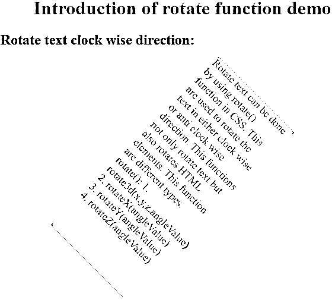
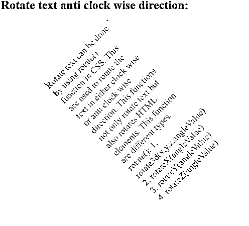
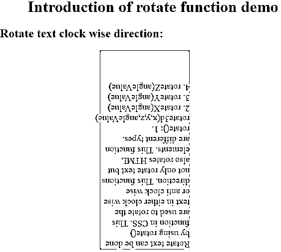
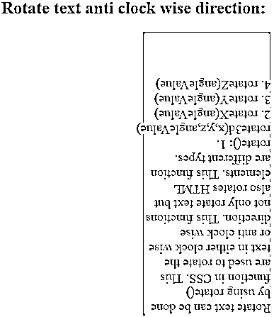

# CSS 旋转文本

> 原文：<https://www.educba.com/css-rotate-text/>




## CSS 旋转文本简介

使用 CSS 中的 Rotate()函数可以旋转文本。这用于顺时针或逆时针旋转文本。这个函数不仅旋转文本，还旋转 HTML 元素。这些函数是不同类型的。

```
rotate():
```

*   旋转 3d(x，y，z，角度值)
*   旋转角度值
*   rotateY(angleValue)
*   rotateZ(角度值)

**实时示例:**一些情况文本必须在精确的垂直方向上呈现，一些情况文本必须以某个角度呈现。这可以通过使用旋转函数来实现。

<small>网页开发、编程语言、软件测试&其他</small>

### CSS 中如何旋转文本？

使用 Rotate()函数可以旋转文本。每个功能都有下面给出的子功能

#### 1.旋转 3d(x，y，z，角度值)

它会将文本在 x、y 和 z 方向旋转一定角度。

**语法:**

```
text
{
transform: rotate3d(x,y,z,angleValue);
}
```

#### 2.旋转角度值

它会将文本在 x 方向旋转一定角度。

**语法:**

```
text
{
transform: rotateX(angleValue);
}
```

#### 3\. rotateY(angleValue)

它会将文本在 y 方向旋转一个角度。

**语法:**

```
text
{
transform: rotateY(angleValue);
}
```

#### 4.rotateZ(角度值)

它会将文本在 z 方向旋转一定角度。

**语法:**

```
text
{
transform: rotateZ(angleValue);
}
```

### 例子

下面是提到的例子:

#### 1.Rotate()函数

**代码:**

```
<!DOCTYPE html>
<html>
<head>
<style>
.rotate1 {
width: 180px;
height: 400px;
margin: 0 0 0 200px;
font-size: 18px;
color: brown;
background-color: lightgray;
transform: rotate(90deg);
}
.rotate2
{
width: 180px;
height: 400px;
font-size: 18px;
margin: 0 0 0 200px;
color: brown;
background-color: lightgray;
transform: rotate(-90deg);
}
h2
{
color: blue;
}
h1
{
color: green;
text-align: center;
}
</style>
</head>
<body>
<h1>Introduction of rotate function demo</h1>
<h2>Rotate text clock wise direction:</h2>
<div class="rotate1">Rotate text can be done by using rotate() function in CSS. This are used to rotate the text in either clock wise or anti clock wise direction. This functions not only rotate text but also rotates HTML elements. This function are different types.
rotate():
rotate3d(x,y,z,angleValue)
rotateX(angleValue)
rotateY(angleValue)
rotateZ(angleValue)
</div>
<br>
<h2>Rotate text anti clock wise direction:</h2>
<div class="rotate2">Rotate text can be done by using rotate() function in CSS. This are used to rotate the text in either clock wise or anti clock wise direction. This functions not only rotate text but also rotates HTML elements. This function are different types.
rotate():
rotate3d(x,y,z,angleValue)
rotateX(angleValue)
rotateY(angleValue)
rotateZ(angleValue)
</div>
<br>
</body>
</html>
```

**输出:**







#### 2.RotateZ()函数

**代码:**

```
<!DOCTYPE html>
<html>
<head>
<style>
.rotate1 {
width: 180px;
height: 400px;
margin: 0 0 0 200px;
font-size: 18px;
color: red;
background-color: lightblue;
transform: rotateZ(45deg);
}
.rotate2
{
width: 180px;
height: 400px;
font-size: 18px;
margin: 0 0 0 200px;
color: red;
background-color: lightblue;
transform: rotateZ(-45deg);
}
h2
{
color: orange;
}
h1
{
color: blue;
text-align: center;
}
</style>
</head>
<body>
<h1>Introduction of rotate function demo</h1>
<h2>Rotate text clock wise direction:</h2>
<div class="rotate1">Rotate text can be done by using rotate() function in CSS. This are used to rotate the text in either clock wise or anti clock wise direction. This functions not only rotate text but also rotates HTML elements. This function are different types.
rotate():
rotate3d(x,y,z,angleValue)
rotateX(angleValue)
rotateY(angleValue)
rotateZ(angleValue)
</div>
<br>
<h2>Rotate text anti clock wise direction:</h2>
<div class="rotate2">Rotate text can be done by using rotate() function in CSS. This are used to rotate the text in either clock wise or anti clock wise direction. This functions not only rotate text but also rotates HTML elements. This function are different types.
rotate():
rotate3d(x,y,z,angleValue)
rotateX(angleValue)
rotateY(angleValue)
rotateZ(angleValue)
</div>
<br>
</body>
</html>
```

**输出:**







#### 3.RotateZ()函数

**代码:**

```
<!DOCTYPE html>
<html>
<head>
<style>
.rotate1 {
width: 180px;
height: 400px;
margin: 0 0 0 200px;
font-size: 18px;
color: navy;
background-color: lightgreen;
transform: rotateZ(180deg);
}
.rotate2
{
width: 180px;
height: 400px;
font-size: 18px;
margin: 0 0 0 200px;
color: navy;
background-color: lightgreen;
transform: rotateZ(-180deg);
}
h2
{
color: red;
}
h1
{
color: green;
text-align: center;
}
</style>
</head>
<body>
<h1>Introduction of rotate function demo</h1>
<h2>Rotate text clock wise direction:</h2>
<div class="rotate1">Rotate text can be done by using rotate() function in CSS. This are used to rotate the text in either clock wise or anti clock wise direction. This functions not only rotate text but also rotates HTML elements. This function are different types.
rotate():
rotate3d(x,y,z,angleValue)
rotateX(angleValue)
rotateY(angleValue)
rotateZ(angleValue)
</div>
<br>
<h2>Rotate text anti clock wise direction:</h2>
<div class="rotate2">Rotate text can be done by using rotate() function in CSS. This are used to rotate the text in either clock wise or anti clock wise direction. This functions not only rotate text but also rotates HTML elements. This function are different types.
rotate():
rotate3d(x,y,z,angleValue)
rotateX(angleValue)
rotateY(angleValue)
rotateZ(angleValue)
</div>
<br>
</body>
</html>
```

**输出:**







### 结论

使用 Rotate()函数可以旋转文本。我们可以顺时针和逆时针方向旋转文本。rotate 函数也可以旋转 HTML 元素。

### 推荐文章

这是一个 CSS 旋转文本的指南。在这里，我们讨论一个 CSS 旋转测试的介绍，如何旋转文本与编程实例，以便更好地理解。您也可以浏览我们的其他相关文章，了解更多信息——

1.  [CSS 填充](https://www.educba.com/css-padding/)
2.  [CSS 位置](https://www.educba.com/css-position/)
3.  [CSS Clearfix](https://www.educba.com/css-clearfix/)
4.  [CSS 的优势](https://www.educba.com/advantages-of-css/?source=leftnav)


