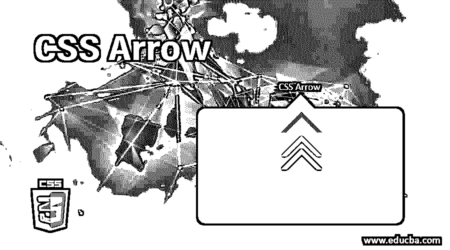
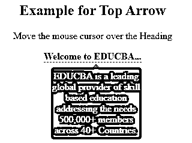
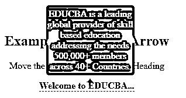
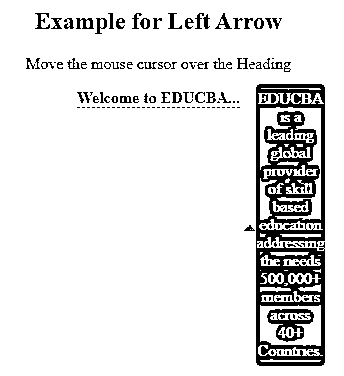
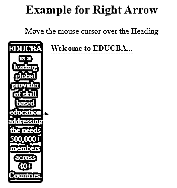
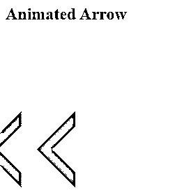

# CSS 箭头

> 原文：<https://www.educba.com/css-arrow/>




## CSS 箭头概述

使用 CSS 创建箭头非常简单。CSS 箭头可用于创建工具提示集。它使工具提示成为一个讲话的气泡。箭头可以指定如何在网站或应用程序上操作它们，方法是执行特定的操作，如“转到下一页”、“顶部或底部、左侧或右侧”以及其他一些操作。使用 CSS 伪元素和边框，将很容易构建各种风格的箭头，在桌面和移动上都很棒。

CSS 箭头可以以下列方式使用:

<small>网页开发、编程语言、软件测试&其他</small>

*   顶部箭头
*   底部箭头
*   向左箭头
*   向右箭头
*   动画箭头

### CSS 箭头的类型

下面是 CSS 中的 5 种箭头，解释如下:

#### 1.顶部箭头

如果您将鼠标光标放在元素上，顶部箭头可用于在工具提示顶部应用类似箭头的形状。工具提示将显示在元素的底部。

**代码:**

```
<!DOCTYPE html>
<html>
<head>
<title>Top Arrow</title>
</head>
<style>
.tooltip {
position: relative;
display: inline-block;
border-bottom: 1px dashed grey;
}
.tooltip .tltp_text {
visibility: hidden;
background-color: brown;
color: #fff;
border-radius: 5px;
padding: 6px 0;
position: absolute;
top: 150%;
left: 50%;
margin-left: -70px;
}
.tooltip .tltp_text::after {
content: "";
position: absolute;
bottom: 100%;
left: 50%;
margin-left: -6px;
border-width: 6px;
border-style: solid;
border-color: transparent transparent grey transparent;
}
.tooltip:hover .tltp_text {
visibility: visible;
}
</style>
<body style="text-align:center;">
<h2>Example for Top Arrow</h2>
<p>Move the mouse cursor over the Heading</p>
<div class="tooltip"><strong>Welcome to EDUCBA...</strong>
EDUCBA is a leading global provider of skill based education addressing the needs 500,000+ members across 40+ Countries.
</div>
</body>
</html>
```

**输出:**

*   将上述代码保存在 [HTML 页面](https://www.educba.com/what-is-html/)中，根据自己的选择命名。
*   在浏览器中打开该文件，它将显示如下图所示的输出。




#### 2.底部箭头

如果将鼠标光标放在元素上，底部箭头可用于在工具提示底部应用类似箭头的形状。工具提示将显示在元素的顶部。

**代码:**

```
<!DOCTYPE html>
<html>
<head>
<title>Bottom Arrow</title>
</head>
<style>
.tooltip {
position: relative;
display: inline-block;
border-bottom: 1px dashed grey;
}
.tooltip .tltp_text {
visibility: hidden;
background-color: brown;
color: #fff;
border-radius: 5px;
padding: 6px 0;
position: absolute;
bottom: 150%;
left: 50%;
margin-left: -70px;
}
.tooltip .tltp_text::after {
content: "";
position: absolute;
top: 100%;
left: 50%;
margin-left: -6px;
border-width: 6px;
border-style: solid;
border-color: transparent transparent grey transparent;
}
.tooltip:hover .tltp_text {
visibility: visible;
}
</style>
<body style="text-align:center;"><br><br>
<h2>Example for Bottom Arrow</h2>
<p>Move the mouse cursor over the Heading</p>
<div class="tooltip"><strong>Welcome to EDUCBA...</strong>
EDUCBA is a leading global provider of skill based education addressing the needs 500,000+ members across 40+ Countries.
</div>
</body>
</html>
```

**输出:**




#### 3.向左箭头

如果您将鼠标光标放在元素上，左箭头可用于在工具提示的左侧应用类似箭头的形状。工具提示将显示在元素的右侧。

**代码:**

```
<!DOCTYPE html>
<html>
<head>
<title>Left Arrow</title>
</head>
<style>
.tooltip {
position: relative;
display: inline-block;
border-bottom: 1px dashed grey;
}
.tooltip .tltp_text {
visibility: hidden;
background-color: brown;
color: #fff;
border-radius: 5px;
padding: 6px 0;
position: absolute;
top: -5px;
left: 110%;
}
.tooltip .tltp_text::after {
content: "";
position: absolute;
top: 50%;
right: 100%;
margin-top: -6px;
border-width: 6px;
border-style: solid;
border-color: transparent transparent grey transparent;
}
.tooltip:hover .tltp_text {
visibility: visible;
}
</style>
<body style="text-align:center;"><br><br>
<h2>Example for Left Arrow</h2>
<p>Move the mouse cursor over the Heading</p>
<div class="tooltip"><strong>Welcome to EDUCBA...</strong>
EDUCBA is a leading global provider of skill based education addressing the needs 500,000+ members across 40+ Countries.
</div>
</body>
</html>
```

**输出:**




#### 4.向右箭头

如果您将鼠标光标放在元素上，右箭头可用于在工具提示的右侧应用类似箭头的形状。工具提示将显示在元素的左侧。

**代码:**

```
<!DOCTYPE html>
<html>
<head>
<title>Right Arrow</title>
</head>
<style>
.tooltip {
position: relative;
display: inline-block;
border-bottom: 1px dashed grey;
}
.tooltip .tltp_text {
visibility: hidden;
background-color: brown;
color: #fff;
border-radius: 5px;
padding: 6px 0;
position: absolute;
top: -5px;
right: 110%;
}
.tooltip .tltp_text::after {
content: "";
position: absolute;
top: 50%;
left: 100%;
margin-top: -6px;
border-width: 6px;
border-style: solid;
border-color: transparent transparent grey transparent;
}
.tooltip:hover .tltp_text {
visibility: visible;
}
</style>
<body style="text-align:center;"><br><br>
<h2>Example for Right Arrow</h2>
<p>Move the mouse cursor over the Heading</p>
<div class="tooltip"><strong>Welcome to EDUCBA...</strong>
EDUCBA is a leading global provider of skill based education addressing the needs 500,000+ members across 40+ Countries.
</div>
</body>
</html>
```

**输出:**




#### 5.动画箭头

**代码:**

```
<!DOCTYPE html>
<html>
<head>
<title>Animated Arrow</title>
</head>
<style>
#animation_arrow {
width: 75vh;
height: 75vh;
display: flex;
align-items: center;
}
.myarrow {
width: 6vw;
height: 6vw;
border: 2vw solid;
border-color: grey transparent transparent grey;
transform: rotate(-45deg);
}
.sliding_arrow {
position: absolute;
-webkit-animation: slide 3s linear infinite;
animation: slide 3s linear infinite;
}
.animation1 {
-webkit-animation-delay: 1s;
animation-delay: 1s;
}
.animation2 {
-webkit-animation-delay: 2s;
animation-delay: 2s;
}
.animation3 {
-webkit-animation-delay: 3s;
animation-delay: 3s;
}
@-webkit-keyframes slide {
0% { opacity:0; transform: translateX(15vw); }
20% { opacity:1; transform: translateX(9vw); }
80% { opacity:1; transform: translateX(-9vw); }
100% { opacity:0; transform: translateX(-15vw); }
}
@keyframes slide {
0% { opacity:0; transform: translateX(15vw); }
20% { opacity:1; transform: translateX(9vw); }
80% { opacity:1; transform: translateX(-9vw); }
100% { opacity:0; transform: translateX(-15vw); }
}
</style>
<body style="text-align:left;">
<h2>Animated Arrow</h2>
<div id="animation_arrow">
<div class="sliding_arrow">
<div class="myarrow"></div>
</div>
<div class="sliding_arrow animation1">
<div class="myarrow"></div>
</div>
<div class="sliding_arrow animation2">
<div class="myarrow"></div>
</div>
<div class="sliding_arrow animation3">
<div class="myarrow"></div>
</div>
</div>
</body>
</html>
```

**输出:**




### 结论–CSS 箭头

到目前为止，我们已经研究了各种 CSS 箭头，它们可以很容易地放入网站或应用程序中。通过使用 CSS 伪元素和边框，我们可以很容易地创建在桌面和手机上都很棒的箭头。试着用上面的代码片段创作，你会对这些箭头有更好的理解。

### 推荐文章

这是一个 CSS 箭头指南。在这里，我们讨论 CSS 箭头的概述和前 5 种类型，即顶部、底部、左侧、右侧和动画以及代码实现。您也可以阅读以下文章，了解更多信息——

1.  [CSS 表格样式属性](https://www.educba.com/css-table-styling/)
2.  [CSS 三角形生成器](https://www.educba.com/css-triangle-generator/)
3.  [CSS 位置](https://www.educba.com/css-position/)
4.  [CSS 边距颜色](https://www.educba.com/css-margin-color/)


