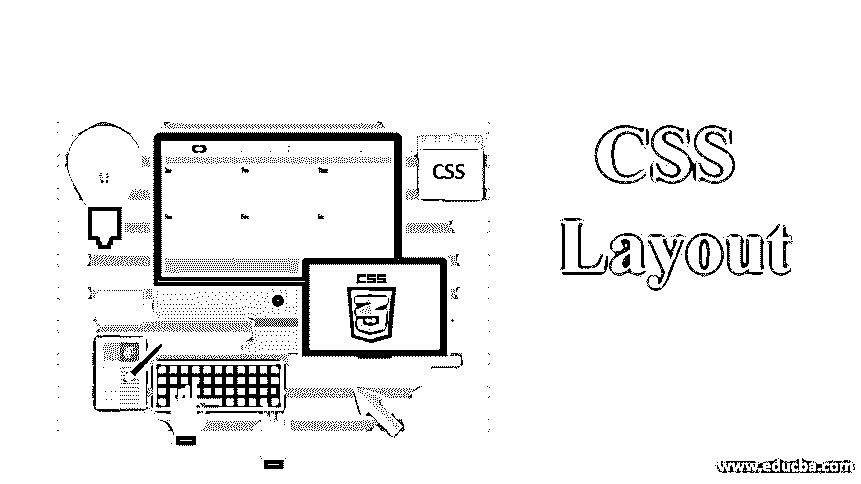
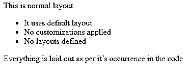
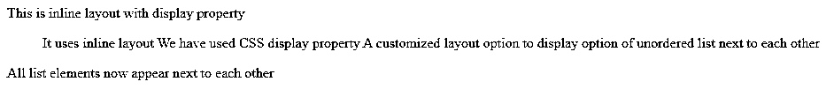
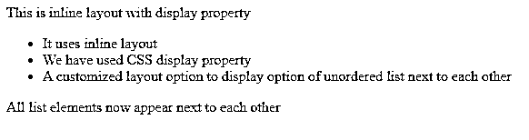
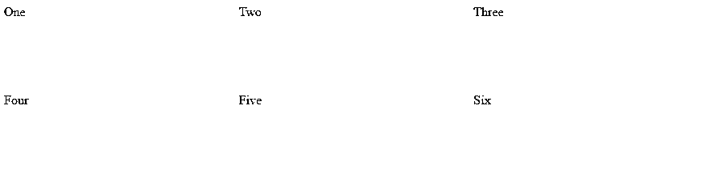
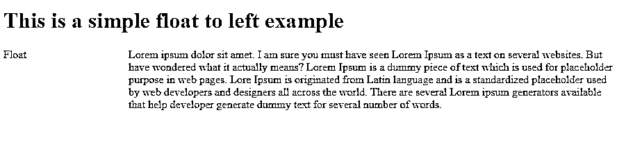

# CSS Layout

> 原文：<https://www.educba.com/css-layout/>




## CSS 布局概述

CSS 提供了几个布局选项，允许我们控制 HTML 元素的位置，与它们在普通布局中的默认位置相比较。

### 各种布局技术

下面给出了各种布局技术:

<small>网页开发、编程语言、软件测试&其他</small>

*   正常布局
*   CSS 显示属性
*   flex box(flex box)的缩写形式
*   漂浮物
*   网格布局
*   定位元素
*   表格布局
*   多栏布局

单个网页可以只包含上述选项中的一个布局，也可以集成多个布局选项并一起设计样式，以实现所需的网页结构。

#### 1.CSS 中的正常流程

正常流程是默认流程，其中元素根据它们在代码中的出现情况显示在网页上，并且没有定义或应用布局控制。

例如，让我们在 web 浏览器中查看以下代码:

**代码:**

```
<html>
<body>
<p>This is normal layout</p>
<ul>
<li>It uses default layout</li>
<li>No customizations applied</li>
<li>No layouts defined</li>
</ul>
<p>Everything is laid out as per it’s occurrence in the code</p>
</body>
</html>
```

**输出:**




从输出中可以看出，网页上的项目是根据它们在代码文件中的定义来布局的，即段落文本后面是无序列表和第 2 <sup>和第</sup>段文本。这种 HTML 元素一个接一个堆叠的流被称为阻塞式布局，与元素一个接一个呈现的内联布局不同。

#### 2.CSS 显示属性

默认情况下，CSS 的 display 属性设置为 block，其中所有元素都按顺序出现。然而，display 属性提供了很多不同的选项，比如 inline、flex、grid、inline-block 等等。block 属性可以携带的每个值都会在网页上添加不同的布局。

现在让我们看看上面的例子，所有

*   The display values of the elements are all set to inline instead of the default block. After this change, the HTML code looks like this:

**代码:**

```
<html>
<body>
<p>This is inline layout with display property</p>
<ul>
<li style = "display:inline">It uses inline layout</li>
<li  style = "display:inline">We have used CSS display property</li>
<li style = "display:inline">A customized layout option to display option of unordered list next to each other</li>
</ul>
<p>All list elements now appear next to each other</p>
</body>
</html>
```

**输出:**




#### 3.CSS 中的灵活布局

Flex 或 flexbox 布局用于使 web 设计人员能够轻松地将 HTML 元素按一个方向布局，即所有元素要么按行布局，要么按列布局。要使用 flexbox 布局，我们可以为 display 属性设置 flex 值。当应用到父元素时，它的所有直接子元素都变成 flex 项目。

**代码:**

```
<html>
<body>
<p>This is inline layout with display property</p>
<ul style="display:flex"> // setting display:flex here will align all li elements in row
<li >It uses inline layout</li>
<li >We have used CSS display property</li>
<li >A customized layout option to display option of unordered list next to each other</li>
</ul>
<p>All list elements now appear next to each other</p>
</body>
</html>
```

**输出:**




**在设置显示:** Flex 到父 div，它的所有子元素都在一行中对齐，因为默认的 flex-direction 设置为 row。

#### 4.CSS 网格布局

flexbox 布局用于一维布局，而 CSS 网格布局用于二维布局，即将元素排成行和列。我们可以使用网格布局，将 display 的值设置为 Grid。下面的示例使用了与 flex 示例类似的结构，但是使用了一个容器作为父元素和一些子元素。此外，除了使用网格，我们还使用 grid-template-rows 和 grid-template-columns CSS 属性在父元素上定义了一些行和列参数。

**举例:**

**代码:**

```
<!DOCTYPE html>
<html lang="en">
<head>
<meta charset="utf-8">
<meta name="viewport" content="width=device-width, initial-scale=1">
<style>
.wrapper {
display: grid;
grid-template-columns: 1fr 1fr 1fr;
grid-template-rows: 100px 100px;
grid-gap: 10px;
}
.wrapper > div
{
Background : rgb(207,232,220);
}
</style>
</head>
<body>
<div class="wrapper">
<div >One</div>
<div >Two</div>
<div >Three</div>
<div >Four</div>
<div >Five</div>
<div >Six</div>
</div>
</body>
</html>
```

**输出:**




### CSS 浮动选项

CSS 浮点值修改遵循正常流程的元素的行为。该元素向左或向右移动，并从正常流程中移除。它周围的内容会在浮动元素周围浮动。

CSS Float 属性有四个可能的值，如下所示:

*   **向左浮动—** 用于将元素向左浮动。
*   **向右浮动—** 用于将元素向右浮动。
*   f**float none—**它指定完全不浮动，是默认值。
*   **Float inherit —** 指定 Float 属性的值应该从父元素继承。

下面我们来详细探讨一下剩余价值浮动选项:

**代码:**

```
<!DOCTYPE html>
<html lang="en">
<head>
<meta charset="utf-8">
<meta name="viewport" content="width=device-width, initial-scale=1">
<style>
.box {
float: left;
width: 150px;
height: 150px;
margin-right: 30px;
Background : rgb(207,232,220);
}
</style>
</head>
<body>
<h1>This is a simple float to left example</h1>
<div class="box">Float</div>
<p> Lorem ipsum dolor sit amet. I am sure you must have seen Lorem Ipsum as a text on several websites. But have you wondered what it actually means? Lorem Ipsum is a dummy piece of text which is used for placeholder purpose in web pages. Lore Ipsum is originated from the Latin language and is a standardized placeholder used by web developers and designers all across the world. There are several Lorem ipsum generators available that help developer generate dummy text for several numbers of words.</p>
</body>
</html>
```

**输出:**




### 结论–CSS 布局

作为总结，我们可以得出结论，CSS 提供了足够的灵活性，可以将各种布局选项组合在一起，并实现所需的结构，特别是借助 CSS 的显示、位置和浮动属性。

### 推荐文章

这是一个 CSS 布局的指南。在这里，我们讨论了概述，CSS 浮动选项，各种布局技术以及各自的例子。您也可以阅读以下文章，了解更多信息——

1.  [CSS 字体属性](https://www.educba.com/css-font-properties/)
2.  [CSS 表格样式](https://www.educba.com/css-table-styling/)
3.  [CSS 位置](https://www.educba.com/css-position/)
4.  [CSS 文本下划线](https://www.educba.com/css-text-underline/)


