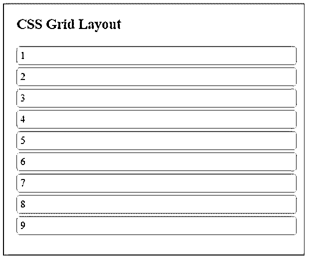
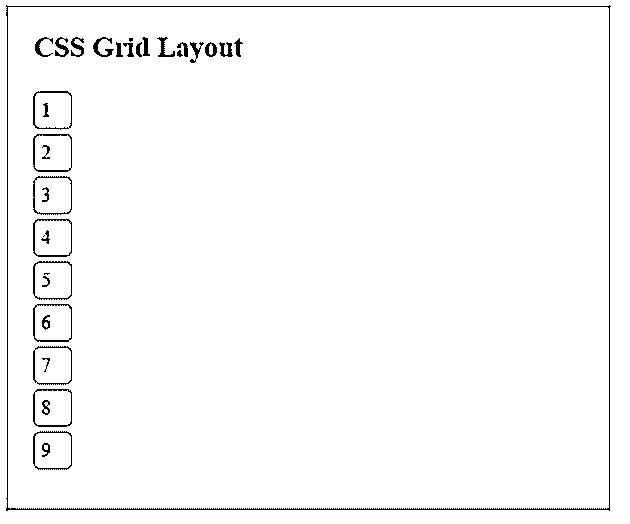
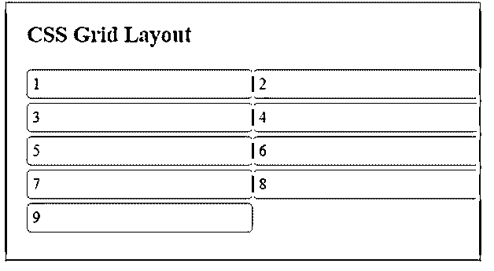
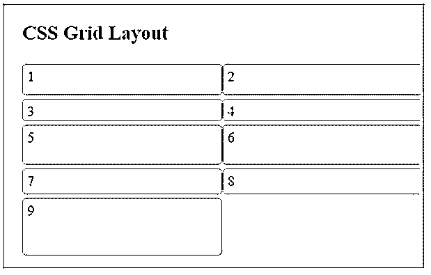
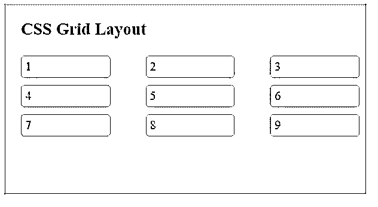
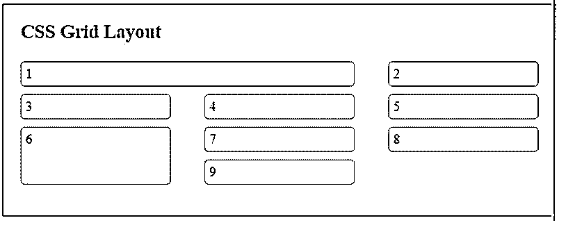

# CSS 网格布局

> 原文：<https://www.educba.com/css-grid-layout/>


## CSS 网格布局介绍

CSS Grid 是一种现代的、最强大的布局技术，可以在 CSS 中使用，它允许使用基于网格的布局系统来设计网页。与使用 flexbox 等其他设计元素相比，CSS grid 是一个二维系统。它帮助 web 开发人员根据需要排列 web 元素，并且可以根据大小、层、位置等关系将元素划分为不同的区域。在网格布局系统中做一些改变不会影响其他元素。CSS 网格布局系统不同于现有的 CSS 框架，它允许 web 开发者在设计方面有更多的自由。

### CSS 网格布局的属性

下面给出了布局属性:

<small>网页开发、编程语言、软件测试&其他</small>

#### 1.网格容器:显示属性

为了制作网格，我们定义了一个网格容器，它是一个父容器，其中的所有元素都是网格的子容器。

**代码:**

```
<!DOCTYPE html>
<html>
<head>
<title>
CSS Grid Layout
</title>
<style>
.all-display{
border : #81D4FA 2px solid;
background-color : #03a9f400;
text-align : left;
padding-left : 20px;
height :400px;
width : 95%;
}
.heading {
font-weight: bold;
font-size: 15px;
width: 95%;
}
.parent {
display: grid;
}
.child {
border: 1px solid #ccc;
margin-top: 4px;
width: 95%;
padding: 5px;
border-radius: 5px;
}
</style>
</head>
<body>
<div class = "all-display">
<div class = "heading">
<h2> CSS Grid Layout </h2>
</div>
<div class = "parent">
<div class = "child"> 1 </div>
<div class = "child"> 2 </div>
<div class = "child"> 3 </div>
<div class = "child"> 4 </div>
<div class = "child"> 5 </div>
<div class = "child"> 6 </div>
<div class = "child"> 7 </div>
<div class = "child"> 8 </div>
<div class = "child"> 9 </div>
</div>
</div>
</body>
</html>
```

**输出:**

**

** 

这里的父元素是用 display : grid 属性定义的。这将把网格设置为块级别。定义网格布局时，此属性是必需的。网格容器中的所有子元素都将被自动视为网格子元素。

显示:内嵌网格

该属性值将设置内嵌级别的网格元素。

**内嵌网格输出:**

**

** 

#### 2.网格容器:网格-模板-列

此属性会将网格布局分为基于列的。提供的值的数量将决定列的数量。

**代码:**

```
<!DOCTYPE html>
<html>
<head>
<title>
CSS Grid Layout
</title>
<style>
.all-display{
border : #81D4FA 2px solid;
background-color : #03a9f400;
text-align : left;
padding-left : 20px;
height : 260px;
width : 95%;
}
.heading {
font-weight: bold;
font-size: 15px;
width: 95%;
}
.parent {
display: grid;
grid-template-columns: auto auto;
}
.child {
border: 1px solid #ccc;
margin-top: 4px;
width: 95%;
padding: 5px;
border-radius: 5px;
}
</style>
</head>
<body>
<div class = "all-display">
<div class = "heading">
<h2> CSS Grid Layout </h2>
</div>
<div class = "parent">
<div class = "child"> 1 </div>
<div class = "child"> 2 </div>
<div class = "child"> 3 </div>
<div class = "child"> 4 </div>
<div class = "child"> 5 </div>
<div class = "child"> 6 </div>
<div class = "child"> 7 </div>
<div class = "child"> 8 </div>
<div class = "child"> 9 </div>
</div>
</div>
</body>
</html>
```

**输出:**




这里，我们将 grid-child 分成两列。

#### 3.网格容器:网格-模板-行

与列类似，该属性将网格元素划分为行。我们可以指定每个网格的大小。

**代码:**

```
<!DOCTYPE html>
<html>
<head>
<title>
CSS Grid Layout
</title>
<style>
.all-display{
border : #81D4FA 2px solid;
background-color : #03a9f400;
text-align : left;
padding-left : 20px;
height : 300px;
width : 95%;
}
.heading {
font-weight: bold;
font-size: 15px;
width: 95%;
}
.parent {
display: grid;
grid-template-columns: auto auto;
grid-template-rows: 40px 30px 50px auto 70px;
}
.child {
border: 1px solid #ccc;
margin-top: 4px;
width: 95%;
padding: 5px;
border-radius: 5px;
}
</style>
</head>
<body>
<div class = "all-display">
<div class = "heading">
<h2> CSS Grid Layout </h2>
</div>
<div class = "parent">
<div class = "child"> 1 </div>
<div class = "child"> 2 </div>
<div class = "child"> 3 </div>
<div class = "child"> 4 </div>
<div class = "child"> 5 </div>
<div class = "child"> 6 </div>
<div class = "child"> 7 </div>
<div class = "child"> 8</div>
<div class = "child"> 9 </div>
</div>
</div>
</body>
</html>
```

**输出:**




#### 4.网格容器:网格间隙

*   **网格-列-间距:**设置列间距值。
*   **网格-行-间隙:**设置行与行之间的间隙值。
*   **grid-gap:** 设置行和列之间的间隙值。

**代码:**

```
<!DOCTYPE html>
<html>
<head>
<title>
CSS Grid Layout
</title>
<style>
.all-display{
border : #81D4FA 2px solid;
background-color : #03a9f400;
text-align : left;
padding-left : 20px;
height : 250px;
width : 95%;
}
.heading {
font-weight: bold;
font-size: 15px;
width: 95%;
}
.parent {
display: grid;
grid-template-columns: auto autoauto;
grid-row-gap: 5px;
grid-column-gap: 40px;
/* grid-gap: 5px 40px;   //Same output*/
}
.child {
border: 1px solid #ccc;
margin-top: 4px;
width: 85%;
padding: 5px;
border-radius: 5px;
background-color: azure;
}
</style>
</head>
<body>
<div class = "all-display">
<div class = "heading">
<h2> CSS Grid Layout </h2>
</div>
<div class = "parent">
<div class = "child"> 1 </div>
<div class = "child"> 2 </div>
<div class = "child"> 3 </div>
<div class = "child"> 4 </div>
<div class = "child"> 5 </div>
<div class = "child"> 6 </div>
<div class = "child"> 7 </div>
<div class = "child"> 8 </div>
<div class = "child"> 9 </div>
</div>
</div>
</body>
</html>
```

**输出:**




#### 5.子网格:网格-间隙

*   **网格-列-开始:**指定网格列的起点。
*   **网格-列-结束:**指定网格列的结束点。
*   **网格-行-开始:**指定网格行的起点。
*   **网格-行-结束:**指定网格行的结束点。

**代码:**

```
<!DOCTYPE html>
<html>
<head>
<title>
CSS Grid Layout
</title>
<style>
.all-display{
border : #81D4FA 2px solid;
background-color : #03a9f400;
text-align : left;
padding-left : 20px;
padding-right: 15px;
height : 250px;
width : 95%;
}
.heading {
font-weight: bold;
font-size: 15px;
width: 95%;
}
.parent {
display: grid;
grid-template-columns: auto autoauto;
grid-row-gap: 5px;
grid-column-gap: 40px;
}
.parent> div {
border: 1px solid #ccc;
margin-top: 4px;
padding: 5px;
border-radius: 5px;
background-color: azure;
}
.child-1 {
grid-column-start: 1;
grid-column-end: 3;
}
.child-6 {
grid-row-start: 3;
grid-row-end: 5;
}
</style>
</head>
<body>
<div class = "all-display">
<div class = "heading">
<h2> CSS Grid Layout </h2>
</div>
<div class = "parent">
<div class = "child-1"> 1 </div>
<div class = "child-2"> 2 </div>
<div class = "child-3"> 3 </div>
<div class = "child-4"> 4 </div>
<div class = "child-5"> 5 </div>
<div class = "child-6"> 6 </div>
<div class = "child-7"> 7 </div>
<div class = "child-8"> 8 </div>
<div class = "child-9"> 9 </div>
</div>
</div>
</body>
</html>
```

**输出:**




这里，子-1 从第 1 列开始，到第 3 列结束，子-6 从第 3 行开始，到第 5 行结束。

### 结论

它允许我们将网页分成一个基于网格的二维变化的系统。正如我们所见，使用多种属性以不同的方式设计这些网格是可能的。

### 推荐文章

这是一个 CSS 网格布局的指南。这里我们讨论 CSS 网格布局的介绍，以及用不同方式设计网格的多种属性。您也可以看看以下文章，了解更多信息–

1.  [媒体查询 CSS](https://www.educba.com/media-query-css/)
2.  [CSS 中的径向梯度](https://www.educba.com/radial-gradient-in-css/)
3.  [CSS 滚动条](https://www.educba.com/css-scrollbar/)
4.  [CSS 动画过渡](https://www.educba.com/css-animation-transition/)


