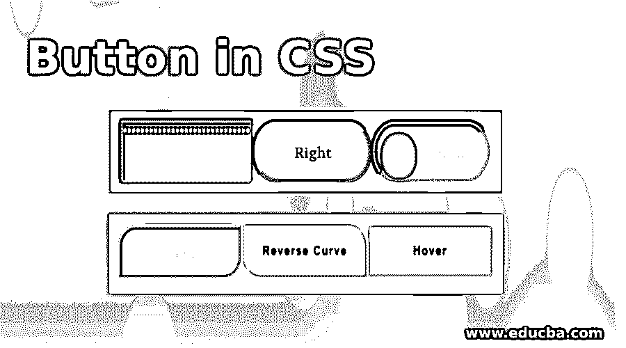
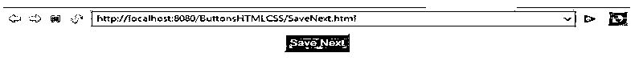
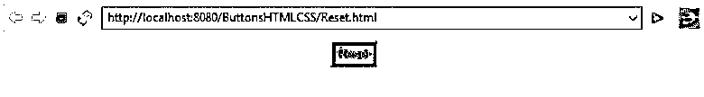
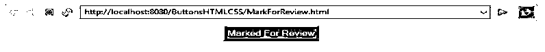
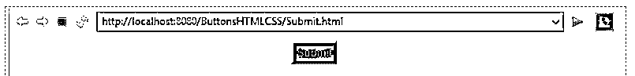
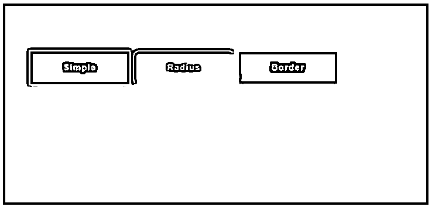
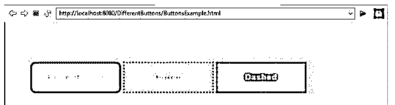
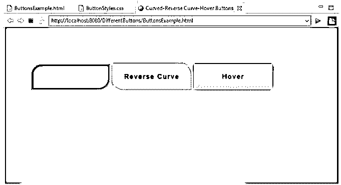
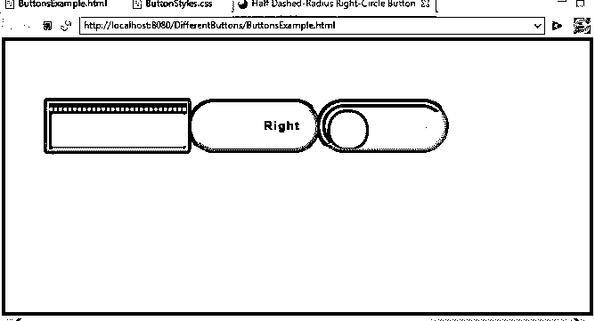
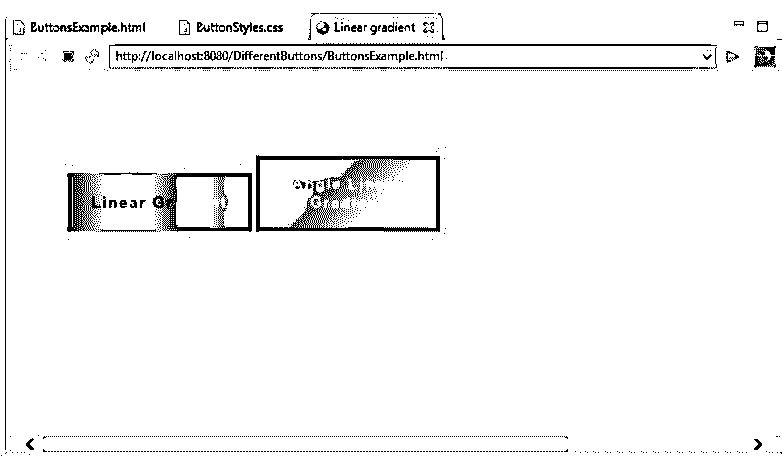

# CSS 中的按钮

> 原文：<https://www.educba.com/button-in-css/>




## CSS 中的按钮介绍

下面的文章提供了 CSS 中按钮的概要。按钮用于通过点击来执行任何操作(比如在应用程序中提交表单)。链接也像一个按钮，但是链接是用来在页面和视图之间导航(改变)的。

实时示例:如果考虑任何在线考试，每个问题都有 4 或 5 个选项。一旦我们选择了任何选项，我们必须进入下一个问题。为此，它有一个保存下一个按钮。如果我们想清除选择的响应，那么有一个重置或清除响应按钮。如果您想重温或概括问题，请使用“标记为审阅”按钮对其进行标记。最后，一旦我们完成了考试，就可以点击“提交”或“完成”按钮结束考试。

<small>网页开发、编程语言、软件测试&其他</small>

在所有这些情况下，每次每个按钮都有其自己的特定动作要执行，如“转到下一个问题”、“明确响应”、“标记为审阅”和“完成测试”。

### 为什么 CSS 会出现？

下面的例子可以说明这一点

#### 1.没有 CSS

让我们借助例子来看看

##### 例子 1:SaveNext.html

**代码:**

```
<!doctype html>
<html>
<head>
<style type="text/css">
input[type=button], input[type=submit], input[type=reset] {
border-width: 2px;
padding: 4px
font-size: 10pt;
color: yellow;
background-color: brown;
text-align: center;
}
#educba{
text-align: center;
}
</style>
<title>Save Next</title>
</head>
<body>
<div id="educba">
<input type="button" value="Save Next">
</div>
</body>
</html>
```

**输出:**




##### 例子 2:Reset.html

**代码:**

```
<!doctype html>
<html>
<head>
<style type="text/css">
input[type=button], input[type=submit], input[type=reset] {
border-width: 2px;
padding: 4px;
font-size: 10pt;
color: yellow;
background-color: brown;
text-align: center;
}
#educba {
text-align: center;
}
</style>
<title>Reset</title>
</head>
<body>
<div id="educba">
<input type="reset" value="Reset">
</div>
</body>
</html>
```

**输出:**




##### 例子 3:MarkForReview.html

**代码:**

```
<!DOCTYPE html>
<html>
<head>
<style type="text/css">
input[type=button], input[type=submit], input[type=reset] {
border-width: 2px;
padding: 4px;
font-size: 10pt;
color: yellow;
background-color: brown;
text-align: center;
}
#educba {
text-align: center;
}
</style>
<title>MarkForReview</title>
</head>
<body>
<div id="educba">
<input type="button" value="Marked For Review">
</div>
</body?
</html>
```

**输出:**




##### 例子 4:Submit.html

**代码:**

```
<!DOCTYPE html>
<html>
<style type="text/css">
input[type=button], input[type=submit], input[type=reset] {
border-width: 2px;
padding: 4px;
font-size: 10pt;
color: yellow;
background-color: brown;
text-align: center;
}
#educba {
text-align: center;
}
</style>
<title>Submit</title>
</head>
<body>
<div id="educba">
<input type="submit" value="Submit">
</div>
</body>
</html>
```

**输出:**




**以上示例演示:**

*   在上面的 4 个例子中，我们有不同的按钮保存下一步，重置，标记回顾和提交。每个按钮都有相同的样式、颜色、背景、边框和填充。
*   即使我们已经写了 4 次相同的行" style = " font-size:10pt；颜色:黄色；背景色:棕色；边框:2px 所有 4 个示例中的填充:4px”。
*   只有 4 个 html 文件，所以我们已经手动编写，但考虑到超过 1000 个这样的文件。编写这么多文件非常耗时，也很困难，而且在查看代码时也很混乱。
*   如果我们有技术在一个地方写所有共同的属性，比我们做我们的工作容易得多。
*   然后工程师们提出 CSS 缩写为 Cascade Style Sheets，名字本身表明目的是“样式化工作表”。

#### 2.使用 CSS

让我们借助例子来看看

##### 例子**# 1:**SaveNext.html

**代码:**

```
<><!doctype html>
<html>
<head&code;
<link rel="stylesheet" href="Styles.css">
<title>Save Next</title>
</head>
<body>
<div id="educba">
<input type="button" value="Save Next">
</div>
</body>
</html>
```

##### 例子 2:Reset.html

**代码:**

```
<!doctype html>
<html>
<head>
<link rel="stylesheet" href="Styles.css">
<title>Reset</title>
</head>
<body>
<div id="educba">
<input type="reset" value="Reset">
</div>
</body>
</html>
```

##### 例子 3:MarkForReview.html

**代码:**

```
<!DOCTYPE html>
<html>
<head>
<link rel="stylesheet" href="Styles.css">
<title>MarkForReview</title>
</head>
<body>
<div id="educba">
<input type="button" value="Marked For Review">
</div>
</body>
</html>
```

##### 例子 4:Submit.html

**代码:**

```
<!DOCTYPE html>
<html>
<head>
<link rel="stylesheet" href="Styles.css">
<title>Submit&lt</title>
</head>
<body>
<div id="educba">
<input type="submit" value="Submit">
</div>
</body>
```

*   **上面例子的 CSS 代码:** **Styles.css**

```
input[type=button], input[type=submit], input[type=reset] {
border-width: 2px;
padding: 4px;
font-size: 10pt;
color: yellow;
background-color: brown;
text-align: center;
}
#educba{
text-align: center;
}
```

*   最后，我们实现了我们的要求与上述 css 的共同逻辑到位。有 css 和没有 css 的输出都和上面的例子一样。

### CSS 按钮是如何工作的？

*   CSS 将通过在 html < head >标签中添加<link rel="”stylesheet”" href="”Styles.css”">**来发挥作用。**
*   按钮功能动作按照代码中所写的那样工作。这段代码将由内部 javascript 机器运行，它将所有 HTML 和 CSS 指令转换成 web 指令。

**语法:**

```
Selector{Property: Value;}
```

**举例**:

```
h1{    //h1 is selector
padding: 2px 2px 2px 2px; //padding is property
// 2px 2px 2px 2px are values to property} 
```

### CSS 中不同的属性声明

对于所有即将到来的属性声明，请考虑下面的按钮示例。

```
<html>
<head>
<title>Button</title>
</head>
<body>
<button class="button">Button</button>
</body>
</html>
```

#### 1.按钮的颜色

**背景色属性:**设置按钮的背景色。

**颜色属性:**设置文本颜色。

**举例:**

```
.button
{
background-color: green;
color: yellow;
}
```

**注意:**类选择器必须以“.”开头后面跟着选择器。即将推出所有示例。这个按钮是选择器，就像我们在上面的示例类中把它当作一个按钮一样。2.按钮填充

**Padding 属性:**设置按钮的填充意味着它将决定按钮从上、右、下、左的大小。示例:

```
.button{
padding: 10px 20px 10px 20px; //top right, bottom, left respectively
}
```

#### 3.按钮的边距

**M** **argin 属性:** S et 按钮的边距意味着它将决定按钮必须从 顶部、右侧、底部和左侧定位到哪里。

**例如:**

```
. button{
margin: 10px 20px 10px 20px; //top right, bottom, left respectively
}
```

#### 4.按按钮调整大小

**字体大小属性:** 设置按钮的字体大小。

**例如:**

```
.button
{
Font-size: 5px;
}
```

#### 5.按钮的半径

**边框-半径属性:** 设置按钮的半径(制作圆形)。

**举例:**

```
.button
{
border-radius: 5px;
}
```

#### 6.悬停到按钮

**悬停属性:** 将光标移动到按钮上将会执行比动作。

**例如:**

```
.button: hover
{ 
background-color: green;//Move cursor on to button than appear green color 
color: yellow;//Move away from button than appear yellow color
}
```

#### 7.阴影按钮

**框-阴影:** 将光标移动到按钮上，其阴影将按照指定的值出现在顶部、右侧、底部或左侧。

**例如:**

```
.button
{
box-shadow : 0 10px 20px 0 black; //shadow appears as black at right and bottom side of the button
}
```

#### 8.禁用按钮

**禁用属性:**禁用按钮。

**举例:**

```
. disable .button{
opacity: 0.5; //Makes button half visible in color
cursor: not-allowed; //cursor is not allowed on this button
} <?code>
```

### CSS 代码示例

下面是一些例子:

#### 示例#1

简单的&半径&边框按钮。

**代码:**

```
<!DOCTYPE html>
<html>
<head>
<meta charset="ISO-8859-1">
<link rel="stylesheet" href="ButtonStyles.css">
<title>Simple & Radius & Border Buttons </title>
</head>
<body>
<div class="educba">
<button type="button" >Simple</button>
<button type="button" >Radius</button>
<button type="button" >Border</button>
</div>
</body>
</html>
```

**CSS 逻辑:**

```
.educba{
width:900px;
padding:10% 50px;
margin:0 auto;
}
body{
background:brown;
}
button{
width:180px;
display:inline-block;/*top and bottom padding done respectively*/
padding:20px 0px;
text-align: center;font-family: sans-serif;
font-size: 15px;
font-weight: bold;
color:#fff;
position: relative; /*normal default position of button*/
text-decoration: none;
letter-spacing: 1.5px;
}
button:NTH-CHILD(1) { /*NTH-CHILD represent which button affects from multiple*/
background: blue;
}
button:NTH-CHILD(2) {
background: green;
border-radius: 10px;
}
button:NTH-CHILD(3) {
background: black;
border:3px solid red;
}
```

**输出:**



 

#### 实施例 2

边框半径-点划线按钮。

**代码:**

```
<!DOCTYPE html>
<html>
<head>
<meta charset="ISO-8859-1">
<link rel="stylesheet" href="ButtonStyles.css">
<title>Border Radius-Dotted-Dashed Buttons</title>
</head>
<body>
<div class="educba">
<button type="button" >BorderRadius</button>
<button type="button" >Dotted</button>
<button type="button" >Dashed</button>
</div>
</body>
</html>
```

**CSS 代码:**

```
.educba{
width:900px;
padding:10% 50px;
margin:0 auto;
}
body{
background:white;
}
button{
width:180px;
display:inline-block;
padding:20px 0px;
text-align: center;font-family: sans-serif;
font-size: 15px;
font-weight: bold;
color:#fff;
position: relative;
text-decoration: none;
letter-spacing: 1.5px;
}
button:NTH-CHILD(1) {
background: orange;
border:3px solid red;
border-radius: 10px;
}
button:NTH-CHILD(2) {
background: silver;
border:3px dotted red;/*border with dotted lines*/
}
button:NTH-CHILD(3) {
background: gray;
border:3px dashed red;/*border with dashed lines*/
}
```

**输出:**



 

#### 实施例 3

曲线-反向曲线-悬停按钮。

**代码:**

```
<!DOCTYPE html>
<html>
<head>
<meta charset="ISO-8859-1">
<link rel="stylesheet" href="ButtonStyles.css">
<title>Curved-Reverse Curve-Hover Buttons</title>
</head>
<body>
<div class="educba">
<button type="button" >Curve</button>
<button type="button" >Reverse Curve</button>
<button type="button" >Hover</button>
</div>
</body>
</html>
```

**CSS 代码:**

```
.educba{
width:900px;
padding:10% 50px;
margin:0 auto;
}
body{
background:lime;
}
button{
width:180px;
display:inline-block;
padding:20px 0px;
text-align: center;font-family: sans-serif;
font-size: 15px;
font-weight: bold;
color:black;
position: relative;
text-decoration: none;
letter-spacing: 1.5px;
}
button:NTH-CHILD(1) {
background: brown;
border-radius: 25px 0 25px 0;
}
button:NTH-CHILD(2) {
background: gold;
border-radius: 0 25px 0 25px;
}
button:NTH-CHILD(3):HOVER {
background: blue; /*hover than button becomes blue*/
}
```

**输出:**



 

#### 实施例 4

半虚线半径右内圆按钮。

**代码:**

```
<!DOCTYPE html>
<html>
<head>
<meta charset="ISO-8859-1">
<link rel="stylesheet" href="ButtonStyles.css">
<title>Half Dashed-Radius Right Circle Buttons</title>
</head>
<body>
<div class="educba">
<button type="button" >Half Dashed</button>
<button type="button" >Right</button>
<button type="button" >Circle</button>
</div>
</body>
</html>
```

**CSS 代码:**

```
.educba{
width:900px;
padding:10% 50px;
margin:0 auto;
}
body{
background:purple;
}
button{
width:180px;
display:inline-block;
padding:20px 0px;
text-align: center;font-family: sans-serif;
font-size: 15px;
font-weight: bold;
color:black;
position: relative;
text-decoration: none;
letter-spacing: 1.5px;
}
button:NTH-CHILD(1){
background:green;
}
button:NTH-CHILD(1)::BEFORE {
content:"";
width:calc(100%); /*calc() function used for calculate width or height*/
height: calc(100%-14px);
position: absolute; /*not fixed moved along with a page if increase or decrease the page size*/
left: 0px;
top:5px;
border-bottom: 2px dashed yellow;
border-top: 2px dashed yellow;
}
button:NTH-CHILD(2) {
background: orange;
border-radius: 30px;
text-align: right;
width:160px;
padding-right: 20px;
}
button:NTH-CHILD(3)::BEFORE {
content:"";
width:calc(45px);
height: calc(45px);
position: absolute;
left: 11px;
top:11px;
border-radius:20px;
background: orange;
}
button:NTH-CHILD(3){
background: brown;
border-radius: 30px;
text-align: right;
width:160px;
padding-right: 20px;
}
```

**输出:**




#### 实施例 5

线性渐变按钮。

**代码:**

```
<!DOCTYPE html>
<html>
<head>
<meta charset="ISO-8859-1">
<link rel="stylesheet" href="ButtonStyles.css">
<title>Linear gradient</title>
</head>
<body>
<div class="educba">
<button type="button" >Linear Gradient</button>
<button type="button" >Angle Linear Gradient</button>
</div>
</body>
</html>
```

**CSS 代码:**

```
.educba{
width:900px;
padding:10% 50px;
margin:0 auto;
}
body{
background:white;
}
button{
width:180px;
display:inline-block;
padding:20px 0px;
text-align: center;font-family: sans-serif;
font-size: 15px;
font-weight: bold;
color:black;
position: relative;
text-decoration: none;
letter-spacing: 1.5px;
}
button:NTH-CHILD(1){
background: linear-gradient(to left,blue,green,yellow,brown); /*multiples colors at a time */border: 0px;
}
button:NTH-CHILD(2) {
background: linear-gradient(-45deg,red,blue);/* multiples colors at a time with angle*/
border: 0px;
}
```

**输出:**



 

**重要提示:**在 HTML 文件中应用 CSS 文件我们必须在<头>标签中添加下面的脚本。

```
<link rel="stylesheet" href="Styles.css">
```

### 推荐文章

这是一个 CSS 中的按钮指南。这里我们讨论 CSS 按钮的介绍，以及 CSS 和例子中不同的属性声明。您也可以看看以下文章，了解更多信息–

1.  [CSS 透明边框](https://www.educba.com/css-transparent-border/)
2.  [CSS 颜色生成器](https://www.educba.com/css-color-generator/)
3.  [CSS 弧形边框](https://www.educba.com/css-curved-border/)
4.  [CSS Clearfix](https://www.educba.com/css-clearfix/)


