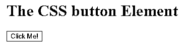
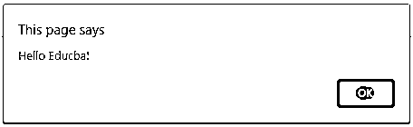
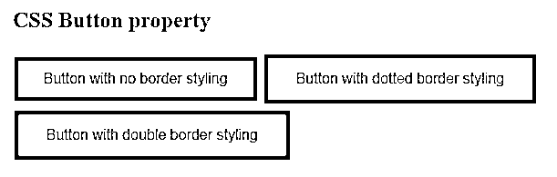
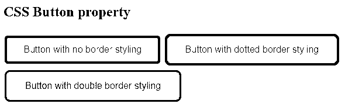
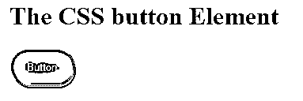

# CSS 按钮边框

> 原文：<https://www.educba.com/css-button-border/>


## CSS 按钮边框介绍

在这篇文章中，我们正在讨论 CSS 中的按钮边框。一般来说，按钮是在元素中使用的可点击事件，当我们点击按钮时，它将转到另一个页面或元素，或者执行一些其他操作。在本文中，让我们看看边框是如何应用到按钮上的。border 属性用于为我们使用 border-radius 属性的按钮提供边框，用于设计按钮边框的样式，使按钮的角变圆。我们还可以通过减少 border-radius 属性在内部 span 元素上添加另一个 border 属性来提供 give double stroke。

### CSS 按钮边框的处理

边框用于样式化 CSS 中的按钮。在本文中，我们将讨论如何使用边框半径属性来设计按钮的样式。大多数情况下，边框不用于设计按钮的样式。

<small>网页开发、编程语言、软件测试&其他</small>

首先，我们必须使用按钮标签创建按钮，如下所示。这个按钮标签或属性有不同的属性来设置按钮的样式，如颜色、边框、文本对齐、字体大小等。让我们看看语法和例子。

**语法:**

```
<button type = "button" class = "button"> text or name of the button </button>
```

### CSS 按钮边框的示例

下面举几个例子:

#### 示例#1

**代码:**

```
<!DOCTYPE html>
<html>
<head>
<title> Educba Training </title>
</head>
<body>
<h1>The CSS button Element</h1>
<button type="button" onclick="alert('Hello Educba!')">Click Me!</button>
</body>
</html>
```

**输出:**




点击按钮后




在上面的程序中，我们看到了一个按钮的简单创建，它将创建一个名为“单击我”的按钮，单击该按钮后，它将弹出消息“你好 Educba”。

让我们看一个在创建按钮时如何声明边界的一般例子。

#### 实施例 2

**代码:**

```
<!DOCTYPE html>
<html>
<head>
<title> Educba Training </title>
<style>
.button1 {
background-color: Blue;
border: none;
color: black;
padding: 15px 32px;
text-align: center;
font-size: 16px;
margin: 4px 2px;
}
.button2 {
background-color: Blue;
border: dotted;
color: black;
padding: 15px 32px;
text-align: center;
font-size: 16px;
margin: 4px 2px;
}
.button3 {
background-color: Blue;
border: double;
color: black;
padding: 15px 32px;
text-align: center;
font-size: 16px;
margin: 4px 2px;
}
</style>
</head>
<body>
<h2>CSS Button property</h2>
<button class="button1">Button with no border styling </button>
<button class="button2">Button with dotted border styling</button>
<button class="button3">Button with double border styling</button>
</body>
</html>
```

**输出:**




在上面的程序中，我们可以看到我们设计了三个带有边框属性的按钮，比如第一个按钮我们没有应用任何边框属性，指定为“none”，第二个按钮我们指定为“dotted ”,第三个按钮我们指定为“double”。

在几个例子中，我们还为 CSS 中的按钮使用了 border-radius 属性。该边框半径属性用于按钮的圆角。让我们看一个例子，它正在工作。

#### 实施例 3

**代码:**

```
<!DOCTYPE html>
<html>
<head>
<title> Educba Training </title>
<style>
.button1 {
background-color: red;
border: none;
border-radius: 5px;
color: black;
padding: 15px 32px;
text-align: center;
font-size: 16px;
margin: 4px 2px;
}
.button2 {
background-color: Blue;
border: dotted;
border-radius: 9px;
color: black;
padding: 15px 32px;
text-align: center;
font-size: 16px;
margin: 4px 2px;
}
.button3 {
background-color: green;
border: double;
border-radius: 9px;
color: black;
padding: 15px 32px;
text-align: center;
font-size: 16px;
margin: 4px 2px;
}
</style>
</head>
<body>
<h2>CSS Button property</h2>
<button class="button1">Button with no border styling </button>
<button class="button2">Button with dotted border styling</button>
<button class="button3">Button with double border styling</button>
</body>
</html>
```

**输出:**




在上面的程序中，我们可以看到我们用按钮半径指定了所有三个按钮，第一个按钮用“5px”指定，第二个和第三个按钮的按钮半径为“9px”。

我们将会看到移动的边界会产生类似的效果，这可以通过下面的例子来实现。让我们看看下面的例子。

#### 实施例 4

**代码:**

```
<!DOCTYPE html>
<html>
<head>
<title> Educba Training </title>
<style>
.dislodged-border {
background: #FB3FDE;
border-radius: 30px;
color: #fff;
display: inline-block;
font-family: sans-serif;
padding: 15px 20px 14px;
position: relative;
text-decoration: none;
}
.dislodged-border,
.dislodged-border:before {
border-radius: 30px;
box-sizing: border-box;
}
.dislodged-border:before {
border: 2px solid #FB3FDE;
content: "";
display: block;
height: 100%;
position: absolute;
width: 100%;
top: 5px;
left: 3px;
z-index: -1;
}
</style>
</head>
<body>
<h1>The CSS button Element</h1>
<button class="dislodged-border">Button</button>
</body>
</html>
```

**输出:**




在上面的程序中，我们看到我们的输出，首先按钮背景颜色是粉红色的，它就像一个内嵌块按钮，当我们单击这个按钮，然后我们得到一个蓝色轮廓的移动按钮。在上面的代码中，我们将白色指定为字体颜色，将 display 属性指定为 inline-block，这使得 inline 元素具有漂亮的梅花外观，我们指定了用于文本间距的 padding，我们还将 position 的值指定为“relative ”,这使得元素具有绝对定位。

指定了用于应用于按钮本身的移位边框:before，还定义了 consistent，并且我们还使用 border-box 值指定了 border-radius、box-sizing，因为当我们声明移位边框样式时，我们将 border-box 指定为 box-sizing 属性的值。

### 结论

在本文中，我们已经得出结论，按钮是用于动作事件的。可以通过为按钮以及不同类型的按钮(如单选按钮、简单按钮等)提供名称来声明这些按钮。这些按钮可以通过使用 CSS 的不同样式属性来设计，如边框、颜色、背景色、字体大小、填充等。在本文中，我们讨论了一个应用于按钮样式的属性，即 borders。一般来说，按钮的边框通常不太可取，因为简单的按钮比有边框的按钮更容易定义。在这里，我们看到了诸如实线、虚线、双线等边框样式的应用。我们也看到了应用于按钮的移位边框。

### 推荐文章

这是一个 CSS 按钮边框的指南。在这里，我们讨论 CSS 按钮边框的工作方式，并给出相应的例子，以便更好地理解。您也可以阅读以下文章，了解更多信息——

1.  [CSS 溢出](https://www.educba.com/css-overflow/)
2.  [CSS 溢出](https://www.educba.com/css-overflow/)
3.  [CSS 边框颜色](https://www.educba.com/css-border-color/)
4.  [CSS 颜色透明](https://www.educba.com/css-color-transparent/)


